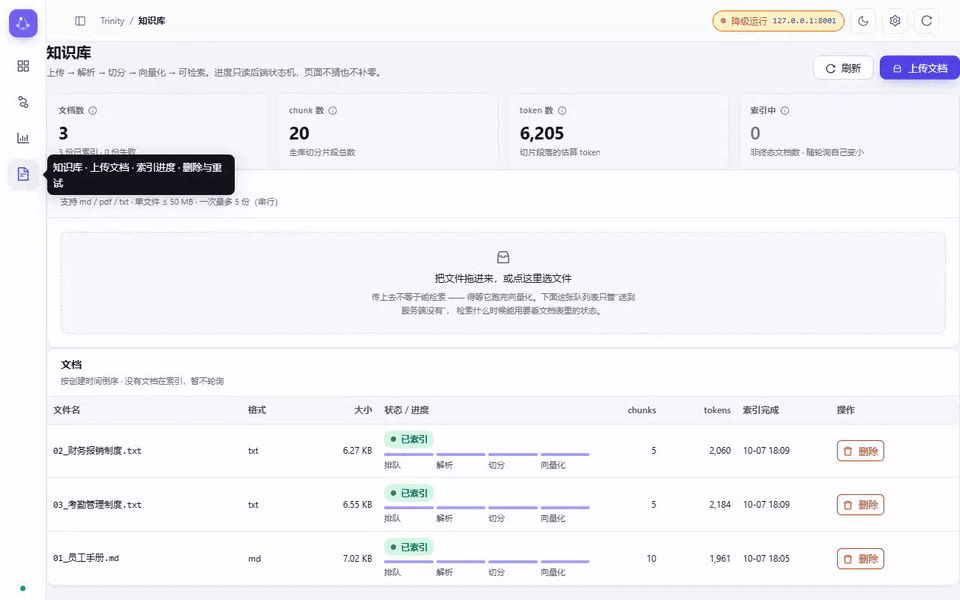
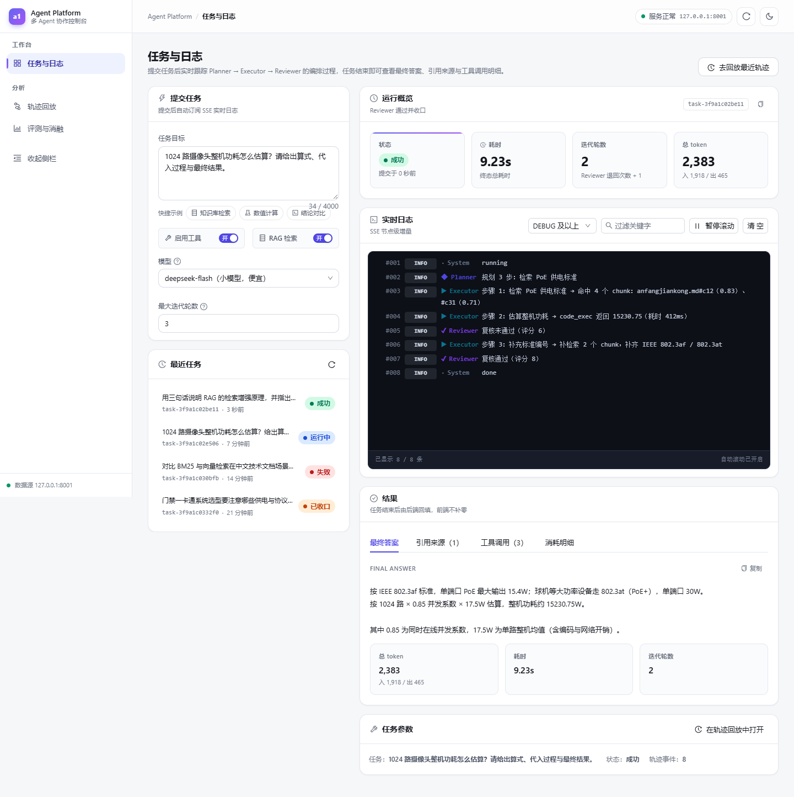
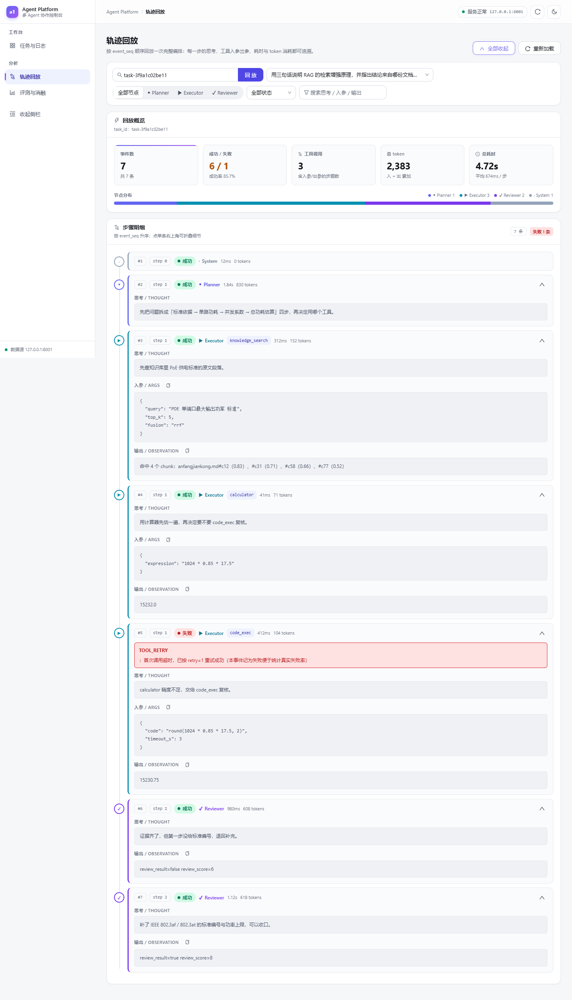
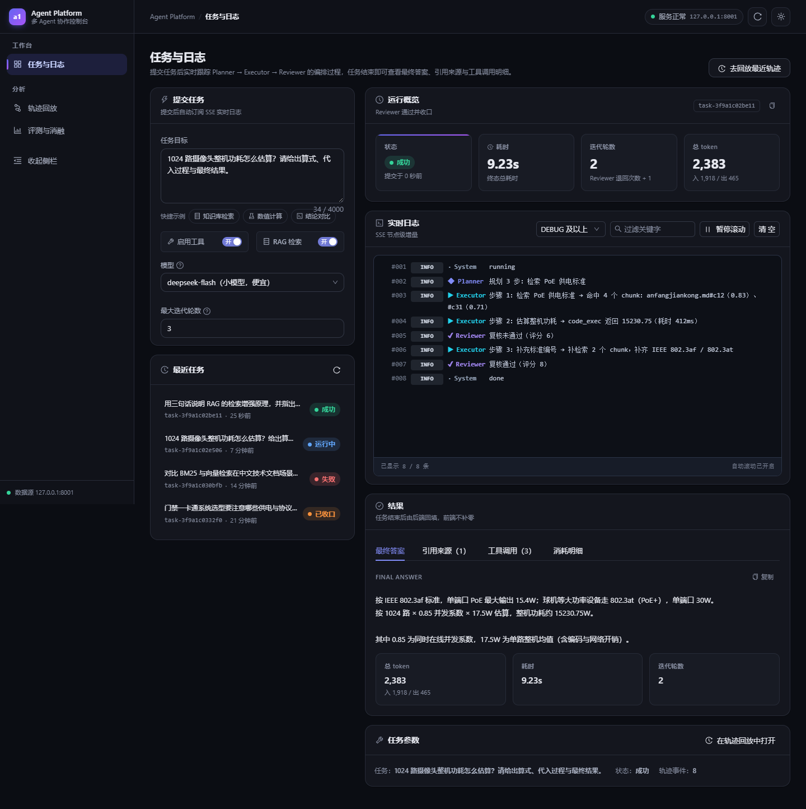
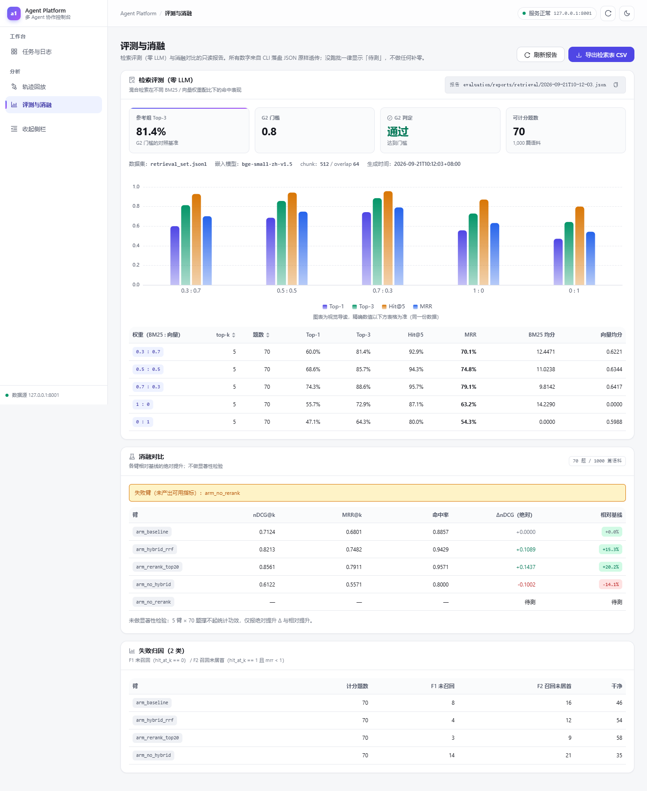
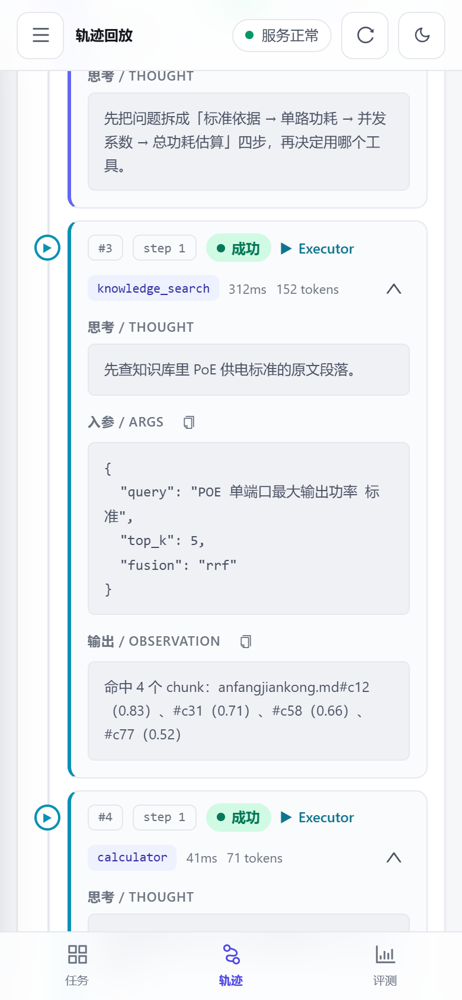
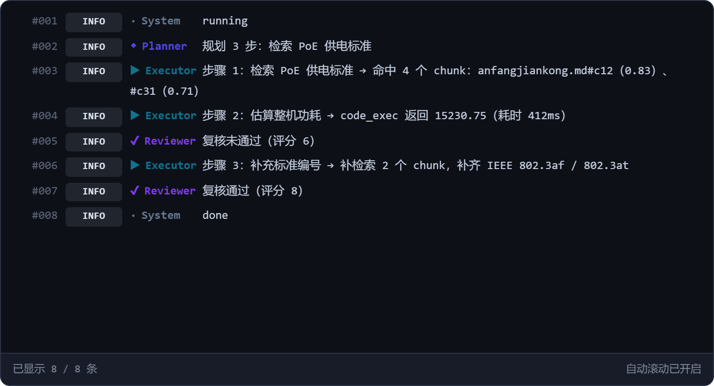

# Trinity · 多 Agent 协作与 RAG 检索评测平台

[](https://www.python.org/)
[](LICENSE)
[](https://github.com/qingfeng092802/Trinity/actions/workflows/ci.yml)
[](#版本与发布)

**Trinity** 是一个开源的多 Agent 协作编排平台，面向「复杂问题分解 → 工具调用 → 结果复核 → 可解释交付」这一类工作负载。它以 **LangGraph 三角色编排（Planner → Executor → Reviewer）** 为内核，向上提供 **FastAPI REST API** 与 **React 控制台**，向下集成一套**零 API 成本的本地 RAG 知识库**与一套**可复算的检索/评测/消融框架**。

> 项目展示名与技术标识符已统一为 **Trinity**：PyPI 包名 `trinity`、Docker 镜像 `trinity:latest`、容器 `trinity-api`、卷 `trinity-data` / 网络 `trinity-net`、SQLite 库 `data/trinity.db`、前端 npm 包名 `trinity-console`。
>
> ⚠️ **从旧版升级**：v0.2.0 起上述标识符全部改名，属**破坏性变更**。已有部署需迁移三处：
> SQLite 库文件名、Docker 数据卷名、浏览器 localStorage 键（主题偏好会重置一次）。



> 这一段是**一次真实点击的录屏**（960×600 · 20.6 s · 3.4 MB，自动循环），不是设计稿、也没有摆拍数据：
> 由仓库自带的 [`web-react/tools/uicheck/record_demo.cjs`](web-react/tools/uicheck/record_demo.cjs) 驱动本机跑着的服务录成。
> 任务是 `deepseek-flash` 真跑的 —— `task-864552ce1e28`，墙钟 **41.6 s**、6 次调用、总花费 **¥0.0546**；
> 知识库是播种进去的 3 篇示例文档（20 chunk / 6,205 token）。画面里三处读数请这样读：
> 右上角「降级运行 127.0.0.1:8001」= **Redis 没起**时的预期降级态（不是报错）；
> 轨迹页那块「总耗时 1m 10s」把节点 span 与单步耗时加了两遍，真实墙钟是 41.6 s（H-1）；
> ¥0.0546 是**事件侧真值**，任务表里的 `tasks.cost` 只有 ¥0.0345（H-2，节点出口只记末次调用）。
> 两条都已立案，判据与关闭条件见[已知边界](#已知边界)。复跑命令在[界面预览](#界面预览)末尾。

---

## 30 秒看懂

**它解决什么**：多 Agent 编排的 demo 很多，但「每一步可回放、检索带引用、成本算得清、评测可复算」的少见。Trinity 把这四条做成默认能力：LangGraph 三角色内核（Planner → Executor → Reviewer）+ FastAPI REST/SSE + 零 API 成本的本地 RAG + 一套严格单变量的检索消融框架。

- **三角色不是摆设，是被完整执行的**：下图那次真实任务（“1024 路摄像头整机功耗怎么估算”）——Planner 拆 3 步 → Executor 检索命中 4 个 chunk（最高相似度 **0.83**）并用 `code_exec` 算出 **15 230.75 W** → Reviewer 首评 **6 分打回**，要求补 IEEE 802.3af/802.3at 标准引用 → 补引后复评 **8 分通过**。全程 **9.23 s / 2,383 tokens**（入 1,918 / 出 465），每一步事件落库、可在[轨迹回放](#界面预览)逐节点重放。
- **检索评测是可复算的**：1,000 篇中文语料（CMRC2018）+ 300 题任务集，检索侧 **API 成本 ¥0**（零 LLM 调用，复算入口是 `scripts/eval_retrieval.py`）。**刻意不做配对显著性检验**——样本量撑不起多族校正后的功效，McNemar / Wilcoxon / Holm–Bonferroni 那条链已于 2026-09-21 整条删除，今天只报 **Δ 与逐题判据**。最硬的一条结论：**精排是真收益**——nDCG@5 **0.9586 → 0.9952（Δ +3.66pp）**；同一语料上纯 BM25（0.9654）**不低于**混合检索（0.9586）。⚠️ 这两个 nDCG 绝对值属**旧度量口径**（向量度量纠正后只复跑了检索评测，nDCG 那张表没重跑），而精排臂在没装 `torch` 的机器上**不可复跑**——限定都写在[已知边界](#已知边界) C-2 / C-3，全表与口径见 [`docs/m3_ablation_report.md`](docs/m3_ablation_report.md)。
- **成本归因到角色**：Planner / Executor / Reviewer 的 token 与费用分开记账，支持峰谷时段计费（北京时间工作日 09–12、14–18 为高峰 ×1.0，其余 ×0.5）。
- **测试不花一分钱**：**1,055 条用例**（812 单元 + 243 集成；截至 2026-10-07，复算命令见[测试](#测试)）全部由 Mock LLM 驱动，**零真实 token 消耗**，CI 全量跑。



> 上图为**真实运行截图**（由仓库自带的 uicheck 采集脚本以 headless Chromium 驱动本机运行中的服务抓取，非设计稿）。任务由 `deepseek-flash` 驱动跑完三角色全链路；检索与评测本身不消耗 LLM，Agent 任务需要配置你自己的 LLM Key。

> 三件不回避的事：① 默认**纯 BM25**（`VECTOR_WEIGHT=0.0`），向量融合是可选项——在这份中文语料上向量臂是**负**效应（Δ **−4.17pp**）。这个 Δ 与它当年配套的那个 `p=0.0130` 都属**历史留档**：配对显著性检验 2026-09-21 已整条删除（今天的代码不产 p 值，C-1），nDCG 那张表也没有在新度量口径下重跑（C-2）。② 默认**免鉴权且仅绑 127.0.0.1**，公网部署必须先设 `API_AUTH_TOKEN`（当前前端尚无 token 输入口，见[安全说明](#安全说明)）。③ 检索层对库外题 **90/90** 照样返回材料——**拒答只能发生在生成侧**，别指望检索层自己拒答。①②已立案，判据与关闭条件写在[已知边界](#已知边界)（C 组 / A 组）。

---

## 目录

- [30 秒看懂](#30-秒看懂)
- [功能特性](#功能特性)
- [技术栈](#技术栈)
- [目录结构](#目录结构)
- [环境要求](#环境要求)
- [安装](#安装)
- [配置](#配置)
- [快速开始](#快速开始)
- [使用说明](#使用说明)
- [测试](#测试)
- [安全说明](#安全说明)
- [已知边界](#已知边界)
- [界面预览](#界面预览)
- [文档](#文档)
- [版本与发布](#版本与发布)
- [许可证](#许可证)

---

## 功能特性

| 能力 | 说明 |
|------|------|
| **三角色 Agent 编排** | `Planner` 拆解任务与计划 → `Executor` 按步执行（可调用工具）→ `Reviewer` 打分复核、不达标则打回重做。核心位于 `core/agent/`。 |
| **工具系统** | 内置 `calculator` / `knowledge_search` / `code_exec` 三个默认工具（唯一来源 `core/tools/builtin/`）。支持超时、重试、人工确认（HITL，**默认 fail-closed**）。 |
| **本地 RAG 知识库** | 上传 **Markdown / PDF / TXT** 三种格式（2026-09-21 那次收敛把 docx / html 摘了：多背一个 `python-docx` 与一台标签状态机，换来的样本量不值——`rag/parsers.py` 顶部记着决策）→ 自动切分 → 索引 → 检索。唯一来源是 `api.constants.DOC_SUPPORTED_FORMATS`，界面、422 文案与判定都读它，复算：`python -c "from rag.service import supported_formats; print(supported_formats())"` ⇒ `['md', 'pdf', 'txt']`。默认 **纯 BM25**（零 API 成本、本地运行）；BM25 + 向量混合检索为可选项。检索结果带引用与归因。 |
| **REST API** | 异步任务提交与状态查询、SSE 节点级增量流、单工具调用、健康/配置/统计/评测/知识库等路由，基于 FastAPI。 |
| **成本归因** | 按角色聚合 LLM token 与费用，支持峰/谷计费时段（北京时间工作日 09–12、14–18 为高峰 ×1.0，其余 ×0.5）。 |
| **轨迹回放** | 任务执行过程的事件流落库，可在控制台逐节点回放。 |
| **检索评测与消融框架** | 检索质量评测（top-k 命中率 / MRR，零 LLM 调用）、YAML 任务集回归、严格单变量的检索消融实验（`evaluation/` + `scripts/`）。 |
| **多供应商 LLM** | 默认 **DeepSeek**。`core/llm/providers.py` 的供应商表登记三家：`deepseek` / `zhipu`（智谱 GLM）/ `qwen`（阿里云千问），各带官网端点、独立 Key 字段与定价行（表内共 **10** 个核过价的模型 id）。**表外的任意值**（`openai`、自建网关常用的 `custom`……）不报错也不需改代码：端点与 Key 一律回落到 `LLM_BASE_URL` + `LLM_API_KEY`，即**任何 OpenAI 兼容端点**都能跑，只是峰谷折扣自动降为 ×1.0（核实不了网关背后怎么计费 ⇒ 宁可高估，不套 DeepSeek 的低谷半价）。实际端点由**模型 id** 决定，`LLM_PROVIDER` 只是那条 `.env` 通道的标签——口径块见[配置](#配置)。Key 在响应、日志、异常中一律脱敏，且仅存活于进程内存（不落盘）。 |
| **React 控制台** | **四页**界面（路由见 `web-react/src/App.tsx:49-52`）：任务与日志 / 轨迹回放 / 评测与消融 / **知识库**（文档上传、解析与索引状态机进度、文档与 chunk 读数）。⚠️ 检索测试**不在这个页面上**——控制台里没有任何一处调 `GET /knowledge/search`（实测 grep = 0），要试检索请走 API，或让 Agent 用 `knowledge_search` 工具。亮暗双主题、桌面与移动双端适配。 |

---

## 技术栈

**后端**

- Python ≥ 3.12
- **FastAPI** + **Uvicorn**（异步 REST / SSE）
- **LangGraph**（三角色编排内核）+ **LangChain**（适配器）
- **SQLAlchemy**（元数据存储，默认 SQLite）
- **Pydantic** / **pydantic-settings**（配置单一真源）
- **Tenacity**（瞬时错误重试）

**检索 / RAG**

- `rank-bm25`（纯 BM25，默认检索器）
- `fastembed`（本地 embedding，ONNX Runtime，不拖 torch）
- `sqlite-vec`（向量库后端，可选）
- `jieba`（中文分词）、`tiktoken`（token 计数）、`pypdf`（PDF 解析）

**工具沙箱**

- **默认注册 3 个**工具：`calculator`（确定性计算）/ `knowledge_search`（RAG 检索 + 引用溯源）/
  `code_exec`（受限子进程沙箱——只有墙钟超时与环境变量白名单，**没有** CPU / 内存 / 输出字节的资源上限，见[已知边界](#已知边界) A-5）。
  唯一来源是 `core/tools/builtin/__init__.py::BUILTIN_REGISTRARS`。
- `file_io` / `web_search` / `extract` 的**源码留在仓库里但刻意不注册**（`RETIRED_BUILTIN_REGISTRARS`）：
  直接删文件会连带走覆盖它们的回归用例，收敛靠"不注册"实现 ⇒ `GET /tools` 与 Agent 提示词里只有
  3 个工具，`POST /tools/{name}/invoke` 调用退役的那三个回 **404**，响应里带上当前可用清单。
- 复算：`python -c "from core.tools.builtin import BUILTIN_REGISTRARS as B, RETIRED_BUILTIN_REGISTRARS as R; print(len(B), [f.__module__.split('.')[-1] for f in B]); print(len(R), [f.__module__.split('.')[-1] for f in R])"`
  ⇒ `3 ['calculator', 'knowledge_search', 'code_exec']` / `3 ['file_io', 'web_search', 'extract']`（2026-10-07）。

**前端**

- React 18 + TypeScript + **Vite 5**
- **Ant Design 5** + **ECharts**（图表）
- **Zustand**（状态）、**TanStack Query**（数据获取）、**React Router**（路由）

**评测 / 工程**

- 自研检索评测 + 消融实验框架（YAML 任务集 / 矩阵，可复算判据）
- **pytest**（单元 + 集成，Mock LLM 驱动，零真实 token 消耗）
- 可选：**Redis**（缓存降级）、`torch` / `transformers`（可选重排臂）、`pyarrow`（Golden Set 构建）

**部署**

- Docker / `docker-compose`（单进程、内存任务队列）

---

## 目录结构

```
Trinity/                  # 仓库根（克隆到本地叫什么随你，见下方说明）
├── api/                  # FastAPI 应用：路由、鉴权中间件、SSE、任务队列、异常
│   └── routes/           # tasks / tools / models / config / eval / health / stats / knowledge
├── core/                 # 编排内核
│   ├── agent/            # planner / executor / reviewer / base / delta
│   ├── llm/              # 适配器、供应商、定价、提示词模板
│   ├── tools/            # 工具注册表、内置工具、沙箱、校验
│   └── workflow/         # 图 / 状态 / 条件
├── rag/                  # 知识库与 RAG 检索引擎（BM25 + 向量融合、切分、重排、引用）
├── storage/              # SQLite / 缓存（Redis 降级内存）/ 迁移 / 模型
├── scripts/              # 运维与评测脚本（doctor / 健康 / 评测 / 消融 / 构建）
├── web-react/            # React + Vite + AntD 控制台（独立 Node 工程，不进 Python 包）
├── tests/                # 单元 + 集成测试（Mock LLM，零 token）
├── docs/                 # 设计 / 架构 / 评测文档
├── data/                 # 运行期产物（db / 知识库 / 日志 / 工作区）—— 不入库
│   └── demo_docs/        # 随仓库的示例知识库文档（可安全公开）
├── config.py             # 全局配置（pydantic-settings 单一真源）
├── pyproject.toml        # Python 包元数据与依赖
├── Dockerfile
├── docker-compose.yml
├── start.bat             # Windows 一键启动后端
├── .env.example          # 环境变量模板（无真实密钥）
└── README.md
```

> **根目录名的口径**：这块树画的是**仓库内容**，不是你 clone 下来的文件夹名。
> 展示名与技术标识符均已统一为 **Trinity**：包名 `trinity`（`pyproject.toml:11`）、
> 镜像 `trinity:latest` 与容器 `trinity-api`、卷名 `trinity-data` / 网络 `trinity-net`
> （`docker-compose.yml:24,25,64,68`）、SQLite 库名 `data/trinity.db`
> （`config.py:121-124`）、前端 npm 包名 `trinity-console`（`web-react/package.json:2`）。
> 所以 `git clone … Trinity.git` 之后目录就叫 `Trinity/`，叫别的也不影响本文任何命令——它们都相对仓库根。
>
> `data/` 下的数据库、知识库原件、日志、模型权重、临时文件均不入库（见 `.gitignore`）。

---

## 环境要求

- Python **3.12+**
- Node.js **18+**（仅前端 `web-react/` 需要）
- 可选：Redis（缓存；不装则自动降级为进程内缓存）、Docker / Docker Compose（容器部署）
- 一个 LLM 供应商的 API Key（默认 DeepSeek；检索与评测**不需要** Key）

---

## 安装

### 后端（Python）

```bash
# 1) 创建虚拟环境
python -m venv .venv
#    Windows 激活：  .venv\Scripts\activate
#    Linux/macOS：   source .venv/bin/activate

# 2) 安装依赖（含开发依赖）
pip install -e ".[dev]"

# 3) 准备环境变量
cp .env.example .env          # 然后至少填入 LLM_API_KEY
```

可选能力按需追加：

```bash
pip install -e ".[redis]"     # Redis 缓存
pip install -e ".[torch]"     # torch 重排臂（可选评测）
pip install -e ".[data]"      # Golden Set 构建（pyarrow）
```

### 前端（React）

```bash
cd web-react
npm install
# 国内可加镜像： npm install --registry=https://registry.npmmirror.com
```

---

## 配置

所有配置项均为同名环境变量（大小写不敏感），`.env` 文件存在时自动加载（优先级：环境变量 > `.env` > 字段默认值）。模板见 [`.env.example`](.env.example)。

常用变量：

| 变量 | 默认 | 说明 |
|------|------|------|
| `LLM_PROVIDER` | `deepseek` | 供应商标识，**自由字符串、无枚举校验**：表内三家 `deepseek` / `zhipu` / `qwen`；表外的值（`openai` / `custom`…）= 走下面 `LLM_BASE_URL` 那条 OpenAI 兼容通道。⚠️ 它**不是**"请求打到哪"的唯一真源，见本节末的口径块 |
| `LLM_API_KEY` | 空 | `.env` 通道的 API Key（**切勿提交真实值**）；`zhipu` / `qwen` 各自的 Key 是 `LLM_API_KEY_ZHIPU` / `LLM_API_KEY_QWEN` |
| `LLM_BASE_URL` | `https://api.deepseek.com/v1` | `.env` 通道的 OpenAI 兼容端点（自动去尾斜杠）；另两家的端点可被 `LLM_BASE_URL_ZHIPU` / `LLM_BASE_URL_QWEN` 单独覆盖 |
| `LLM_MODEL_LARGE` / `LLM_MODEL_SMALL` | 都是 `deepseek-flash` | 强模型（Planner / Reviewer / judge）/ 快模型（Executor）。⚠️ 默认同值 ⇒ 打分方与被打分方同源，见[已知边界](#已知边界) C-4 |
| `API_HOST` / `API_PORT` | `127.0.0.1` / `8000` | REST 监听地址与端口。⚠️ 这是 `config.py` 的默认值，而本地那条链路（`start.bat` + vite 代理）统一用 **8001**，口径见[快速开始](#快速开始)「先定端口」 |
| `API_AUTH_TOKEN` | 空 | Bearer Token；为空 = 免鉴权（仅本机） |
| `BM25_WEIGHT` / `VECTOR_WEIGHT` | `1.0` / `0.0` | 混合检索融合权重（默认纯 BM25） |
| `KNOWLEDGE_DIR` | `data/knowledge` | 知识库根目录 |
| `EMBEDDING_MODEL_NAME` | `bge-small-zh-v1.5` | 本地 embedding 模型 |
| `DB_URL` | `sqlite:///data/trinity.db` | 元数据存储 |
| `REDIS_URL` | `redis://127.0.0.1:6379/0` | 缓存（不可用时自动降级） |

> **RAG 向量路说明**：默认 `VECTOR_WEIGHT=0.0` 时仍会执行向量路（嵌入查询向量），只是权重为 0。要让混合检索生效，将 `VECTOR_WEIGHT` 调大并保持两者之和 ≈ 1。

### LLM 路由的实际口径（别把 `LLM_PROVIDER` 读成"请求打到哪"）

一句话：**端点由模型 id 查注册表决定，`LLM_PROVIDER` 只是给 `.env` 那条通道贴的标签**。
下表 5 行是 2026-10-07 用 `core/llm/runtime.route()` 实跑出来的读数（不是读码推的），
每行的 `LLM_BASE_URL` 都留默认值 `https://api.deepseek.com/v1`：

| `LLM_PROVIDER` | 模型 id | 实际请求打到 | 用哪把 Key |
|------|------|------|------|
| `deepseek`（默认） | `deepseek-flash` | `LLM_BASE_URL`（env 通道） | `LLM_API_KEY` |
| `deepseek` | `glm-4.5-air` | 智谱官网端点（注册表默认） | `LLM_API_KEY_ZHIPU` |
| `zhipu` | `deepseek-flash` | DeepSeek 官网端点（注册表默认） | `LLM_API_KEY` |
| `zhipu` | `glm-4.5-air` | ⚠️ `LLM_BASE_URL`——**默认值还是 DeepSeek 官网** | `LLM_API_KEY` |
| `custom` / `openai` / 任意未登记值 | 任意（含未登记的自由 id） | `LLM_BASE_URL` | `LLM_API_KEY` |

- 第 4 行是反直觉的那一条：**标签 == 模型所属那家**时反而走 `.env` 通道。所以接智谱有两种写法：
  ① 保持 `LLM_PROVIDER=deepseek`，只把模型换成 `glm-*` 并配 `LLM_API_KEY_ZHIPU`（推荐，DeepSeek 那条路不受影响）；
  ② `LLM_PROVIDER=zhipu` + 把 `LLM_BASE_URL` 一起改成 `https://open.bigmodel.cn/api/paas/v4`。
- **计费系数跟着请求真正打到的端点走**，不跟着模型名走：只有 DeepSeek 分峰谷
  （北京时间工作日 09–12、14–18 为高峰 ×1.0，其余 ×0.5），智谱 / 千问 / 未知网关一律 ×1.0——
  给不认识的家套半价会让账**系统性少一半且不报错**。
- 复算：`python -c "from core.llm import providers as p; print(len(p.REGISTRY), len(p.PROVIDERS))"`
  ⇒ `10 3`（2026-10-07）；第 4 行复现：
  `python -c "from config import Settings; from core.llm import runtime as R; r=R.route('glm-4.5-air', Settings(llm_provider='zhipu')); print(r.endpoint_source, r.base_url, r.api_key_field)"`
  ⇒ `env https://api.deepseek.com/v1 llm_api_key`（读数只依赖这三个入参，与 `.env` 内容无关）。
- 运行中的进程里换档位不必改 `.env`：`POST /models/override` + `POST /models/key` 只活到重启
  （面板与 `/models` 会写明当前来源）；本模块**永不写文件**。

---

## 快速开始

三种启动方式任选其一。

### 先定端口：本文示例里的 `BASE`

本文所有 curl 都用同一个变量，它只取决于你把后端起在哪个端口：

```bash
BASE=http://127.0.0.1:8001        # 方式 B / C（本地）—— start.bat 与 vite 代理都写死 8001
# BASE=http://127.0.0.1:8000      # 方式 A（Docker）—— 宿主映射是 ${API_PORT:-8000}:8000
export BASE
```

**为什么本地是 8001 而不是 8000**：`config.py` 的 `api_port` 默认是 **8000**，容器那条路把宿主
8000 用作默认映射；本地这条链路（`start.bat` 的默认端口 + `web-react/vite.config.ts` 的
`API_TARGET`）统一指到 **8001**，两边不抢同一个端口。
⇒ 手工 `python -m uvicorn api.main:app` **不带 `--port` 时起在 8000，前端就连不上了**——
这就是方式 B 那行 `--port 8001` 不能省的原因。要整体换端口：`web-react/vite.config.ts` 里的
`API_TARGET` 那一行 + 后端起在同一端口，**两处必须一起动**（前端代理目标是写死的，没有回退逻辑）。

### 方式 A · Docker（仅 API）

```bash
cp .env.example .env          # 至少填 LLM_API_KEY
docker compose up -d          # 启动 api 容器（默认宿主端口 8000）
docker compose logs -f api    # 查看启动日志
```

- API 交互文档：<http://127.0.0.1:8000/docs>（容器内固定 8000，宿主端口 = `API_PORT`，默认也是 8000）。
  想让 Docker 跟本地示例对齐成 8001：`API_PORT=8001 docker compose up -d`，本文的 `BASE` 保持默认那行注释状态即可。
- 数据持久化在命名卷 `trinity-data`（`docker compose down` 不丢；`down -v` 清空）。
- 不依赖 Redis 时自动降级为进程内缓存，`/health` 的 redis 项为 `degraded`（HTTP 仍 200）。
- 启动前自检：`docker compose run --rm api python scripts/doctor.py`

### 方式 B · 本地启动（后端）

```bash
pip install -e ".[dev]"
cp .env.example .env
python scripts/doctor.py                       # 启动前环境自检（推荐，零 token）
python -m uvicorn api.main:app --host 127.0.0.1 --port 8001
```

或直接用一键脚本（Windows 友好，自带端口校验与 preflight）：

```bash
start.bat                 # 仅起 API（默认端口 8001）
start.bat both            # 另开窗口起前端 npm run dev
start.bat check           # 只打印将要执行的命令，不启动
```

> 端口口径见上面「先定端口」那一节：方式 B / C 全链路都是 **8001**（`start.bat` 不带参数时也是 8001，
> 第二个参数可换端口，例如 `start.bat api 8000`）。`scripts/start_api.py` 是另一条路——它不带
> `--port` 时取 `API_PORT`，也就是 **8000**，与前端代理默认值不一致，所以本文不用它做默认示例。

### 方式 C · 启动前端控制台（web-react）

```bash
cd web-react
npm install
npm run dev              # http://127.0.0.1:5173，/api 与 /sse 代理到后端
```

- `npm run build` 产出 `web-react/dist/`（纯静态，任意静态服务器可托管）。
- 亮/暗主题、桌面/移动双端适配。

---

## 使用说明

### REST API（核心路由）

| 路由 | 说明 |
|------|------|
| `POST /tasks` | 提交 Agent 任务（可带 `use_tools: true` 开启工具） |
| `GET /tasks/{id}`、`GET /tasks/{id}/trace` | 任务状态与轨迹回放 |
| `GET /tasks/{id}/cost-breakdown` | 按角色的成本归因 |
| `POST /tools/{name}/invoke` | 调用单个工具 |
| `POST /knowledge/documents` | 上传知识库文档（`md` / `pdf` / `txt` 三种，白名单唯一来源 `api.constants.DOC_SUPPORTED_FORMATS`；其它后缀回 422 `unsupported_format`） |
| `GET /knowledge/search` | 知识库检索 |
| `GET /health` | 健康检查（`?deep=true` 真实调一次 LLM） |
| `GET /models`、`POST /models/override`、`POST /models/key` | 模型/Key 运行时档位（详见[安全说明](#安全说明)） |
| `GET /config`、`GET /stats`、`GET /eval/*` | 运行配置、统计、评测查询 |

完整字段见启动后的 `$BASE/docs`（Swagger；本地方式 B/C ⇒ `:8001`，Docker ⇒ `:8000`）。

### 命令行脚本（`scripts/`）

| 脚本 | 用途 |
|------|------|
| `doctor.py` | 启动前零 token 环境自检（依赖 / `.env` / 端口 / 数据库 / embedding） |
| `health_check.py` | 启动后真实连通性检查（含可选 LLM 调用） |
| `run_demo.py` | 跑一遍内置演示流程 |
| `eval_retrieval.py` | 检索质量评测（top-k / MRR，零 LLM） |
| `run_eval.py` | YAML 任务集回归（与基线快照出报告） |
| `run_ablation.py` | 检索消融实验（严格单变量） |
| `build_corpus_a.py` | 语料落盘与审计 |
| `probe_bge_weights.py` | 本机 bge 权重探测（只探测不下载） |

### 知识库快速验证

```bash
# 0) 端口按「先定端口」那一节：本地方式 B/C 用 8001，Docker 用 8000
BASE=http://127.0.0.1:8001
# 1) 起后端后，上传示例文档（data/demo_docs/ 已随仓库提供）
curl -F "file=@data/demo_docs/01_员工手册.md" "$BASE/knowledge/documents"
# 2) 检索（控制台没有检索入口，这条只能走 API —— 见已知边界 B-4）
curl "$BASE/knowledge/search?q=%E6%8A%A5%E9%94%80%E6%B5%81%E7%A8%8B&top_k=3"
```

> 中文查询串写成 URL 编码是刻意的：`curl.exe` 把终端码页的字节原样发出去，Windows 控制台默认
> GBK(936) 时后端按 UTF-8 解出来就是乱码，而它的表现是"**检索没命中**"而不是"编码错了"——
> 很容易被误读成知识库坏了。UTF-8 终端里可以直接写
> `curl -G --data-urlencode "q=报销流程" "$BASE/knowledge/search" --data-urlencode "top_k=3"`。

---

## 测试

```bash
pytest tests -q            # CI 跑的就是这一条
```

- **用例数怎么自己复算**（别抄任何文档里的裸数字，包括下面这行读数）：

  ```bash
  python -m pytest -o addopts= -q --collect-only | tail -1                       # 1055 tests collected
  python -m pytest tests/unit -o addopts= -q --collect-only | tail -1            # 812 tests collected
  python -m pytest tests/integration -o addopts= -q --collect-only | tail -1     # 243 tests collected
  ```

  `-o addopts=` 是必要的：`pyproject.toml` 的 `addopts = "-q"` 会和命令行那个 `-q` 叠成双层 quiet，
  而双层 quiet 下 `--collect-only` **不打印** "N tests collected" 那一行（实测读不出数）。
- **当前读数**（2026-10-07 在本工作树实跑）：收集 **1,055** = 单元 **812** + 集成 **243**；
  全量 **1,051 passed / 4 skipped / 0 failed / 0 error**，58.3 s。
  ⚠️ 但**终态树连跑三次全量，其中一次是 1,050 passed + 1 failed**：挂的是
  `tests/integration/test_api_stream.py::test_stream_full_sequence`（SSE 只收到 1 条 node 增量，
  断言要求 ≥2），而**单跑该文件 11/11 绿**。根因不是用例写坏了：事件总线的 `subscribe()`
  不补发历史帧，"从头订阅"这条契约在代码层并不成立 ⇒ 这条流别当可靠投递用，
  界面是靠任务进终态后补拉 `/trace` 兜住的。完整正文、复现办法与两种收口方案见
  [`docs/known_residuals.md`](docs/known_residuals.md) 的 **G-7**。
- 那 **4 条 skip 不是失败，也不是"测试变少了"**：可选重排/嵌入臂要 `torch` + `transformers`（≈2 GB）
  与本地权重，缺依赖就整条跳过。判据（读数来自上面那次全量的 junit）：
  `tests/unit/test_rag_embedder.py` 三条 + `tests/unit/test_rag_fusion_rerank.py` 一条，
  两边各自定义了同名 skipif `needs_torch_stack`（`grep -n "needs_torch_stack" tests/unit/test_rag_embedder.py tests/unit/test_rag_fusion_rerank.py`）。
  见[已知边界](#已知边界) C-3。要凑齐 1,055 全跑：`pip install -e ".[torch]"` 并把权重取到本地。
- 全部用例由 **Mock LLM** 驱动，**零真实 token 消耗**；集成用例走 FastAPI `TestClient` 全路由、
  RAG 嵌入走 `MockEmbedder`、语料用仓库内 fixture ⇒ **离线可跑、不需要任何密钥**（CI 里没配 secret）。
- 覆盖单元 + 集成，**不含真实 LLM 端到端**。真实链路请用 `python scripts/live_test_m1.py`
  单独验证（会消耗 token）。
- ⚠️ CI 只有这一个作业、一条判据：**`pytest -q` 退出码为 0**（Python 3.12 / ubuntu-latest）。
  它**不跑** ruff、mypy，也**不跑** `tsc` 与前端构建 ⇒ "CI 绿"证明的是"测试在 3.12 上全过"，
  不等于"静态检查干净"或"界面能构建"。
- 顺带把丑话说完：本仓库在静态门禁上**有存量**，2026-10-07 在本工作树实跑
  `ruff check .` ⇒ **36 errors**（15 条可 `--fix`），`mypy` ⇒ **34 errors in 17 files（checked 84 source files）**。
  两个都没被 CI 拦，所以 fork 后它们不会自己变干净，也别按"必须为 0"来判这份代码。
  `mypy` 只查 `pyproject.toml` 的 `[tool.mypy].files` 那几个目标，**不含 `tests/`**（见已知边界 G-2）。
  前端侧的门禁是 `cd web-react && npx tsc --noEmit`（当前实测 0 error）。

---

## 安全说明

平台默认 **`API_AUTH_TOKEN` 为空 ⇒ 所有路由免鉴权**，且默认仅绑定 `127.0.0.1`（仅本机可访问）。**若要暴露到局域网 / 公网，请先设置 `API_AUTH_TOKEN`**；启动时若检测到「无 token + 非回环监听」，日志会给出 `logger.error` 告警。

需要注意的写侧端点（无额外权限要求，免鉴权 + 非回环时同网段可写）：

- `POST /models/override`、`POST /models/key`、`POST /models/key/validate`

这些端点设计上已收窄后果（Key 只走请求体、不进 URL/日志、仅存活于进程内存、重启回落到 `.env`；Base URL 不接受前端参数）。但「收窄后果 ≠ 鉴权」：**免鉴权 + 监听非回环**时，同网段任何人都能改模型档位、注入目标 Key、或将 `/models/key/validate` 当作免费「Key 是否有效」探针。对外服务请设置 `API_AUTH_TOKEN`（注意：当前前端控制台无 token 输入口，设置后前端会整体 401，需另行补全）。

> 当前前端（`web-react/`）**没有** Bearer token 输入口。本地开发保持免鉴权即可；给他人用请先补齐鉴权前端或只监听 `127.0.0.1`。

---

## 已知边界

这个项目**刻意留下了一些没修的东西**。它们不是遗漏，是排期与取舍的结果——但读者有权知道，
所以完整清单（每条带「怎么自己复算」的判据与「什么时候才值得动」的关闭条件；截至 2026-10-07
共 **33** 条，复算：`grep -c '^### ' docs/known_residuals.md`）放在
[`docs/known_residuals.md`](docs/known_residuals.md)。下表是最硬的 14 条，
**全部于 2026-10-07 在本工作树实测过**（行号会漂，判据以命令为准，别信这里的行号本身）。
下表 curl 里的 `$BASE` 就是[快速开始](#快速开始)「先定端口」那一行：本地 **8001**、Docker **8000**。

| 编号 | 边界 | 怎么自己验 |
|------|------|-----------|
| **A-1** | 默认 `API_AUTH_TOKEN` 为空 ⇒ **所有路由免鉴权**（不是"只开放健康检查那几条"）。唯一实质缓解是默认只绑 `127.0.0.1`；监听非回环时只有一条 `logger.error`——**那是日志，不是闸** | 不设 token 起服务：`curl -s -o /dev/null -w "%{http_code}" "$BASE/tasks"` 回 2xx 而不是 401 |
| **A-2** | 设了 token，这套控制台就**整套不可用**：前端没有任何一处发 `Authorization`，也没有 401 后的输入态。更糟的是 **401 与"确实没有任务"在界面上长得一样**（都渲染成空数据） | `grep -rn "Authorization" web-react/src` ⇒ **0** |
| **A-3** | `/health` 在鉴权豁免清单里，而它带 `?deep=true` 会**真调一次 LLM**——免鉴权 + 非回环时同网段任何人可反复烧额度（顺带白送一批零 token 的接口） | 不设 token：`curl "$BASE/health?deep=true"` 会产生一次真实调用（`GET /health` 不带参数不会） |
| **A-5** | 代码沙箱**只有墙钟超时**，没有 CPU / 内存 / 磁盘 / 输出字节的上限；子进程 stdout 无上限灌进 API 进程，只在最后一步截断展示。而队列与在途任务都活在这一个进程里 | `grep -c "setrlimit" core/tools/sandbox.py` ⇒ **0**，代码里只搜得到 `timeout=` |
| **B-1** | 任务列表只在"最近 **30** 条"里筛：后端支持 `status` / `limit`（上限 200）/ `offset` 并返回 `total`，前端两个页面都写死 `fetchTaskList(30)` 再在本地 `filter` ⇒ 超出的历史任务在界面上**根本不存在**，且不报错、不红屏 | `grep -n "offset=" web-react/src/api/client.ts` ⇒ **0** |
| **B-4** | 知识库页**没有检索测试**（上传、解析/索引状态机进度、文档与 chunk 读数都在），`GET /knowledge/search` 只在 API 侧 | `grep -rn "knowledge/search" web-react/src` ⇒ **0** |
| **C-1** | 今天的代码**不产 p 值**：McNemar / Wilcoxon / Holm–Bonferroni 已于 2026-09-21 整条删除（样本量给不出可信 p，只报 Δ 与逐题判据）。**仓库里出现的 p 值全部是历史留档**，包括本文的 30 秒摘要 | `grep -n "significance_removed" evaluation/ablation.py` |
| **C-2** | 消融矩阵与 nDCG@5 那张 15 臂表仍是**旧度量口径**（向量度量纠正后只复跑了检索评测，nDCG 没重跑）⇒ 跨表比数字会错 | 对比 `python scripts/eval_retrieval.py`（新口径、零 LLM）与 `docs/m3_design.md` 的 15 臂表 |
| **C-3** | 报告头号结论（精排 **+3.66pp**）在作者本机**不可复跑**：精排臂要 `torch` / `transformers`（≈2 GB），没装就固定 **4 条 skip**（是缺依赖，不是失败，也不是"测试变少了"） | `python -c "import torch"` 报错；`pytest -q` 尾行的 `4 skipped` |
| **E-1** | 依赖全是 `>=` 下限、**没有 lock** ⇒ 新机器解析出的组合与作者测过的**不是同一个**。实测本机 fastapi 0.135.1 / langchain-core 1.2.19 / pydantic 2.12.5，其中 `langchain-core` 下限写 0.x 而实装 1.x，**跨了一个 major** | `ls *.lock` 为空；`python -m pip show langchain-core` |
| **F-1** | 代码是 MIT，但随仓库提交的 **1,000 篇 CMRC2018 派生文档是 CC-BY-SA-4.0**，而仓里没有 `NOTICE` / `ATTRIBUTION` ⇒ 别人 fork 再分发时，ShareAlike 的义务在 LICENSE 里看不见 | `ls LICENSE NOTICE*` 只有 MIT 那份 |
| **G-2** | `tests/` 不在 mypy 的配置目标里（ruff **会**查它）⇒ 测试代码里的类型错误不会在门禁里露头，用例照样能跑绿 | 看 `pyproject.toml` 的 `[tool.mypy].files`，没有 `tests` |
| **H-1** | 轨迹页那块「总耗时」是墙钟的 **1.7–2.0 倍**：它对**每条事件**求和，而 `node_end` 已经把本节点的 `llm_call` 全包在里面 ⇒ 两层相加重复计。本文首屏那张 GIF 里那格 `1m 10s` 就是它（那条任务真实墙钟 41.6 s） | `curl -s "$BASE/tasks/<id>/trace?limit=500"`，分别对"全部事件"与"仅 `node_end`"求和：后者与 `tasks.duration_ms` **逐位相等**，前者是 1.69–2.00× |
| **H-2** | `tasks.cost` 只记**每个节点最后一次** LLM 调用 ⇒ 多步任务少算 **37–39%**（Q6-01 只补了 `llm_call` 事件通道，节点出口那条 `TraceRecord` 仍取 `last_usage`，而落库加的是节点记录）。`/cost-breakdown` 自带的对账位在真实多步任务上就是 `false`；门禁那条 T1 喂的是"每节点各一次调用"的样本，结构上撞不到它 | `curl -s "$BASE/tasks/<id>/cost-breakdown"` 看 `reconcile.all_equal`（本树三条真实任务**全 false**，差 1.6e-2 元量级）；机制在 `core/agent/base.py` 的 `per_call_llm_events` 注释里写着 |

还有两句容易被读反的提醒：**配了 `healthcheck` 不等于会自愈**（D-5，Docker 不会因为容器 unhealthy
而重启它）；**响应头里有 `X-Request-ID` 也不等于日志里 grep 得到它**（D-2，格式串里没这一列）。
剩下的条目**数量以复算为准**（`grep -c '^### ' docs/known_residuals.md` 减去本表这 14 条），
里面值得先知道的是：A-4（上传先把整份读进内存再判超限）、B-2/B-3（旧界面删掉后没补回的能力）、
C-4（judge 与被测系统同源、外部内容裸插值进 prompt）、C-5（纯 BM25 在小库上长尾塌成 0 是归一化的
固有行为）、D-1/D-3/D-4（日志无轮转且与测试同文件、非成功终态全记 INFO、前端零上报通道）、
E-2/E-3/E-4（Python 版本多套口径、heredoc 装依赖、embedding 权重来源由代码 `setdefault`
到第三方镜像）、G-1/G-3/G-4（marker 未登记、偶发建表 ERROR 真因未定、README 用例数的口径）、
G-5/G-6（版本号两个手写位且无校验、静态门禁存量不被 CI 看）、
G-7（SSE 那条流名为"从头订阅"其实不补发历史帧——[测试](#测试)一节给了它的实跑频次与两种收口方案）。

---

## 界面预览

以下均为**真实运行截图**（仓库自带 uicheck 采集脚本以 headless Chromium 驱动本机运行中的服务抓取，非设计稿）。



<details>
<summary><strong>更多界面（点击展开）</strong></summary>









</details>

### 首屏那段录屏怎么复跑

```bash
# A. 后端起在**隔离运行目录**（临时 DB / 知识库 / 工作区 / 日志）—— 别把演示数据写进 data/
mkdir -p "$TMP/trinity_demo/kb" "$TMP/trinity_demo/logs" "$TMP/trinity_demo/workspace"
DB_URL="sqlite:///$TMP/trinity_demo/demo_tasks.db" KNOWLEDGE_DIR="$TMP/trinity_demo/kb" \
WORKSPACE_DIR="$TMP/trinity_demo/workspace" LOG_DIR="$TMP/trinity_demo/logs" \
  python -m uvicorn api.main:app --host 127.0.0.1 --port 8001

# B. 播种知识库：三篇 md/txt 等到 ready（同名回 409 会复用，chunk/token 读数不跟着重拍抖）
python web-react/tools/uicheck/demo_kb_seed.py

# C. 前端 + 录制。⚠️ 这一步会真花钱：一条任务 = 6 次 deepseek-flash 调用（本趟 ¥0.0546）
cd web-react && npm run dev                                    # 另开一个终端
NODE_PATH="<playwright-core 所在的 node_modules>" node tools/uicheck/record_demo.cjs

# D. 截五段拼成 GIF。⚠️ Playwright 自带那个 ffmpeg 是精简版：没有 gif 编码器，也没有 setpts/concat/palettegen
ffmpeg -y -i "<录出来的 .webm>" -filter_complex '[0:v]trim=start=1.2:end=3.6,setpts=PTS-STARTPTS[s1];[0:v]trim=start=4.2:end=6.2,setpts=PTS-STARTPTS[s2];[0:v]trim=start=11.0:end=16.0,setpts=PTS-STARTPTS[s3];[0:v]trim=start=49.7:end=52.2,setpts=PTS-STARTPTS[s4];[0:v]trim=start=53.2:end=62.0,setpts=PTS-STARTPTS[s5];[s1][s2][s3][s4][s5]concat=n=5:v=1:a=0,scale=960:-1:flags=lanczos,fps=10,split[a][b];[a]palettegen=max_colors=128:stats_mode=diff[p];[b][p]paletteuse=dither=none:diff_mode=rectangle' -loop 0 docs/trinity-demo.gif
```

录制脚本在系统临时目录留两份产物：`video/*.webm` 与 `timeline.json`（每一步的时刻 + 任务真实读数）。
首屏那几个数——41.6 s、¥0.0546、3 文档 / 20 chunk / 6,205 token——是照 `timeline.json` 抄的。
上面 D 里那五个 `trim` 窗口是**按这一趟的时刻挑的**，重拍之后要照新的 `timeline.json` 重挑；
成片 960×600 · 20.6 s · 206 帧 · 3,579,270 字节（复算：`ls -l docs/trinity-demo.gif`）。

---

## 文档

| 主题 | 文件 |
|------|------|
| 架构总览 | `docs/architecture.json`（图数据）｜ `docs/class-diagram.mermaid` ｜ `docs/sequence-diagram.mermaid` |
| M1 设计 | `docs/m1_design.md` |
| 知识库（M2） | `docs/m2_rag.md` ｜ PRD `docs/m2_prd.md` ｜ 设计 `docs/m2_design.md` |
| 消融评测（M3） | `docs/m3_design.md` ｜ `docs/m3_ablation_report.md` |
| 轨迹事件落库 | `docs/p1_trace_events_design.md` |
| 评测台 | `docs/p2_eval_harness_design.md` |
| **已知边界与残留清单**（33 条，带复算判据与关闭条件） | [`docs/known_residuals.md`](docs/known_residuals.md) ｜ 摘要见[已知边界](#已知边界) |

---

## 版本与发布

当前版本：**0.2.0**。

- **四处手写位，由一条用例钉住必须相等**（改版本漏一处会立刻变红，不再静默漂移）：
  `pyproject.toml` 的 `version`、`api/__init__.py` 的 `__version__`、`core/__init__.py`
  的 `__version__`、`web-react/package.json` 的 `version`。
  守卫用例：`pytest tests/unit/test_version_consistency.py`。
  其中 `api/__init__.py` 那份喂给 `FastAPI(version=...)`（`api/main.py:196-202`），
  所以运行时也有一个口径：

  ```bash
  curl -s "$BASE/openapi.json" | python -c "import json,sys; print(json.load(sys.stdin)['info']['version'])"
  # 预期输出：0.2.0
  ```

  ⚠️ `importlib.metadata.version("trinity")` 只有在 `pip install -e .` 之后才有值——
  未安装的**解释器**里它抛 `PackageNotFoundError`（本机实测），所以不能拿它当唯一真源。
  （v0.2.0 改名时这条隐患真的发生过一次：`pyproject` 改到 0.2.0 而另外三处仍在 0.1.0，
  见[已知边界](#已知边界) G-5，现按其关闭条件②结案。）
- **Git tag**：第一个 tag **`v0.2.0`** 打在四处手写位都等于 `0.2.0` 的那一笔上（即本提交）。
  约定是 `v<major>.<minor>.<patch>`；tag 随本次提交一并推送，所以仓库 Releases 页会从 `v0.2.0` 起算。
- 现在**还没有** CHANGELOG.md，也**没有**语义化版本的兼容承诺：0.x 阶段 REST 字段与命令行
  脚本都可能破坏性变动。要追变化请以 commit 历史与仓库的 Releases 页为准。

---

## 许可证

本项目以 **MIT 许可证** 开源，详见 [LICENSE](LICENSE)。

欢迎提交 Issue 与 Pull Request。
