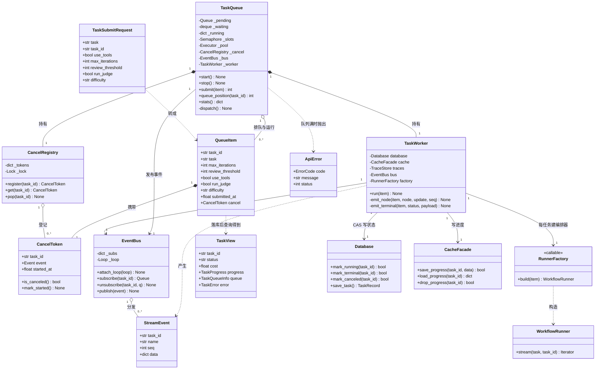
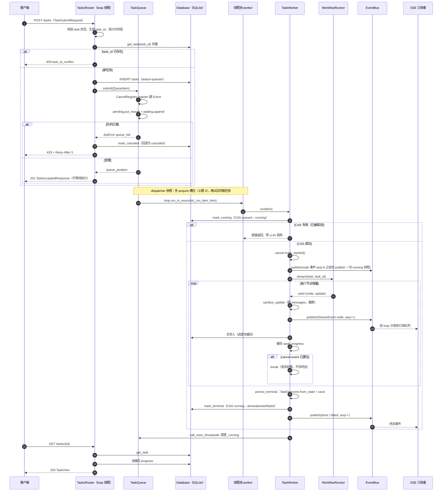
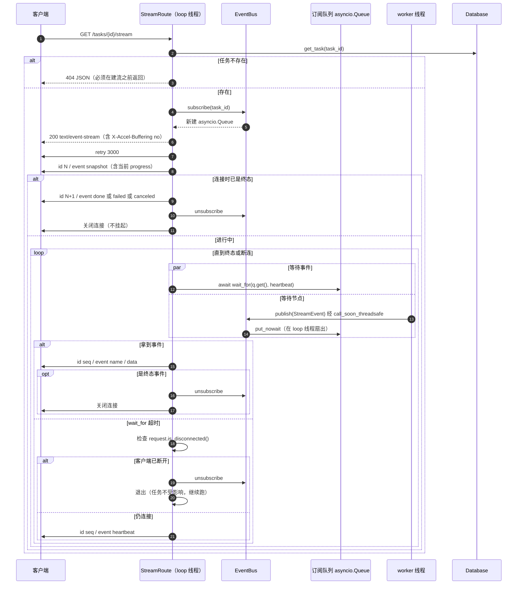
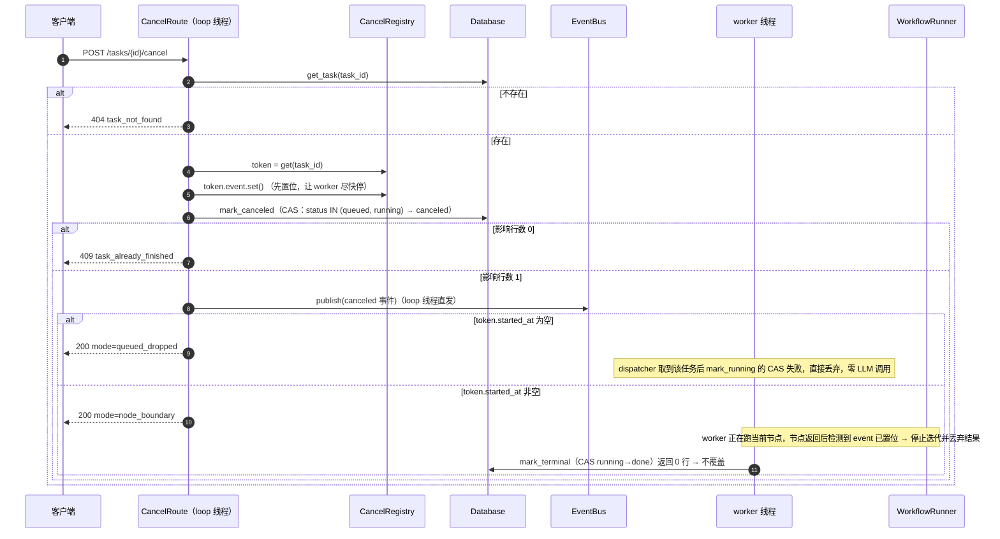
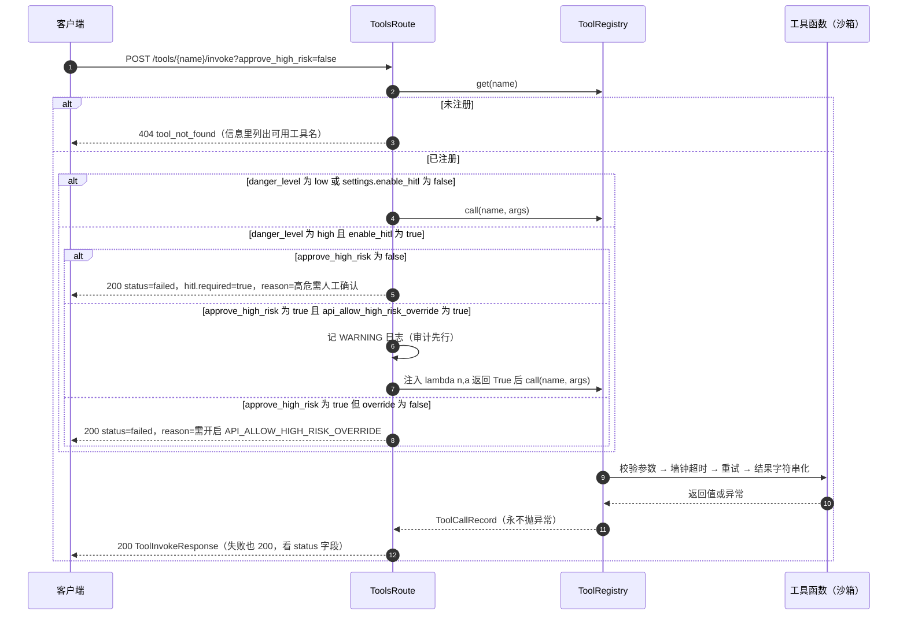
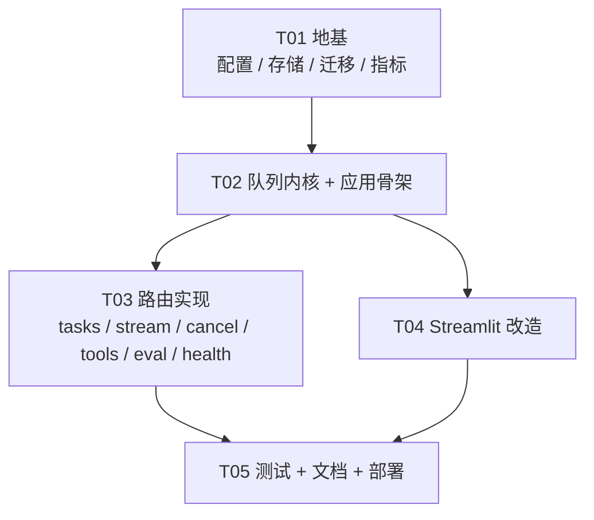

# M1 系统设计 + 任务分解：REST API 层 + 异步任务队列

> 阶段 5 · M1（第 1-2 周 · 只做 P0）
> 需求基线：`docs/m1_prd.md`　|　面向：工程师施工图
> 本文只做**设计**，不含实现代码。

---

## 0. 结论先行

### 0.1 拍板决策的落点（PRD §8 → 本设计）

| # | 决策 | 落点文件 | 实现要点 |
|---|---|---|---|
| Q1 | 加 `error_code`/`error_message` + 一次性迁移 | `storage/models.py`、`storage/migrations.py`、`scripts/migrate_add_task_error_fields.py`、`config.py` | 迁移用 `PRAGMA table_info` 判存在后 `ALTER TABLE ADD COLUMN`，**幂等**；`Database.init_db()` 内自动调用一次，脚本供运维手工跑 |
| Q2 | 接受「节点边界取消」 | `api/queue.py`、`README.md`、`docs/m1_api.md` | 不杀线程/不做子进程隔离；L1 写入两份文档 |
| Q3 | SQLite 开 WAL + `busy_timeout` | `storage/db.py`（SQLAlchemy connect 事件）、`evaluation/trace.py`（独立连接也要设） | 集中在 `_create_engine` 与 `TraceStore.__init__` 两处，**禁止散落** |
| Q4 | `canceled` 单独计数 | `evaluation/metrics.py` | `BatchMetrics` 加 `canceled: int`；不计入 `completed` / `failed`，完成率分母仍是 `total` |
| Q5 | 内存队列 | `api/queue.py` | `asyncio.Queue(maxsize=api_queue_max_size)` + `ThreadPoolExecutor(max_workers=api_max_concurrent_tasks)` + dispatcher 协程 + `asyncio.Semaphore` |
| Q6 | 不加 `/v1` | `api/main.py` | 路由直接挂 `/tasks`、`/health` … |
| Q7 | `api_allow_high_risk_override` 默认 false | `config.py`、`api/routes/tools.py` | 必须能靠 `API_ALLOW_HIGH_RISK_OVERRIDE=true` 打开，否则开发期没法用 API 跑 `code_exec` |
| Q8 | docker-compose 加 `api` service | `docker-compose.yml`、`Dockerfile` | 暴露 8000，`API_HOST=0.0.0.0`，与 `app` 同卷同 env |
| Q9 | `run_judge` 默认 false | `api/schemas.py` | — |
| Q10 | 不做单任务成本上限 | — | 靠 `max_iterations` 约束 |

### 0.2 三大技术风险的结论（这是本文最该看的部分）

| 风险 | 结论 | 一句话理由 |
|---|---|---|
| ① 同步 `runner.stream()` 在线程池 + SSE 协程订阅，如何跨线程分发事件？ | **用 `asyncio.Queue` + `loop.call_soon_threadsafe` 桥接**（方案 A），**不用**轮询缓存（方案 B） | 节点级事件本来就稀疏（一条任务 3-10 个），轮询会白烧 CPU 且引入 0.3-0.5s 延迟；桥接是标准做法，代价仅"worker 线程不能 await、必须记住 loop 引用" |
| ② 取消的竞态（worker 覆盖 `canceled`） | **所有状态写入改成数据库层 CAS（Compare-And-Swap）**：单条 `UPDATE ... WHERE task_id=? AND status IN (...)`,以影响行数判定成败；内存 `threading.Event` 只负责"快点停" | 锁解决不了"取消 handler 在 loop 线程、worker 在池线程"的跨线程协调，CAS 把仲裁交给 SQLite 的写串行化，最省心也最不容易写错 |
| ③ SQLite 多线程写 | **WAL + `busy_timeout=5000` + 每次调用独立 Session + 终态 CAS**，另外 `TraceStore` 的裸 sqlite3 连接**也要设同样的 PRAGMA** | TraceStore 是独立于 SQLAlchemy 的第二条写连接，只改一边等于没改 |

### 0.3 诚实声明（做不到的事）

1. **不能中止飞行中的 LLM 请求**（L1）。最坏 `llm_timeout × (1 + llm_max_retries)` = 120s × 4 = **480s** 才释放 worker 槽位。
2. **worker 槽位不能被强制回收**（L2）。3 个任务全卡死 → 队列完全停滞 → 只能重启进程。
3. **SSE 是节点级，不是 token 级**（L4）。一个 LLM 调用期间客户端看不到任何中间文本。
4. `estimated_cost_cny` 是**粗估**（见 §7.7），误差可能 3-5 倍，**不得用于计费**。
5. 队列与进度是**进程内存态**，重启即丢；M1 **不做**孤儿回收（P1-4）。

---

## 1. 实现方案与框架选型

### 1.1 核心难点

| # | 难点 | 本质 | 解法 |
|---|---|---|---|
| D1 | 编排内核是**同步阻塞**的（`WorkflowRunner.stream()` 是生成器，节点是同步 `__call__`） | 不能 await，不能放进协程 | 扔进 `ThreadPoolExecutor`，用 future 回调回写结果 |
| D2 | 一个任务要同时服务「HTTP 轮询」和「SSE 长连接」两种消费方式 | 一对多、跨线程 | `EventBus`：每任务一个 topic，订阅者各自一个 `asyncio.Queue`；worker 线程 `call_soon_threadsafe` 投递 |
| D3 | 取消要与"正在跑的同步代码"竞争 | 无抢占点 | 内存 `Event`（快速停） + DB CAS（状态仲裁）双保险 |
| D4 | 多个 worker 线程 + TraceStore + Streamlit 进程同时写一个 SQLite 文件 | 写锁竞争 | WAL + busy_timeout，终态写 CAS |
| D5 | 现有 `LLMAdapter` 是 `lru_cache` 单例且持有可变字段 `last_usage` | 并发下 token/成本**串号** | 每个任务**新建** `LLMAdapter`（见 §8.5） |
| D6 | 测试不能消耗真实 token | — | `TaskQueue` 接受注入的 `runner_factory`，测试用 `MockLLMAdapter` |

### 1.2 选型

| 领域 | 选型 | 理由 | 被否掉的选项 |
|---|---|---|---|
| Web 框架 | **FastAPI ≥0.110** | 原生 Pydantic v2（项目已在用）、自动生成 OpenAPI（P0-1 要求 Swagger 可见 7 个端点）、`StreamingResponse` 足够做 SSE、依赖注入便于测试替换 Mock | Flask（无 schema/无 DI）、Django（过重） |
| ASGI 服务器 | **uvicorn ≥0.30**（**不用 `[standard]`**） | `uvicorn[standard]` 会拉 `uvloop`，**Windows 装不上**，本项目在 Windows 上开发 | hypercorn（生态小） |
| 数据契约 | **Pydantic v2**（已在依赖里） | 与 `config.py`、`core/workflow/state.py` 同源；422 自动校验（P0-2 验收 4） | — |
| 并发执行 | **`concurrent.futures.ThreadPoolExecutor`** | 内核是同步的，只能靠线程让出事件循环；池大小天然等于并发上限 | asyncio 化内核（见下方代价分析） |
| 排队 | `asyncio.Queue(maxsize=N)` + `asyncio.Semaphore` | 队列满可 `put_nowait` 捕获 `QueueFull` → 429；信号量保证"槽位先到再取任务"，排队顺序可观测 | 直接用 `run_in_executor` 裸提交（池内部队列无界 → 429 永不触发） |
| SSE | **手写 `StreamingResponse` 帧格式** | 需要自定义心跳间隔、终态即关、`id:` 递增，第三方库反而绕；**零新增依赖** | `sse-starlette`（多一个依赖，断连行为不透明） |
| DB 迁移 | **一次性 ALTER 脚本**（`PRAGMA table_info` 判存在） | 项目当前 `create_all`，引入 Alembic 是过度设计 | Alembic |
| 前端 | **Streamlit 沿用** | 阶段 5 明确 M4 才考虑迁移 | React 迁移 |

### 1.3 为什么用 `ThreadPoolExecutor` 而不是把核心 async 化（代价说清楚）

**选线程池的理由**

1. `WorkflowRunner.stream()`、`BaseNode.__call__`、`ToolRegistry.call()`（内含子进程沙箱 `run_with_deadline`）全是同步代码，涉及 LangGraph、langchain-openai、subprocess 三套同步 API；
2. 阶段 0-4 的 30+ 个测试全部建立在这些同步签名上，async 化 = 全量重构 + 全量改测试；
3. 验收只要求"并发上限 3"，线程池足够。

**代价（必须知道）**

| 代价 | 影响 | 是否已缓解 |
|---|---|---|
| 无法真硬取消 | L1，最坏 480s | 否（P2-6 子进程隔离才是根治） |
| 槽位不可回收 | L2 | 否（`/health.queue` 可观测） |
| 每任务占一个 OS 线程 | 3 个线程，可忽略 | — |
| 线程内不能 `await` | worker 只能通过 `call_soon_threadsafe` 与 loop 通信 | 已用 `EventBus` 封装 |
| **每任务新建 `LLMAdapter`**（为避开 `last_usage` 串号） | 每任务新建一个 `ChatOpenAI` 及连接池 | 已权衡：任务耗时秒级，连接建立成本可忽略；若后续 profiling 发现瓶颈，改 `last_usage` 为 `threading.local` |
| GIL 下的 LLM 等待 | 全是 IO 等待，会释放 GIL | 无影响 |

---

## 2. 完整文件列表

> 行数 = 预估值（含 docstring 与空行），误差 ±30%。

### 2.1 新增文件

| 相对路径 | 职责 | 预估行数 |
|---|---|---|
| `api/__init__.py` | 包声明 + `__version__ = "0.2.0"`（`/health.version` 读它） | 12 |
| `api/constants.py` | **全局唯一常量源**：任务状态常量、`API_TERMINAL_STATUSES`、SSE 事件名、`TASK_ID_PATTERN`、`AUTH_EXEMPT_PATHS`、`MAX_UPDATE_CHARS` | 60 |
| `api/errors.py` | `ErrorCode` 枚举 + `ApiError` 异常 + 三个异常处理器（ApiError / HTTPException / RequestValidationError）+ `request_id` ContextVar | 110 |
| `api/schemas.py` | 全部 Pydantic 请求/响应模型（§3.1） | 280 |
| `api/events.py` | `StreamEvent` 数据类 + `EventBus`（订阅/退订/跨线程发布）+ SSE 帧格式化 | 140 |
| `api/queue.py` | `QueueItem` / `CancelToken` / `CancelRegistry` / `TaskQueue`（提交、dispatcher、槽位、位置查询）/ `TaskWorker`（线程内跑编排的纯函数集合） | 380 |
| `api/runner.py` | 每任务的 `NodeContext` + `WorkflowRunner` + `LLMAdapter` 装配；节点增量清洗；终态落库与 `error_code` 映射；judge 触发 | 200 |
| `api/deps.py` | FastAPI 依赖：`get_settings`/`get_database`/`get_cache`/`get_trace_store`/`get_task_queue`/`get_tool_registry`/`get_runner_factory` | 130 |
| `api/main.py` | `create_app()` 工厂：lifespan（启动/停止队列）、中间件（request_id + Bearer 鉴权）、异常处理器挂载、路由注册 | 170 |
| `api/routes/__init__.py` | 汇总四个 router | 15 |
| `api/routes/tasks.py` | `POST /tasks`、`GET /tasks/{task_id}`、`POST /tasks/{task_id}/cancel`、`GET /tasks/{task_id}/stream` | 260 |
| `api/routes/tools.py` | `POST /tools/{tool_name}/invoke`（含 HITL 决策表） | 110 |
| `api/routes/eval.py` | `GET /eval` | 60 |
| `api/routes/health.py` | `GET /health`（api/database/redis/llm/queue 五项） | 150 |
| `scripts/start_api.py` | 启动 API：preflight（venv/.env/uvicorn）→ 打印端点 → `uvicorn api.main:app` | 110 |
| `scripts/migrate_add_task_error_fields.py` | 一次性 ALTER 迁移（幂等），可被运维手工执行 | 70 |
| `storage/migrations.py` | `ensure_task_error_columns(db_path)`：幂等加列；被 `Database.init_db()` 与上面的脚本共用 | 80 |
| `ui/api_client.py` | `httpx.Client` 封装：提交/查询/取消/工具调用/健康/SSE 生成器；统一超时与中文错误翻译 | 220 |
| `tests/integration/conftest.py` | API 测试夹具：临时 DB、Mock LLM runner factory、TestClient、队列自动停止 | 140 |
| `tests/integration/test_api_tasks.py` | 提交/查询/409/422/并发上限/队列满/取消 | 230 |
| `tests/integration/test_api_stream.py` | SSE 握手/事件序列/心跳/终态即关/无 messages/404 | 170 |
| `tests/integration/test_api_tools.py` | 工具调用成功/HITL 三态/未注册 404 | 130 |
| `tests/integration/test_api_health.py` | 健康分级：全绿/Redis 挂 200/DB 坏 503/无 Key 503/队列计数 | 150 |
| `docs/m1_api.md` | 对外接口文档（curl 示例 + 限制 L1-L8） | 320 |
| **小计（新增）** | | **≈ 3 497** |

### 2.2 修改文件

| 相对路径 | 改什么 | 预估增量 |
|---|---|---|
| `config.py` | 新增 `api_host/api_port/api_max_concurrent_tasks/api_queue_max_size/api_sse_heartbeat_seconds/api_auth_token/api_block_peak_tasks/api_allow_high_risk_override` 8 个字段 | +70 |
| `storage/models.py` | `TaskRecord` 加 `error_code`(String(32), nullable) / `error_message`(Text, nullable)；`as_dict()` 增两键 | +12 |
| `storage/db.py` | ① SQLite `connect` 事件设 `PRAGMA journal_mode=WAL / busy_timeout=5000 / synchronous=NORMAL`；② 新增 `mark_running` / `mark_terminal` / `mark_canceled`（**均为 CAS，返回影响行数**）；③ `list_evals` 加 `offset` | +90 |
| `storage/cache.py` | 新增 `PROGRESS_PREFIX = "progress:"` 与 `save_progress` / `load_progress` / `drop_progress` | +35 |
| `evaluation/metrics.py` | `BatchMetrics` 加 `canceled: int`；`summarize()` 计数；`as_dict()` 与 `format_report` 输出 | +18 |
| `ui/pages/__init__.py` | 新增 `get_api_client()`；`STATUS_LABELS` 补 `queued` / `canceled` | +30 |
| `ui/pages/2_workflow_test.py` | **重写**：页面内直跑 → 走 API（提交 / SSE 渲染 / 取消 / 排队反馈 / 错误提示） | 300（重写） |
| `docker-compose.yml` | 新增 `api` service（8000），profile `full` | +40 |
| `Dockerfile` | `EXPOSE 8000` | +3 |
| `pyproject.toml` | 依赖加 `fastapi` / `uvicorn`；`[tool.mypy] files` 加 `"api"`；`[tool.ruff.lint.isort] known-first-party` 加 `"api"` | +4 |
| `README.md` | 「启动 API」一节 + curl 三连 + L1/L2 限制明示 | +60 |
| **小计（修改）** | | **≈ 662** |

**总量：新增 ≈ 3 497 行，修改 ≈ 662 行（含 300 行重写），合计 ≈ 4 160 行。**

---

## 3. 数据结构与接口

### 3.1 Pydantic Schema（`api/schemas.py`）

```text
# ---------- 通用 ----------
ErrorBody        { code: str, message: str, request_id: str }
ErrorResponse    { detail: ErrorBody }

# ---------- POST /tasks ----------
TaskSubmitRequest
  task              : str            # 去空白后 1..4000（用 field_validator 先 strip 再校验）
  task_id           : str | None = None
  use_tools         : bool = True
  max_iterations    : int | None = None   # 1..10，None → settings.max_iterations
  review_threshold  : int | None = None   # 0..10，None → settings.review_threshold
  run_judge         : bool = False
  difficulty        : Literal["easy","medium","hard"] | None = None

TaskAcceptedResponse                # 201
  task_id           : str
  status            : Literal["queued","running"]
  queue_position    : int
  submitted_at      : datetime      # 北京时间，带 +08:00
  poll_url          : str
  stream_url        : str
  cancel_url        : str
  estimated_cost_cny: float         # round(...,6)，粗估
  peak_pricing      : bool
  price_multiplier  : float         # 相对低谷的倍数：高峰 2.0 / 低谷 1.0
  warnings          : list[str]

# ---------- GET /tasks/{id} ----------
TaskProgress
  current_node      : str | None
  completed_nodes   : list[str]
  iteration         : int
  max_iterations    : int
  elapsed_ms        : int

TaskQueueInfo
  position          : int           # 排队中 ≥1；running/终态 = 0
  wait_seconds      : float

TaskError  { code: str, message: str }

TaskView                              # 200
  task_id, task, status, iterations, score(int|None), grade(str|None),
  final_answer(str), cost(float,6位), duration_ms(int), tool_calls(int),
  tool_failures(int), difficulty(str|None),
  created_at(datetime,+08:00), updated_at(datetime,+08:00),
  progress   : TaskProgress | None    # 终态为 null
  queue      : TaskQueueInfo
  error      : TaskError | None       # 仅 failed 时非空

# ---------- POST /tasks/{id}/cancel ----------
CancelResponse                        # 200
  task_id, status="canceled", canceled_at(datetime),
  mode : Literal["queued_dropped","node_boundary"],
  note : str

# ---------- POST /tools/{name}/invoke ----------
ToolInvokeRequest  { args: dict[str, Any] = {} }
ToolHitlInfo       { required: bool, approved: bool, reason: str | None }
ToolInvokeResponse                    # 200（工具失败也是 200）
  name, args, result(str), status(Literal["success","failed","timeout"]),
  duration_ms(int), hitl(ToolHitlInfo)

# ---------- GET /eval ----------
EvalListResponse { items: list[dict], total: int, limit: int, offset: int }

# ---------- GET /health ----------
CheckResult   { status: Literal["ok","degraded","fail"], detail: str, **extra }
HealthResponse
  status : Literal["healthy","degraded","unhealthy"]
  version, uptime_seconds(int)
  checks : { api, database, redis, llm, queue }   # queue 额外带 running/queued/max_concurrent
```

### 3.2 核心类签名

```python
# ---------------- api/queue.py ----------------
@dataclass(slots=True)
class QueueItem:
    task_id: str
    task: str
    max_iterations: int
    review_threshold: int
    use_tools: bool
    run_judge: bool
    difficulty: str | None
    submitted_at: float                 # time.time()
    cancel: "CancelToken"

@dataclass(slots=True)
class CancelToken:
    task_id: str
    event: threading.Event
    started_at: float | None = None     # worker 成功 CAS 到 running 时写入
    def is_canceled(self) -> bool: ...
    def mark_started(self) -> None: ...

class CancelRegistry:
    def __init__(self) -> None: ...
    def register(self, task_id: str) -> CancelToken: ...     # loop 线程
    def get(self, task_id: str) -> CancelToken | None: ...   # 任意线程
    def pop(self, task_id: str) -> None: ...                 # loop 线程

class TaskQueue:
    def __init__(self, *, settings, database, cache, trace_store,
                 event_bus, runner_factory, max_concurrent: int,
                 queue_size: int) -> None: ...
    async def start(self) -> None: ...                       # 捕获 running loop，起 dispatcher
    async def stop(self) -> None: ...                        # 取消 dispatcher + shutdown(wait=False)
    async def submit(self, item: QueueItem) -> int: ...      # 返回 queue_position；QueueFull → ApiError(queue_full)
    def queue_position(self, task_id: str) -> int: ...
    def stats(self) -> dict[str, int]: ...                   # {running, queued, max_concurrent}
    # 内部
    async def _dispatch(self) -> None: ...                   # 先 acquire 槽位，再 get 任务，再 run_in_executor
    def _run_item(self, item: QueueItem) -> None: ...        # **在池线程执行**，见 api/runner.py

class TaskWorker:                                            # 无状态，纯函数集合（便于单测）
    def __init__(self, *, database, cache, trace_store, event_bus, runner_factory) -> None: ...
    def run(self, item: QueueItem) -> None: ...

# ---------------- api/events.py ----------------
@dataclass(frozen=True, slots=True)
class StreamEvent:
    task_id: str
    name: str            # snapshot|node|heartbeat|done|failed|canceled
    seq: int
    data: dict[str, Any]

class EventBus:
    def __init__(self) -> None: ...
    def attach_loop(self, loop: asyncio.AbstractEventLoop) -> None: ...
    async def subscribe(self, task_id: str) -> asyncio.Queue[StreamEvent]: ...
    async def unsubscribe(self, task_id: str, q) -> None: ...
    def publish(self, event: StreamEvent) -> None: ...       # 线程安全：从 worker 线程调用
    def publish_nowait_from_loop(self, event: StreamEvent) -> None: ...  # loop 线程直发（cancel 用）

def format_frame(event: StreamEvent) -> str: ...             # "id: N\nevent: X\ndata: {...}\n\n"
def format_retry_frame(ms: int = 3000) -> str: ...

# ---------------- api/runner.py ----------------
RunnerFactory = Callable[[QueueItem], WorkflowRunner]

def default_runner_factory(settings, trace_store) -> RunnerFactory: ...   # 每任务新建 LLMAdapter
def build_runner(item: QueueItem, *, settings, trace_store, llm=None) -> WorkflowRunner: ...
def sanitize_update(update: Mapping[str, Any], limit: int = MAX_UPDATE_CHARS) -> dict[str, Any]: ...
def persist_terminal(item, collected, *, database, trace_store, run_judge, settings) -> str: ...
def classify_error(state: Mapping[str, Any]) -> tuple[str, str]: ...      # → (error_code, message)

# ---------------- api/errors.py ----------------
class ErrorCode(str, Enum):
    TASK_NOT_FOUND="task_not_found"; TASK_ID_CONFLICT="task_id_conflict"
    QUEUE_FULL="queue_full"; TASK_ALREADY_FINISHED="task_already_finished"
    TOOL_NOT_FOUND="tool_not_found"; UNAUTHORIZED="unauthorized"
    PEAK_BLOCKED="peak_blocked"; INTERNAL_ERROR="internal_error"
class ApiError(Exception):
    def __init__(self, code: ErrorCode, message: str, status: int, **headers) -> None: ...

# ---------------- storage/db.py（新增方法） ----------------
def mark_running(self, task_id: str) -> bool        # UPDATE ... SET status='running' WHERE task_id=? AND status='queued'
def mark_terminal(self, task_id: str, *, status: str, **fields) -> bool  # WHERE status='running'
def mark_canceled(self, task_id: str) -> bool       # WHERE status IN ('queued','running')
```

### 3.3 类图



---

## 4. 程序调用流程

### 4.1 时序图一：提交任务 → 落终态全链路



### 4.2 时序图二：SSE 订阅与跨线程事件分发



> **机制说明（方案 A 的代价）**：worker 线程**不能** `await`，它通过 `EventBus.publish()` → `loop.call_soon_threadsafe(fanout, event)` 把事件交给 loop 线程，由 loop 线程扇出到该任务的每一个订阅队列。代价：① worker 必须持有 loop 引用（`TaskQueue.start()` 里捕获，存进 `EventBus`）；② 若 loop 已关闭（关停中），`call_soon_threadsafe` 抛 `RuntimeError`，必须 `try/except` 吞掉；③ 订阅队列需设 `maxsize`（建议 256），满时丢弃事件并记 WARNING——M1 事件量极小，实为兜底。
> **被否掉的方案 B（轮询缓存）**：每 0.3s 读一次 `progress:{task_id}`。优点是不需要跨线程桥接、断线重连天然可续；代价是固定延迟 + 常驻轮询开销 + 无法表达"同一节点内多次事件"。不选。

### 4.3 时序图三：取消任务（queued / running 两条分支）



### 4.4 时序图四：单工具调用与 HITL 决策



---

## 5. 任务列表（有序 · 含依赖 · 按实现顺序）

> 五个任务，每个任务内部按「子步骤」给出施工图。所有任务统一遵守 §7 共享约定。

### T01 · 地基：配置、存储层、迁移、指标口径

- **依赖**：无
- **优先级**：P0
- **涉及文件**：
  - 改：`pyproject.toml`、`config.py`、`storage/models.py`、`storage/db.py`、`storage/cache.py`、`evaluation/metrics.py`
  - 新：`storage/migrations.py`、`scripts/migrate_add_task_error_fields.py`、`api/__init__.py`

**子步骤**

1. `pyproject.toml`
   - `dependencies` 增加 `fastapi>=0.110`、`uvicorn>=0.30`（**不要** `uvicorn[standard]`）；
   - `[tool.mypy] files` 数组加 `"api"`；`[tool.ruff.lint.isort] known-first-party` 加 `"api"`；
   - `[tool.coverage.run] source` 加 `"api"`。
2. `config.py` 新增 8 个字段（放在 `# ---- API ----` 新小节，全部带 `description`）：
   `api_host: str = "127.0.0.1"`、`api_port: int = 8000`、`api_max_concurrent_tasks: int = 3`、`api_queue_max_size: int = 50`、`api_sse_heartbeat_seconds: float = 15`、`api_auth_token: SecretStr = SecretStr("")`、`api_block_peak_tasks: bool = False`、`api_allow_high_risk_override: bool = False`。
   - **禁止**用 `if settings.api_auth_token:` 判空，统一 `if settings.api_auth_token.get_secret_value().strip():`（见 §9 R19）。
3. `storage/models.py`：`TaskRecord` 增加 `error_code: Mapped[str|None] = mapped_column(String(32), nullable=True)`、`error_message: Mapped[str|None] = mapped_column(Text, nullable=True)`；`as_dict()` 增加 `"error_code"` / `"error_message"` 两个键。
4. `storage/migrations.py`：
   - `ensure_task_error_columns(db_path: Path|None) -> list[str]`：连 sqlite3 → `PRAGMA table_info(tasks)` → 缺哪列 `ALTER TABLE tasks ADD COLUMN ...` → 返回本轮新增列名（空列表表示已是最新）；
   - 对非 SQLite（`db_path is None`）直接返回 `[]` 并记 INFO；
   - **必须幂等**，重复执行返回 `[]` 且不报错。
5. `scripts/migrate_add_task_error_fields.py`：解析 `--db-url`（可选），调 `ensure_task_error_columns`，打印结果，退出码 0。
6. `storage/db.py`
   - 在 `_create_engine` 里对 SQLite 注册 `sqlalchemy.event.listens_for(Engine, "connect")` 回调，执行 `PRAGMA journal_mode=WAL`、`PRAGMA busy_timeout=5000`、`PRAGMA synchronous=NORMAL`（**只在这一处设，禁止散落**）；
   - 新增 `mark_running(task_id) -> bool`、`mark_terminal(task_id, *, status, **fields) -> bool`、`mark_canceled(task_id) -> bool`，**全部是单条 `UPDATE ... WHERE` 的 CAS**，用 `result.rowcount == 1` 返回；`mark_terminal` 的 `**fields` 白名单校验（只允许 TaskRecord 上存在的列）；
   - `list_evals` 增加 `offset: int = 0`；
   - `init_db()` 在 `create_all` 之后调用 `ensure_task_error_columns(self.db_path)`。
7. `evaluation/trace.py`：`TraceStore.__init__` 的 `executescript` 里追加 `PRAGMA journal_mode=WAL;` 与 `PRAGMA busy_timeout=5000;`（**独立连接也要设，否则白改**）。
8. `storage/cache.py`：新增 `PROGRESS_PREFIX = "progress:"` 与 `save_progress(task_id, data) -> bool` / `load_progress(task_id) -> dict|None` / `drop_progress(task_id) -> bool`（TTL 用 `cache_ttl_seconds`）。
9. `evaluation/metrics.py`：`BatchMetrics` 加 `canceled: int`；`summarize` 里 `canceled = sum(1 for o in outcomes if o.status == "canceled")`；`as_dict` 加键；`format_report` 的「完成 / 收口 / 失败」行尾补 `/ 取消 {canceled}`；空输入分支补 `canceled=0`。
10. `api/__init__.py`：`__version__ = "0.2.0"`。

**验收**

- `uv sync` 通过；`python -c "import fastapi, uvicorn; print(fastapi.__version__)"` 正常。
- `pytest tests/ -q` 全绿（现有测试不受影响；若 `test_evaluation.py` 因新增字段报错，说明断言写死了全量字典，改为逐字段断言）。
- 幂等性：`python scripts/migrate_add_task_error_fields.py` 连跑两次，第二次输出「无需变更」。
- WAL：`python -c "...PRAGMA journal_mode..."` 返回 `wal`。
- `python -c "from config import get_settings as s; print(s().api_max_concurrent_tasks)"` → `3`；`API_MAX_CONCURRENT_TASKS=7` 时 → `7`。

---

### T02 · 队列内核 + 应用骨架

- **依赖**：T01
- **优先级**：P0
- **涉及文件**：新 `api/constants.py`、`api/errors.py`、`api/schemas.py`、`api/events.py`、`api/queue.py`、`api/runner.py`、`api/deps.py`、`api/main.py`、`api/routes/__init__.py`、`scripts/start_api.py`

**子步骤**

1. `api/constants.py`：按 §7.2/§7.3/§7.4 定义状态常量、终态集合、SSE 事件名、`TASK_ID_PATTERN`、`AUTH_EXEMPT_PATHS`、`MAX_UPDATE_CHARS=4000`、`SUBSCRIBE_QUEUE_SIZE=256`、`RETRY_AFTER_SECONDS=5`、`SQLITE_BUSY_TIMEOUT_MS=5000`。
2. `api/errors.py`：
   - `request_id_ctx: ContextVar[str]` + `new_request_id()`；
   - `ErrorCode` 枚举（§7.5）；
   - `ApiError(code, message, status, headers)`；
   - `install_exception_handlers(app)`：ApiError → `{"detail": {...}}`；`RequestValidationError` → 422 + `code="invalid_request"`；未捕获异常 → 500 + `code="internal_error"`（**响应里不回显堆栈**）。
3. `api/schemas.py`：按 §3.1 定义所有模型；`TaskSubmitRequest` 用 `field_validator("task")` 先 `strip()` 再校验长度 1..4000；时间字段统一用 `pricing.now()` 生成（带 +08:00）。
4. `api/events.py`：
   - `StreamEvent`（frozen slots dataclass）；
   - `EventBus.attach_loop(loop)`、`subscribe/unsubscribe`（`async`）、`publish(event)`（线程安全：`loop.call_soon_threadsafe`，捕获 `RuntimeError`）、`publish_from_loop(event)`；
   - `format_frame` / `format_retry_frame`；`data` 用 `json.dumps(ensure_ascii=False, default=str)`。
5. `api/runner.py`：
   - `default_runner_factory(settings, trace_store)`：内部 `build_runner(item)` **每任务新建 `LLMAdapter(settings=settings)`**（不要 `get_adapter()` 单例），新建 `WorkflowConfig.from_settings(settings).model_copy(update={...})`，`NodeContext.create(settings=..., config=..., trace_sink=trace_store, tool_invoker=...)`，`tool_invoker` = `load_builtin_tools(ToolRegistry(settings=settings, enable_hitl=settings.enable_hitl))`（`use_tools=False` 时传 `None`）；
   - `sanitize_update(update)`：`{k: v for k, v in update.items() if k != "messages"}`，并对 str 值截断到 `MAX_UPDATE_CHARS`；
   - `classify_error(state)`：从 `review_comment`/`final_answer` 里用 `text_reports_non_retryable` 判定 → `("llm_not_retryable", msg)`，否则 `("node_failed", msg)`；
   - `persist_terminal(...)`：`TaskOutcome.from_state(collected, trace_store.for_task(task_id), ...)` → `judge`（`run_judge=True` 时 `LLMJudge(settings).evaluate(...)` 并 `database.save_eval_result`，judge 异常只 WARNING）→ 调 `database.mark_terminal(...)` 返回 bool。
6. `api/queue.py`：
   - `CancelToken` / `CancelRegistry`；
   - `TaskQueue.__init__` 收下所有依赖与 `runner_factory`；
   - `async start()`：`self._loop = asyncio.get_running_loop()`、`bus.attach_loop(loop)`、建 `ThreadPoolExecutor(max_workers=max_concurrent)`、建 `Semaphore(max_concurrent)`、`asyncio.create_task(self._dispatch())`；
   - `_dispatch()`：**先** `await self._slots.acquire()`，**再** `item = await self._pending.get()`，从 `_waiting` 移除、加进 `_running`，`loop.run_in_executor(pool, self._worker.run, item)`，`future.add_done_callback` 里①**检查 `future.exception()` 并记日志**（否则异常被静默吞）②`_slots.release()`③`call_soon_threadsafe` 清理 `_running`；
   - `submit(item)`：`register` → `try: self._pending.put_nowait(item) except QueueFull: raise ApiError(queue_full)` → `waiting.append(task_id)` → 返回 `len(waiting)`；
   - `queue_position(task_id)`：`waiting` 中索引 +1，不在则 0；
   - `stats()`：`{"running": len(_running), "queued": len(_waiting), "max_concurrent": ...}`；
   - `TaskWorker.run(item)`：
     1. `if not database.mark_running(task_id): return`（CAS 失败 = 排队期被取消，**零 LLM 调用**）；
     2. `token.mark_started()`；
     3. `for node, update in runner.stream(...)`：`seq += 1` → `collected.update(sanitize_update(update))` → `cache.save_progress(...)` → `bus.publish(node 事件)` → `if token.is_canceled(): return`；
     4. 正常跑完 → `persist_terminal`（内部 CAS running→终态）；异常走 `except Exception` → `classify_error` → `mark_terminal(status="failed", error_code=..., error_message=...)` → `bus.publish(failed)`；
     5. `finally`：`cache.drop_progress(task_id)`。
7. `api/deps.py`：全部用 `lru_cache` 或模块级单例提供 `get_database`（内部调 `init_db()`）、`get_cache`、`get_trace_store`、`get_tool_registry`、`get_task_queue`（**唯一实例**）、`get_runner_factory`（可被测试 override）、`verify_token`。
8. `api/main.py`：`create_app()` → 装异常处理器 → 加两个中间件（`request_id` 中间件、`Bearer` 鉴权中间件，放行 `AUTH_EXEMPT_PATHS`）→ `lifespan`：启动 `database.init_db()` + `queue.start()` + 打印 token 降级告警，退出 `queue.stop()` → 挂 `api/routes` 里的四个 router。
9. `api/routes/__init__.py`：先只导出空 router（T03 填内容）。
10. `scripts/start_api.py`：照 `scripts/start_ui.py` 的风格写 preflight + `--host/--port/--no-reload`；**默认不开 reload**。

**验收**

- `python scripts/start_api.py` 能起来；`curl -o /dev/null -w '%{http_code}' http://127.0.0.1:8000/docs` → `200`；`/openapi.json` → `200`。
- 手动脚本：构造 `TaskQueue(max_concurrent=1, queue_size=1)`，`submit` 两条 → 第二条抛 `queue_full`。
- `python -m pytest tests/ -q` 仍全绿（无新增断言也应通过）。

---

### T03 · 路由实现（tasks / stream / cancel / tools / eval / health）

- **依赖**：T02
- **优先级**：P0
- **涉及文件**：`api/routes/tasks.py`、`api/routes/tools.py`、`api/routes/eval.py`、`api/routes/health.py`、`api/routes/__init__.py`

**子步骤**

1. `api/routes/tasks.py`
   - `POST /tasks`（**`async def`**）：判重 → 生成 `task_id`（`f"task-{uuid4().hex[:12]}"`）→ 算 `peak_pricing`/`price_multiplier`/`warnings`（`llm_configured` 为假时加告警）→ `peak_blocked` 判断（`api_block_peak_tasks` 且高峰 → 422 `peak_blocked`）→ 落 `queued` → `queue.submit()` → 201；`QueueFull` → `mark_canceled` + 429 + `Retry-After: 5`。
   - `GET /tasks/{task_id}`（`def`，纯 DB 读 + 缓存读）：不存在 → 404；否则拼 `TaskView`（时间转 +08:00，`cost` 6 位小数，`progress` 从缓存取，终态置 `None`）。
   - `POST /tasks/{task_id}/cancel`（**`async def`**）：按 §4.3 时序实现；返回 `mode` 由 `token.started_at is None` 决定。
   - `GET /tasks/{task_id}/stream`（**`async def`**）：先查任务，不存在直接 `raise ApiError(task_not_found)`（**必须在返回 StreamingResponse 之前**）；否则返回 `StreamingResponse(gen(), media_type="text/event-stream", headers={...})`，`gen()` 按 §4.2 实现。
2. `api/routes/tools.py`：`POST /tools/{tool_name}/invoke`（`def`，阻塞型交给 FastAPI 线程池）；按 §4.4 决策表；`registry.get` 抛 `KeyError` → 404 `tool_not_found`（message 里带 `registry.names()`）；放行高危时 `logger.warning("API 高危工具放行：name=%s args=%s", ...)`。
3. `api/routes/eval.py`：`GET /eval`（`def`），`limit` 1..200、`offset >= 0`，越界 422；`items` 用 `EvalRecord.as_dict()`。
4. `api/routes/health.py`：`GET /health`（`def`）：
   - `api` 恒 ok；`database` 用 `SELECT 1`，失败 → `fail` + 整体 `unhealthy` + **503**；
   - `redis` 看 `cache.using_redis` / `ping()`，不通 → `degraded` + 整体 `degraded` + **200**；
   - `llm` 默认只查 `settings.llm_configured`，未配置 → `fail` + `unhealthy` + 503；`?deep=true` 才真调一次探针，异常 → `degraded` + 200；
   - `queue` 恒 ok，带 `running/queued/max_concurrent`；
   - 优先级：任一 `fail` → `unhealthy`；否则任一 `degraded` → `degraded`；否则 `healthy`。
5. `api/routes/__init__.py`：汇总并按顺序注册（tasks → tools → eval → health）。

**验收（人工 curl）**

- `curl -X POST /tasks -d '{"task":"1+1"}'` → 201，`task_id` 匹配 `^task-[0-9a-f]{12}$`，耗时 ≤200ms。
- `curl /tasks/<id>` → 200；`curl /tasks/nope` → 404。
- `API_MAX_CONCURRENT_TASKS=1 API_QUEUE_MAX_SIZE=1` 起服务，连发 3 条 → 第 3 条 429 + `Retry-After`。
- `curl -N /tasks/<id>/stream` 能依次看到 `snapshot` / `node`×3 / `done`。
- `curl -X POST /tools/calculator/invoke -d '{"args":{"expression":"1+1"}}'` → `status=success`。
- `curl '/eval?limit=201'` → 422。
- `curl /health` → 200 healthy。

---

### T04 · Streamlit「工作流测试」页改造为调 API

- **依赖**：T02（契约稳定即可开工，联调需 T03）
- **优先级**：P0
- **涉及文件**：新 `ui/api_client.py`；改 `ui/pages/__init__.py`、`ui/pages/2_workflow_test.py`

**子步骤**

1. `ui/api_client.py`
   - `ApiClient(base_url, token="", timeout_connect=3.0, timeout_read=None)`：`timeout_read` 默认 `api_sse_heartbeat_seconds * 3`；
   - 方法：`submit_task(...) -> dict`、`get_task(task_id) -> dict`、`cancel_task(task_id) -> dict`、`invoke_tool(name, args, approve_high_risk) -> dict`、`health() -> dict`、`stream_events(task_id) -> Iterator[tuple[str, dict]]`（`httpx.stream` + 逐行解析 `event:` / `data:` / `id:`）；
   - `translate_error(exc) -> str`：把 `httpx.ConnectError` 翻成「无法连接 API（{base_url}），请先启动：`python scripts/start_api.py`」；`httpx.HTTPStatusError` 翻成「API 返回 {code}：{detail.message}」；
   - **不做**任何本地降级直跑。
2. `ui/pages/__init__.py`
   - `STATUS_LABELS` 补 `queued: "排队中"`、`canceled: "已取消"`；
   - 新增 `get_api_client()`（从 `st.session_state` 读 `api_base_url` / `api_token`，**不落盘**）与 `show_api_sidebar()`（Base URL 输入框 + Token 密码框 + 连通性一行提示）。
3. `ui/pages/2_workflow_test.py` 重写
   - 提交：按钮改名「提交任务」→ `submit_task` → 拿 `task_id` 存 `st.session_state`；立即展示 `peak_pricing` / `warnings`；
   - 渲染：`for event, data in client.stream_events(task_id)`，`event == "node"` 时复用**同名同签名**的 `_render_node_update(node, data["update"])`（保持与改造前一致的渲染口径，只是数据源从生成器换成 SSE 帧）；
   - 状态条：`queued` →「排队中 · 前面还有 N 个任务（已等 X 秒）」；`running` →「运行中 · 当前节点 {node} · 第 i/max 轮」；
   - 取消按钮：调 `cancel_task`，按 `mode` 给不同提示文案；
   - 错误：连接失败 → 明确提示 + 启动命令；任务失败 → 展示 `error.code` + `error.message`；
   - 保留 `show_env_sidebar()` + `status_line()` + 高峰 `st.info`。

**验收**

- 页面提交后 `curl /health` 的 `queue.running ≥ 1`；**关掉浏览器标签后任务仍在跑**，最终 `GET /tasks/{id}` 为终态。
- 点「取消任务」后状态变 `canceled`。
- 停掉 API 进程后点提交 → 页面显示「无法连接 API…」+ 启动命令，**且不静默回退本地直跑**。

---

### T05 · 测试、文档与部署

- **依赖**：T03、T04
- **优先级**：P0
- **涉及文件**：新 `tests/integration/conftest.py`、`test_api_tasks.py`、`test_api_stream.py`、`test_api_tools.py`、`test_api_health.py`、`docs/m1_api.md`；改 `README.md`、`docker-compose.yml`、`Dockerfile`

**子步骤**

1. `tests/integration/conftest.py`
   - 夹具 `api_env(tmp_path, monkeypatch)`：把 `DB_URL` 指向 `tmp_path/test.db`、`REDIS_URL` 指向不可达端口（强制走内存降级）、`API_MAX_CONCURRENT_TASKS=3`、`API_SSE_HEARTBEAT_SECONDS=0.1`，`reset_settings_cache()`；
   - 夹具 `mock_runner(monkeypatch)`：用 `tests/integration/mock_llm.py::MockLLMAdapter` 构造 `WorkflowRunner`，并让每个节点 `time.sleep(0.2)`（便于观察排队与取消），记录 `adapter.calls` 供断言；
   - 夹具 `client`：用 `fastapi.testclient.TestClient(create_app())` + `app.dependency_overrides[get_runner_factory]`，`yield` 之后**必须** `queue.stop()`（否则线程池泄漏）；
   - 所有测试**不消耗真实 token**。
2. `test_api_tasks.py`：201/≤200ms/409/422/404；并发峰值恰好等于上限（用计数器记录同时进入 `running` 的任务数）；队列满 429 + `Retry-After`；FIFO（首次 running 时间戳单调递增）；取消四条验收（queued 零 LLM 调用、running 不再进下一节点、10s 内恒为 canceled、终态 409）。
3. `test_api_stream.py`：事件序列 `snapshot→node×3→done`；心跳 1s 内 ≥5 个且期间无 node；终态任务连接 1s 内关闭；`update` 不含 `messages`；不存在 → 404 且是 JSON。
4. `test_api_tools.py`：calculator success；HITL 三态（默认拒绝 / override=true 放行 / 未注册 404）。
5. `test_api_health.py`：healthy；Redis 挂 → 200 degraded；DB 坏 → 503 unhealthy；无 Key → 503；队列计数一致。
6. `docs/m1_api.md`：7 个端点的完整说明 + curl 示例 + 错误码表 + **L1~L8 限制**。
7. `README.md`：新增「启动 API」一节（`python scripts/start_api.py` → 提交 → 查询 → 订阅），并把 L1/L2 加粗写在显眼位置。
8. `docker-compose.yml` + `Dockerfile`：加 `api` service（端口 8000、`API_HOST=0.0.0.0`、与 `app` 同 env/volumes、depends_on redis healthy）；`Dockerfile` 加 `EXPOSE 8000`。

**验收**

- `pytest tests/ -q` 全绿，新增 API 断言组 ≥ 20。
- 不设 `LLM_API_KEY` 也能跑通全部 API 测试。
- `docker compose --profile full config` 能解析出 `api` 服务。

### 5.6 任务依赖图



> T04 只依赖 T02 的契约，可与 T03 并行开工；联调要等 T03 完成。

---

## 6. 依赖包清单

| 包 | 版本 | 用途 | 是否已在 `pyproject.toml` |
|---|---|---|---|
| `fastapi` | `>=0.110` | Web 框架 + OpenAPI + DI | ❌ **需新增** |
| `uvicorn` | `>=0.30`（不要 `[standard]`） | ASGI 服务器 | ❌ **需新增** |
| `httpx` | `>=0.27` | `TestClient` 依赖；`ui/api_client.py` 也用 | ✅ 已在主依赖 |
| `pytest` | `>=8.0` | 测试 | ✅ dev |
| `pytest-asyncio` | `>=0.23` | `asyncio_mode=auto` 已配置 | ✅ dev |
| `pydantic` / `pydantic-settings` | 已有 | Schema 与配置 | ✅ |
| `sqlalchemy` | 已有 | `mark_*` CAS | ✅ |
| `redis` | 已有 | 缓存（可降级） | ✅ |
| `streamlit` | 已有 | 前端 | ✅ |
| SSE 相关库 | — | **不引入**，手写帧格式 | — |
| `sse-starlette` | — | 评估后否决 | ❌ 不引入 |

> 注：`uvicorn[standard]` 会拉 `uvloop` + `httptools`，**Windows 上 `uvloop` 无法安装**，故只装裸 `uvicorn`。

---

## 7. 共享知识（跨文件统一约定 · 所有人必须遵守）

### 7.1 命名

| 对象 | 规则 | 示例 |
|---|---|---|
| 模块 / 文件 | `snake_case.py` | `api/queue.py` |
| 类 | `PascalCase` | `TaskQueue` |
| 函数 / 变量 | `snake_case` | `mark_terminal` |
| 常量 | `UPPER_SNAKE` | `API_TERMINAL_STATUSES` |
| Pydantic 请求模型 | `XxxRequest` | `TaskSubmitRequest` |
| Pydantic 响应模型 | `XxxResponse` / `XxxView` | `TaskAcceptedResponse`、`TaskView` |
| 日志器 | `logging.getLogger(__name__)`，即 `api.xxx` | `api.queue` |

### 7.2 任务状态（唯一来源：`api/constants.py`）

```python
STATUS_QUEUED   = "queued"
STATUS_RUNNING  = "running"
STATUS_DONE     = "done"
STATUS_ABORTED  = "aborted"
STATUS_FAILED   = "failed"
STATUS_CANCELED = "canceled"
API_TERMINAL_STATUSES = frozenset({"done", "aborted", "failed", "canceled"})
```

- **不要**改 `core/workflow/state.py::TERMINAL_STATUSES`（那是工作流内部状态，语义不同）。
- `TaskRecord.status` 是 `String(16)`，六个状态全部合规。

### 7.3 SSE 事件名（唯一来源：`api/constants.py`）

| 常量 | 事件名 | 说明 |
|---|---|---|
| `EVT_SNAPSHOT` | `snapshot` | 连接建立后第一帧 |
| `EVT_NODE` | `node` | 每个 LangGraph 节点返回后 |
| `EVT_HEARTBEAT` | `heartbeat` | 每 `api_sse_heartbeat_seconds` 秒 |
| `EVT_DONE` | `done` | 进入 `done` / `aborted` |
| `EVT_FAILED` | `failed` | 进入 `failed` |
| `EVT_CANCELED` | `canceled` | 进入 `canceled` |

- 帧格式：`id: <seq>\nevent: <name>\ndata: <json>\n\n`；首帧额外发 `retry: 3000\n\n`。
- 响应头固定：`Content-Type: text/event-stream; charset=utf-8`、`Cache-Control: no-cache`、`Connection: keep-alive`、`X-Accel-Buffering: no`。
- 终态事件发出后**立即关闭**流。

### 7.4 缓存键

| 键 | 内容 | 写入方 | 生命周期 |
|---|---|---|---|
| `progress:{task_id}` | `{"status","current_node","completed_nodes","iteration","max_iterations","elapsed_ms","updated_at"}` | worker | 任务终态时 `drop_progress` |
| `state:{task_id}` | 断点续跑用的完整 `AgentState`（既有语义） | **M1 不写** | 保持原样 |

> 偏离 PRD §P0-4 建议的 `state:{task_id}`：**刻意**拆出 `progress:` 前缀。理由：`state:{task_id}` 语义是"可恢复的完整状态"（含 `final_answer`，可达数 KB），而 SSE/轮询要的是几十字节的进度视图；混在一个键里会放大 Redis 与序列化开销，也会让"断点续跑"与"进度展示"两种语义互相污染。见 §10。

### 7.5 错误码（唯一来源：`api/errors.py::ErrorCode`）

| code | HTTP | 触发点 |
|---|---|---|
| `task_not_found` | 404 | `GET /tasks/{id}`、`cancel`、`stream` |
| `not_found` | 404 | **路由级** 404（URL 写错、静态文件缺失）；领域级 404 用各自的码 |
| `task_id_conflict` | 409 | `POST /tasks` 客户端指定 id 已存在 |
| `queue_full` | 429 | 队列容量满（带 `Retry-After: 5`） |
| `task_already_finished` | 409 | 对终态任务调 `cancel` |
| `tool_not_found` | 404 | 未注册的工具名 |
| `unauthorized` | 401 | Bearer 缺失/错误（带 `WWW-Authenticate: Bearer`） |
| `peak_blocked` | 422 | `api_block_peak_tasks=true` 且当前高峰 |
| `invalid_request` | 422 | Pydantic 校验失败 |
| `internal_error` | 500 | 兜底（不回显堆栈） |

统一响应体：

```json
{ "detail": { "code": "task_not_found", "message": "任务不存在：task-xxx", "request_id": "a1b2c3d4e5f6" } }
```

### 7.6 状态码与路由定义方式（**强约束**）

| 路由 | 定义方式 | 原因 |
|---|---|---|
| `POST /tasks` | **`async def`** | 触碰 `asyncio.Queue`，必须在 loop 线程 |
| `POST /tasks/{id}/cancel` | **`async def`** | 同上（写 `EventBus` + CAS） |
| `GET /tasks/{id}/stream` | **`async def`** | 长连接协程 |
| `GET /tasks/{id}` | `def` | 纯同步 DB 读，交给线程池不阻塞 loop |
| `POST /tools/{name}/invoke` | `def` | 可能执行 30s×3 的沙箱，必须脱离 loop |
| `GET /eval` | `def` | 同步 DB 读 |
| `GET /health` | `def` | 同步探测 |

> **违反这条会直接导致"队列状态随机错乱"**——FastAPI 会把 `def` 路由丢进线程池执行，那时 `asyncio.Queue`/`deque` 就不是单线程访问了。

### 7.7 时间与成本口径

- 所有响应中的时间：**北京时间 ISO-8601 带 `+08:00`**，由 `core.llm.pricing.now()` 生成；DB 里读出的 naive 时间按 `replace(tzinfo=utc).astimezone(CN_TZ)` 转换。
- `price_multiplier` = `pricing.price_multiplier() / pricing.OFF_PEAK_MULTIPLIER` → 高峰 `2.0`、低谷 `1.0`（**单一真源**，不要在 API 层重写高峰判定）。
- `estimated_cost_cny`：`round((est_in/1e6 * llm_price_in + est_out/1e6 * llm_price_out) * price_multiplier, 6)`，其中 `est_in ≈ 任务字符数/1.6 × (2 + max_iterations × 2)`，`est_out ≈ 800 × (1 + max_iterations)`。**这是粗估，文档里必须写"仅供量级参考，不得用于计费"**。
- `cost` 字段一律 `round(x, 6)`。

### 7.8 配置命名

- 全部新配置以 `api_` 开头，加在 `config.py` 的 `# ---- API ----` 段，禁止任何硬编码。
- 读取一律走 `get_settings()`；测试里改环境变量后必须 `reset_settings_cache()`。

### 7.9 日志

- 沿用 `config.py::setup_logging` 的格式：`%(asctime)s | %(levelname)-7s | %(name)s | %(message)s`。
- 每条任务的关键节点至少记一行，含 `task_id`：`logger.info("任务受理 task_id=%s position=%d", ...)`。
- 高危工具放行必须 `logger.warning`；未来 P1-8 审计直接消费这行日志。
- worker 线程内异常**必须**记 `logger.exception`，不能只靠 future 回调。

### 7.10 数据库写入铁律

1. **永远不要**用 `Database.save_task` 去改 `status`（它是"读-改-写"的 upsert，并发下会互相覆盖）；
2. 状态迁移只能用 `mark_running` / `mark_terminal` / `mark_canceled` 三个 CAS 方法；
3. 每个方法返回 `bool`，调用方必须判断返回值并据此决定后续动作；
4. Session 一律通过 `with database.session()` 获取，一次调用一个 Session，**不跨线程复用**。

---

## 8. 并发与线程安全分析

### 8.1 线程模型

| 线程 | 干的事 |
|---|---|
| **loop 线程**（1 个） | 所有 `async def` 路由、`_dispatch` 协程、`EventBus` 扇出、SSE 生成器、cancel handler |
| **worker 线程**（≤ `api_max_concurrent_tasks` 个） | `TaskWorker.run()`：跑同步 `runner.stream()`、写缓存、发事件、落终态 |
| **FastAPI 线程池**（默认 40） | 所有 `def` 路由（工具调用、DB 读、健康探测） |
| **Streamlit 进程**（另一个 OS 进程） | 只读 DB + 调 API |

### 8.2 共享状态与保护方式

| 共享状态 | 所处对象 | 访问线程 | 保护方式 |
|---|---|---|---|
| `_pending: asyncio.Queue` | `TaskQueue` | **仅 loop** | 无需锁（前提：§7.6 的 `async def` 约束被遵守） |
| `_waiting: deque[str]` | `TaskQueue` | **仅 loop** | 同上 |
| `_running: dict` | `TaskQueue` | **仅 loop**（worker 通过 `call_soon_threadsafe` 回写） | 同上 |
| `_slots: asyncio.Semaphore` | `TaskQueue` | loop | 协程原语 |
| `ThreadPoolExecutor` | `TaskQueue` | — | 标准库内部线程安全 |
| `_tokens: dict[str, CancelToken]` | `CancelRegistry` | loop 写 / worker 只读 | `threading.Lock` 包一层（兜底，实际 CPython 下原子） |
| `CancelToken.event` | 每任务 | worker 读 / loop 写 | `threading.Event` 本身线程安全 |
| `_subs: dict[str, set[Queue]]` | `EventBus` | **仅 loop**（worker 经 `call_soon_threadsafe`） | 无需锁 |
| `Database`（engine/sessionmaker） | 全局 | 多线程 | engine 线程安全；**每调用独立 Session** |
| SQLite 文件 | 磁盘 | 多线程 + TraceStore + Streamlit 进程 | WAL + `busy_timeout=5000` + CAS |
| `TraceStore` | 全局 | 多线程 | 内部已有 `threading.Lock`（**另需加 PRAGMA**） |
| `LLMAdapter.last_usage` | 每任务一个实例 | 单线程内 | **每任务新建 adapter**，从根上避免串号 |
| `CacheFacade` | 全局 | 多线程 | `MemoryCache` 的 dict 操作原子；`redis.Redis` 自带连接池，线程安全 |
| `WorkflowRunner` / 编译后的图 | 每任务新建 | 单线程 | 不共享 |
| `Settings`（`lru_cache`） | 全局 | 只读 | 安全 |
| `request_id` | ContextVar | — | 每请求独立 |

### 8.3 `cancel_event` 的传递路径

```
POST /tasks
  └─ CancelRegistry.register(task_id)  →  CancelToken(task_id, threading.Event())
       └─ 塞进 QueueItem.cancel
            └─ dispatcher 把 item 交给 run_in_executor
                 └─ worker 线程：item.cancel.is_canceled()  ← 读同一个 Event 对象

POST /tasks/{id}/cancel
  └─ CancelRegistry.get(task_id).event.set()   ← 同一个对象，立即可见
```

`threading.Event.set()` 对所有线程的可见性由 GIL + 内存模型保证，**不需要额外同步**。

### 8.4 worker 落终态前如何避免覆盖 `canceled`（最关键）

**核心机制：把状态仲裁交给 SQLite 的写串行化，用 CAS 而不是锁。**

四条写入规则（§7.10）：

| 写入 | SQL 条件 | 失败含义 |
|---|---|---|
| 受理 | `INSERT ... status='queued'` | 主键冲突 → 409 |
| worker 起跑 | `UPDATE ... SET status='running' WHERE task_id=? AND status='queued'` | 已被取消 → **直接 return，零 LLM 调用** |
| worker 落终态 | `UPDATE ... SET status=?, ... WHERE task_id=? AND status='running'` | 已被取消 → **丢弃结果，不覆盖** |
| 取消 | `UPDATE ... SET status='canceled' WHERE task_id=? AND status IN ('queued','running')` | 已终态 → 409 |

**具体检查时序（cancel 与 worker 落终态的竞争）**

```text
T0   (worker)  最后一个节点返回，进入 persist_terminal()，准备写 done
T1   (loop)    cancel handler：token.event.set()                       ← 先置事件
T2   (loop)    cancel handler：mark_canceled → UPDATE ... WHERE status='running'
T2'  (worker)  mark_terminal  → UPDATE ... WHERE status='running'
     └─ SQLite 对同一行的写会串行化，T2 与 T2' 必有一个先提交：
        · 若 T2 先提交（rowcount=1 → 返回 canceled）：
            T2' 的 WHERE status='running' 已不成立 → rowcount=0 → worker 丢弃 done，只记一条 debug 日志
        · 若 T2' 先提交（rowcount=1 → 落 done）：
            T2 的 CAS 失败 → rowcount=0 → 返回 409 task_already_finished
        两种结果都自洽，不存在"canceled 被 done 覆盖"
T3   (worker)  无论上面谁赢，worker 都在进入下一个节点前检查 event：
        if token.is_canceled(): return   ← 不再进入下一节点
```

**为什么不用 `threading.Lock`**

cancel handler 在 loop 线程，worker 在池线程。若共用一把锁，worker 持锁做 DB 写（可能等 SQLite 写锁若干毫秒）时会**阻塞事件循环**，把"取消一个任务"变成"卡住所有请求"。CAS 把仲裁下沉到数据库，loop 线程不阻塞。

**三个已识别的边界（诚实列出）**

1. cancel 与"最后一个节点刚好跑完"几乎同时发生时，**cancel 可能胜出**，任务结果被丢弃。可接受（用户已经要求止损）。
2. worker 在 `mark_running` 成功后、进入第一个节点前被取消 → 仍会跑完**第一个**节点才停（因为检查点在节点返回后）。这是 L1 的必然结果。
3. `queued` 态取消时，dispatcher 可能已经把任务递给了线程池（槽位已 acquire）；此时 `mark_running` CAS 失败 → worker 立即返回，**零 LLM 调用**——这正是 P0-5 验收 1 要求的效果。

### 8.5 一个隐藏的并发 bug：`LLMAdapter.last_usage`

`core/llm/adapter.py` 里 `get_adapter()` 是 `lru_cache` 单例，而 `LLMAdapter.last_usage` 是**实例可变字段**。`core/agent/base.py::BaseNode._emit_trace` 通过 `getattr(self.llm, "last_usage")` 读它来记录 token/cost。

- 单线程（现状）：没问题。
- **3 个 worker 线程共用一个 adapter：A 任务的节点可能读到 B 任务的 `last_usage` → 成本与 token 串号，trace 与 `TaskRecord.cost` 失真。**

**处置**：`api/runner.py` 的 `build_runner()` **每任务新建** `LLMAdapter(settings=settings)`，不复用 `get_adapter()`。代价：每任务新建一个 `ChatOpenAI` 及底层 httpx 连接池（毫秒级，任务耗时秒级，可忽略）。

**备选（本次不做，留作优化）**：把 `last_usage` 改成 `threading.local` 属性，这样连 Streamlit 主线程也受益，且能继续复用单例。若 M2 压测发现连接建立成为瓶颈，再走这条路。

### 8.6 SQLite 多线程写

| 风险 | 处置 |
|---|---|
| 3 个 worker 线程同时写 `tasks` | WAL（多读 + 单写）+ `busy_timeout=5000`（写冲突时排队 5s 而不是立刻报 `database is locked`） |
| `TraceStore` 是**独立的 sqlite3 连接**，与 SQLAlchemy 连接并发写同一文件 | `TraceStore.__init__` 的 `executescript` 里**也**要加 `PRAGMA journal_mode=WAL` 与 `PRAGMA busy_timeout=5000` |
| Streamlit 进程与 API 进程同时写 | WAL 支持多进程；`busy_timeout` 是连接级，两个进程各自设置 |
| `Database.save_task` 的读-改-写 | 仅用于受理阶段（INSERT）；后续状态迁移一律走 CAS |
| `synchronous=NORMAL` | WAL 下的推荐设置，兼顾性能与持久性（掉电最多丢最后一个 checkpoint） |

> **Windows 注意**：WAL 要求数据库文件在本地磁盘（NTFS OK），**不要**放在网络共享盘/SMB 上，否则会出现 `disk I/O error`。默认路径 `data/trinity.db` 在项目内，合规。

---

## 9. 已知限制与风险

### 9.1 PRD §7 的 L1-L8（照单接收，并写明落点）

| # | 限制 | M1 的处置 | 文档落点 |
|---|---|---|---|
| L1 | 取消不能中止飞行中的 LLM 请求（最坏 480s 才释放槽位） | 接受；`POST /tasks/{id}/cancel` 的响应 `note` 字段写明；建议 API 场景把 `llm_timeout` 调到 60s | `README.md`、`docs/m1_api.md` |
| L2 | worker 槽位不可回收，3 个卡死则队列停滞 | `/health.queue` 可观测；只能重启 | 同上 |
| L3 | 队列与进度是进程内存态，重启即丢 | M1 不做孤儿回收（P1-4）；文档明示"重启后残留 `queued`/`running` 需人工处理" | `docs/m1_api.md` |
| L4 | SSE 是节点级不是 token 级 | UI 用"当前节点 + 已等待秒数"填补 | `docs/m1_api.md` |
| L5 | SQLite 并发写 | WAL + busy_timeout（§8.6） | — |
| L6 | 工具调用失败返回 200 | 沿用契约；文档写明"必须判断 `status != success`" | `docs/m1_api.md` |
| L7 | `run_judge` 默认 false | 默认值就是 false | `docs/m1_api.md` |
| L8 | 高峰不硬拦 | `api_block_peak_tasks` 可开 | `docs/m1_api.md` |

### 9.2 我额外识别的风险

| # | 风险 | 影响 | 缓解 |
|---|---|---|---|
| **R9** | **`run_in_executor` 的 future 异常被静默吞掉** | worker 线程里的异常如果不主动取 `future.exception()`，任务会"卡在 running 永不终态"且无日志 | `add_done_callback` 里**必须** `if not fut.cancelled(): exc = fut.exception(); if exc: logger.exception(...)` |
| **R10** | **`LLMAdapter.last_usage` 跨任务串号** | 成本/token 归属错误 | §8.5 每任务新建 adapter |
| **R11** | **`def` 路由触碰 asyncio 队列** | 队列状态随机错乱，`queue_position` 忽大忽小 | §7.6 强约束 + Code Review 检查点 |
| **R12** | **SSE 连接数无上限** | 每个订阅一个 `asyncio.Queue`，大量断连未清理会涨内存 | 订阅队列 `maxsize=256`；`finally` 必退订；M1 不设连接数上限，但 `/health` 未来可暴露订阅数 |
| **R13** | **`bool(SecretStr)` 语义隐晦** | `SecretStr` 的真值取决于 `__len__` 而非内容，写 `if settings.api_auth_token:` 判断"是否配置了 token"是脆弱写法 | 统一 `if settings.api_auth_token.get_secret_value().strip():`，与 `llm_configured` 写法对齐 |
| **R14** | **`estimated_cost_cny` 粗估误差大** | 被误当成计费依据 | 字段名带 `estimated`；文档红字声明 |
| **R15** | **uvicorn `--reload` 起子进程** | 队列与线程池会出现两份，行为诡异 | `start_api.py` 默认**不开** reload |
| **R16** | **`Database.init_db()` 在每个入口都跑** | `ensure_task_error_columns` 每次执行一条 `PRAGMA table_info`，可忽略 | 已幂等；仅按进程执行一次 |
| **R17** | **测试里线程池泄漏** | 每个 `TestClient` 起一个 `TaskQueue`，不 `stop()` 会留驻线程 | conftest 的 `client` 夹具 `yield` 后强制 `queue.stop()` |
| **R18** | **SSE 建流后无法改状态码** | 404 必须在返回 `StreamingResponse` 之前抛出 | 路由里先 `get_task` 再返回流 |
| **R19** | **`mark_terminal(**fields)` 被塞入非法列名** | 拼 SQL 有注入/报错风险 | 白名单校验：只接受 `TaskRecord` 上存在的列名 |
| **R20** | **Streamlit 与 API 两个进程写同一 SQLite** | WAL 下 OK，但 Windows 上若有人把 `data/` 挪到网盘会炸 | 文档提示 |
| **R21** | **孤儿任务**（重启后残留 queued/running） | 页面显示"运行中"但实际没人跑 | M1 不做（P1-4）；文档写明排查方法 |

---

## 10. 待明确事项 / 对 PRD 的技术性偏离

| # | 事项 | 我的判断 | 建议 |
|---|---|---|---|
| **A1** | PRD §P0-4 建议进度缓存用 `state:{task_id}` | **偏离**：改用 `progress:{task_id}` 前缀 | 理由见 §7.4。若坚持用 `state:`，则断点续跑与进度展示会争用同一个键，后续 M2 加恢复能力时会打架。**请确认接受此偏离** |
| **A2** | PRD §P0-2 的 `price_multiplier: 2.0` 与 `pricing.price_multiplier()`（返回 1.0/0.5）口径不一致 | 以"相对低谷的倍数"为准（高峰 2.0 / 低谷 1.0），由 `price_multiplier()/OFF_PEAK_MULTIPLIER` 推导，保证单一真源 | 已按此设计，无需再确认 |
| **A3** | PRD §P0-3 要求响应字段「与 `TaskRecord.as_dict()` 一致」，但示例时间戳带 `+08:00`，而 DB 里是 naive UTC | 响应统一转北京时间带偏移；`cost` 仍 6 位小数 | 已按此设计；若要求严格等于 `as_dict()`，需放弃时区信息——**不推荐** |
| **A4** | `estimated_cost_cny` 公式 PRD 未定义 | 我给了一个粗估公式（§7.7） | 若产品认为"宁可不给也不要给错的"，可改为固定返回 `null`。**建议保留但强制标注"粗估"** |
| **A5** | PRD §P0-9 要求"未配置 Key → 503"，但这会让**未配 Key 的开发者连 `/health` 都探不通**（虽然 `/health` 本身仍 200，只是 `status=unhealthy`） | 符合既有口径（`scripts/health_check.py` 里缺 Key 也是 FAIL），保留 | 无 |
| **A6** | P0-13 要求"新增 API 测试 ≥ 20 条断言组"，但测试文件在 T05 才写 | **建议 T03 完成后立刻补 `test_api_tasks.py` 的冒烟部分**，不要全压到 T05，否则返工风险高 | 由工程师+QA 决定；若工期紧，至少在 T03 结束前跑通一次手工 curl 清单（§5 T03 验收） |
| **A7** | `POST /tasks` 的 `max_iterations`/`review_threshold` 允许覆盖全局配置，但 `WorkflowConfig` 的 `le=50` 与 PRD 的 1..10 冲突 | 以 PRD 的 1..10 为 API 层约束（`Field(ge=1, le=10)`），`WorkflowConfig` 的 50 保持不动 | 已按此设计 |
| **A8** | 取消时 `note` 文案写"当前节点已发出的 LLM 请求会跑完但结果被丢弃" | 与 L1 一致，保留 | 无 |
| **A9** | `api_sse_heartbeat_seconds` 为 `float`（PRD 默认 15），测试要设 0.1 | 类型用 `float` 而不是 `int` | 已按此设计 |
| **A10** | 是否需要在 `POST /tasks` 时预检 `LLM_API_KEY` | PRD 明确"不预检，只 warnings"，保留 | 无 |

---

## 附：工程师最容易踩的 5 个坑（速查）

1. **路由 `def` vs `async def`**：碰 `asyncio.Queue`/`EventBus` 的路由必须是 `async def`，否则队列状态随机错乱。
2. **future 异常被吞**：`run_in_executor` 返回后不取 `exception()`，worker 异常会静默消失，任务永远卡在 `running`。
3. **终态覆盖**：状态迁移只能用 `mark_running`/`mark_terminal`/`mark_canceled` 三个 CAS 方法，**不能**用 `save_task` 改 status。
4. **`LLMAdapter.last_usage` 串号**：每任务新建 adapter，别用 `get_adapter()` 单例。
5. **SQLite 只改了一边**：`storage/db.py` 和 `evaluation/trace.py` 是**两条独立连接**，WAL 与 `busy_timeout` 两处都要设。

---

*文档结束。实现过程中如遇与本文冲突的既有代码，以本文为准；若本文与 `docs/m1_prd.md` 冲突，先找我确认，不要自行改口径。*
