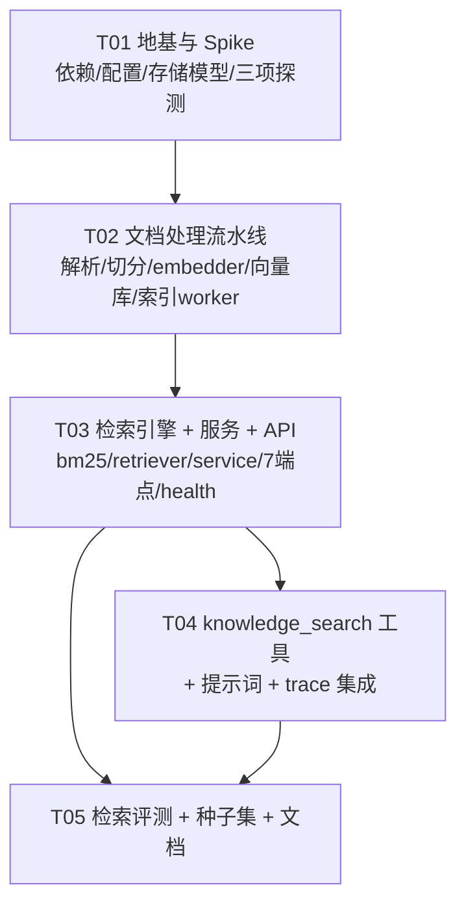

# M2 系统设计 + 任务分解：RAG 知识库接入

> 阶段 5 · M2（第 3-5 周 · 只做 P0，P1 仅预留接口）
> 需求基线：`docs/m2_prd.md`（9 项开放问题已全部拍板）　|　面向：工程师施工图
> 前置依赖：M1 已交付 REST API（`api/`）、任务队列、SSE、`POST /tools/{name}/invoke`。
> 本文只做**设计**，不含实现代码。配套图：`docs/m2_class-diagram.mermaid`、`docs/m2_sequence-diagram.mermaid`。

---

## 0. 结论先行

### 0.1 拍板决策的落点（PRD §8 → 本设计）

| # | 决策 | 落点文件 | 实现要点 |
|---|---|---|---|
| Q1 | DeepSeek 无 embedding API，**本地方案转正** | `rag/embedder.py`、`config.py` | 默认 `embedding_provider="local"`；`"api"` 仅为接口预留，M2 不实现 |
| Q2 | embedding = **本地 bge-small-zh-v1.5**（512 维） | `rag/embedder.py`、`config.py` | 权重路径配置化 + 自动探测（见 §1.4）；懒加载，启动不占时间 |
| Q3 | 向量库 = **sqlite-vec**，受阻降级 chromadb | `rag/vector_store.py`、`scripts/spike_sqlite_vec.py` | `VectorStore` 协议双实现；first-day spike 出结论后固化 `vector_store_backend` 默认值 |
| Q4 | BM25 = **rank_bm25 + jieba**（内存索引） | `rag/bm25.py` | 启动时从 `chunks` 表全量重建（百级 chunk 毫秒级）；写时增量重建 |
| Q5 | chunk = **500 tokens / overlap 80**，标题边界优先 | `rag/splitter.py`、`config.py` | token 估算 = 字符数 / 1.6（与 M1 成本公式同一口径）；单 chunk 上限 480 tokens（模型 max_seq 512 留安全余量） |
| Q6 | `knowledge_search` **不进 HITL** | `core/tools/builtin/knowledge_search.py` | `danger_level="low"`，与 calculator 同级；复用 registry 既有 `call()` 全流程 |
| Q7 | **模型指纹 + 切换强制全量重索引** | `rag/embedder.py`、`storage/models.py`、检索入口 | 指纹 = `sha1(model_name:dim)[:16]`；文档表逐文档存 + `knowledge_meta` 存库级当前值；检索入口不匹配 → 409 `fingerprint_mismatch` |
| Q8 | 混合权重 **BM25 0.4 / 向量 0.6** 起步 | `rag/retriever.py`、`config.py` | 评测脚本支持 `--weights` 网格对比（0.3/0.7、0.4/0.6、0.5/0.5），报告留档后固化 |
| Q9 | 评测集 **≥20 条人工标注**，纯检索层零 LLM | `evaluation/datasets/knowledge_eval.jsonl`、`scripts/eval_retrieval.py` | JSONL：`{"query", "expect_document", "expect_chunk_seq?", "note"}`；指标：top-3 命中率、top-1、recall@5、MRR、逐条明细 |

### 0.2 五大技术风险的结论（这是本文最该看的部分）

| # | 风险 | 结论 | 验证方式（first-day 动作） |
|---|---|---|---|
| ① **sqlite-vec 与 Python 3.14 兼容性**（本项目 `.venv` 是 CPython 3.14，pyc 已证实） | `VectorStore` 双实现 + `create_vector_store()` 工厂，**降级不动上层**。spike 脚本 `scripts/spike_sqlite_vec.py`：Tencent 镜像装 → `conn.load_extension` → 建 vec0 虚拟表 → 插查 10 条 → 计时。任一步失败 → `vector_store_backend="chroma"`（chromadb 0.5+ 声明支持 3.13+，3.14 需实测，双 fallback 链见 §1.2） | T01 内完成，spike 输出写进 `docs/m2_rag.md` 附录 |
| ② **torch/sentence-transformers 在 CPython 3.14 的 wheel 可得性** | 三级降级链：`sentence-transformers + torch(CPU)` → `fastembed`（ONNX，无 torch 依赖，支持 bge 系列）→ 均不可用则仅 API provider（M2 不做）。`EmbeddingProvider` 协议下三者对上层透明 | T01 spike 脚本 `scripts/spike_embedding_stack.py` 试装试跑 `embed(["测试"])` |
| ③ **bge 权重来源**（路径由 `scripts/probe_bge_weights.py` 探测定位，可用 `BGE_SCAN_ROOTS` 覆盖） | `embedding_model_path=""`（默认）→ 启动按探测顺序找：① env/`settings.embedding_model_path` → ② `scripts/probe_bge_weights.py` 在配置的扫描根下按目录名匹配 `bge-small-zh` → ③ hf-mirror.com 下载到 `data/models/bge-small-zh-v1.5/`。**探测结果回填 `.env`，不让运行时每次扫描磁盘** | T01 内运行探测脚本并固化路径 |
| ④ **50 页 PDF ≤2min（CPU）** | 吞吐估算（§1.6）：~120 chunks，解析 2-5s + jieba <1s + bge-small CPU 批量 ~5-15s + 入库 <1s，**常态 ≤30s**，2 分钟有 4 倍余量。降速预案：batch 减半、跳过已索引（file_hash 去重）、极端时 ONNX 导出（P2） | T02 末尾跑 `scripts/bench_index.py` 实测 50 页样例 PDF 计时 |
| ⑤ **embedding 提供商切换** | 指纹校验双闸：检索入口（409 + 提示重索引）与索引入口（新指纹写入后旧向量标记过期）。重索引 = 对每个文档走 retry 通道（P1-4 只做单文档级，M2 够用） | T03 集成测试：改 `EMBEDDING_MODEL_NAME` 后检索 → 409 |

### 0.3 诚实声明（做不到 / 不做的事）

1. **扫描件 PDF 不支持**（PRD L1）：pypdf 提取不到文本层 → `failed("parsing", "文本层缺失，不支持扫描件")`，OCR 明确不做。
2. **BM25 索引在内存**：进程重启需从 DB 重建（毫秒级，可接受）；上万 chunk 规模时才评估 FTS5（Q4 备选）。
3. **检索分数是相对值**（PRD L5）：BM25 原始分与 cosine 量纲不同，落库/展示的是**各自查询内 min-max 归一化后的分**，只用于相对比较。
4. **索引中断恢复是"标记失败"而非"断点续跑"**：进程崩溃时 in-flight 文档在下次启动统一标 `failed("进程重启中断，可重试")`，重试走全量重索引（单文档百级 chunk，秒级，不值得做断点）。
5. **web 控制台知识库页是 P1**：本次只保证 API 完备 + `/console` 页面入口不再置灰所需的数据接口全部就绪，不写前端。
6. **API embedding provider 不实现**：`EmbeddingProvider` 协议预留，`embedding_provider="api"` 配置会被启动校验拒绝并给明确报错。

---

## 1. 实现方案与框架选型

### 1.1 核心难点与解法

| # | 难点 | 本质 | 解法 |
|---|---|---|---|
| D1 | 索引是分钟级长任务，**不能占用 M1 任务队列的 3 个并发槽位**（会饿死 Agent 任务） | 两类工作负载隔离 | 独立 `IndexWorker`：**专职单线程** + `queue.Queue`，跑在进程内；状态持久化到 `documents` 表，轮询可见（不进 SSE——索引进度是分钟粒度，轮询足够） |
| D2 | 单文档失败隔离 | 一个坏文件不能污染全库 | `IndexWorker._process()` 内逐阶段 try/except，异常编码进 `documents.error_stage/error_message`，**绝不冒泡**；worker 主循环永远继续下一个 job（与 `ToolRegistry.call()` 的失败编码纪律一致） |
| D3 | RAG 整体故障不拖垮平台 | 模型加载失败/依赖缺失不能影响 `/health` 与其他工具 | ① rag 重依赖全部**函数内懒加载**（`rag/__init__.py` 不 import 任何重模块）；② `knowledge_search` 走工具边界，服务不可用 → `status="failed"` 记录，不抛异常；③ `/health.rag` 检查项 fail 只贡献 degraded，特判**永不产生 unhealthy** |
| D4 | 混合检索的分数融合 | BM25 无界分 vs cosine [0,1] 量纲不同 | 每路各自在**单次查询候选集内** min-max 归一化到 [0,1]，再加权求和；两路各取 `top_k × 4` 候选保证融合池有交集 |
| D5 | `core` 包引入 RAG 依赖的风险 | `core/tools/builtin/knowledge_search.py` 若在 import 时拉起 torch，未装依赖的环境整个平台崩 | 复用 `web_search.set_search_backend()` 的**模块级注入模式**：`knowledge_search.set_knowledge_service(svc)` 由 `api/deps.py` 装配；工具模块只持有弱引用 + 惰性 import，注册表构造不触发任何模型加载 |
| D6 | 测试不能消耗资源 | embedding 模型重、LLM 烧 token | `EmbeddingProvider` 协议 + `MockEmbedder`（确定性哈希向量，维度可配）；`VectorStore` 用 tmp_path 真 SQLite（sqlite-vec 装上后真用，没装则测试自动 skip 并告警）；LLM 侧沿用 M1 `MockLLMAdapter` 夹具 |
| D7 | planner 提示词 token 预算紧（现 504 字符） | 加"要不要检索"的判断不能膨胀 | 只加**一条判断规则 + 一个示例改写**（约 +130 字符），不解释 RAG 原理；`knowledge_search` 的用法说明由 `ToolRegistry.describe()` 自动渲染进 executor 提示词的工具清单，不重复写 |

### 1.2 选型

| 领域 | 选型 | 理由 | 被否掉的选项 |
|---|---|---|---|
| PDF 解析 | **pypdf ≥5** | 纯 Python、零系统依赖、Windows 友好；文本型 PDF 够用 | PyMuPDF（AGPL + 二进制 wheel 大）、pdfplumber（慢，表格需求用不上） |
| DOCX 解析 | **python-docx ≥1.1** | 事实标准，段落级读取正好喂给切分器 | docx2txt（无结构信息） |
| Markdown/HTML/TXT | **标准库**（`html.parser` 沿用 `web_search.py` 的零依赖纪律）+ 轻量自制行扫描 | Markdown 标题边界就是行首 `#{1,6} `，不值得引 mistune | mistune/markdown-it（切分只需要结构块，不需要 AST） |
| 切分 | **自制 `DocumentSplitter`**（~150 行） | 标题/段落优先 + token 窗口是本项目值得自研的点，引 langchain-text-splitters 反而失去叙事且调参不透明 | langchain-text-splitters |
| Embedding | **sentence-transformers + torch CPU**（fastembed 为 ONNX 备胎） | bge-small-zh-v1.5 官方配方 | API provider（成本+网络依赖+叙事弱，Q2 已否） |
| 向量库 | **sqlite-vec**（chromadb 降级备选） | 与"SQLite 单一存储"哲学一致；同库同事务；备份=拷文件 | FAISS（纯内存自管持久化）、Milvus/Qdrant（独立进程，单机不需要） |
| BM25 | **rank_bm25 + jieba** | 中文分词质量可控；百级 chunk 重建毫秒级 | SQLite FTS5（中文分词器差，Q4 已否） |
| 并发模型 | **专职单线程索引 + FastAPI `def` 路由读** | SQLite 单写者天然友好；索引吞吐瓶颈在模型推理，多线程无收益反增锁复杂度 | 复用 M1 TaskQueue（饿死 Agent 任务）、asyncio 队列（worker 是同步 CPU 密集） |
| 评测 | **自制脚本（纯函数）** | 零 LLM、指标逻辑 100 行内、结果可复现 | ragas 等框架（引入 LLM judge，违背 Q9） |

### 1.3 架构模式

分层 + 门面，与既有代码同构：

```
api/routes/knowledge.py   ← HTTP 边界（Pydantic v2 schema、统一错误、北京时间）
        │
rag/service.py            ← KnowledgeService 门面（唯一编排入口，api/deps 单例）
   ├── rag/ingest.py        IndexWorker（专职线程：parse → chunk → embed → store）
   ├── rag/retriever.py     HybridRetriever（BM25 + 向量并行召回 → 归一化融合）
   ├── rag/bm25.py          BM25Index（内存，jieba 分词）
   ├── rag/vector_store.py  VectorStore 协议（SQLiteVecStore / ChromaStore）
   ├── rag/embedder.py      EmbeddingProvider 协议（LocalBgeEmbedder / MockEmbedder）
   └── rag/parsers.py / splitter.py   纯函数式文档处理
        │
storage/models.py + db.py ← DocumentRecord / ChunkRecord（SQLAlchemy，与 tasks 同库）
```

**依赖方向铁律**：`rag → storage/config`，`core.tools.builtin.knowledge_search →(惰性) rag`，`api → core/rag/storage`。**禁止** rag 反向 import api/core；**禁止** storage import rag。

### 1.4 bge 权重定位与加载（风险③的完整方案）

```
settings.embedding_model_path 非空？
  ├─ 是 → 直接 SentenceTransformer(path)；路径无效 → EmbeddingError("模型路径无效: …")
  └─ 否（默认）→ 依次探测，首个命中即回填（探测逻辑只在 scripts/probe_bge_weights.py 中，
                 运行时读 .env 的固化结果，不做磁盘扫描）：
      ① .env 已有值（上次探测固化）
      ② 常见位置匹配：D:\、E:\、<USER_HOME>\ 下 *ragflow*/…/bge-small-zh* 与
         *bge-small-zh*/（目录名含 sentence_bert/config.json 判定为有效权重）
      ③ hf-mirror.com 下载 BAAI/bge-small-zh-v1.5 到 data/models/bge-small-zh-v1.5/
         （export HF_ENDPOINT=https://hf-mirror.com；~100MB，GitHub/HF 直连均不可用已列入约束）
```

**指纹**：`sha1(f"{model_name}:{dim}")[:16]`，`model_name` 取目录名或配置的 `embedding_model_name`。写入两处：`knowledge_meta.current_fingerprint`（库级）与 `documents.embedding_fingerprint`（逐文档）。检索入口先比对库级指纹；索引完成的文档必须与库级一致才算 `ready`。

### 1.5 `knowledge_search` 工具契约（对齐既有 5 工具）

```python
# core/tools/builtin/knowledge_search.py
def knowledge_search(
    query: Annotated[str, Field(description="检索问题，1..1000 字符；用自然语言描述要查的知识点")],
    top_k: Annotated[int, Field(ge=1, le=20)] = 5,
) -> str:
    """检索本地知识库并返回带来源引用的相关片段（文档名+chunk 位置+原文+相关度）。"""

def register(registry: ToolRegistry) -> ToolSpec:
    return registry.register(
        knowledge_search, name="knowledge_search",
        description=("检索本地知识库（用户上传的文档）。任务需要依据企业内部文档/上传资料"
                     "作答时必须调用本工具，并基于返回片段与来源引用作答"),
        danger_level="low", timeout=10, retry=1,
    )
```

- 结果格式（进 `ToolCallRecord.result`，单条 chunk 截 500 字符、总长走 registry 的 4000 字符上限截断时**优先保完整引用行**）：

```
共命中 3 条相关片段：
【1】综合布线施工规范.md · chunk 3（字符 1200-1698）｜相关度 0.91（BM25 0.85 / 向量 0.94）
<原文…>
【2】…
```

- 空 knowledge_service 注入 / 空库 / 指纹不匹配 / 检索异常 → 返回结构化失败字符串（如 `检索失败：知识库为空，请先上传文档`），由 `ToolRegistry.call()` 编码为 `status="failed"`，**不抛异常**。

### 1.6 索引吞吐估算（验收 A1 的底气）

50 页文本型 PDF ≈ 4-6 万字符 ≈ 60-120 chunks（500 token 窗口 + 80 overlap）：

| 阶段 | 估算 | 依据 |
|---|---|---|
| pypdf 解析 | 2-5s | 纯 Python 逐页提取，50 页量级 |
| 切分 | <0.5s | 纯字符串处理 |
| bge-small-zh CPU 批量 | 5-15s | batch=32、512 维小模型、现代 CPU AVX2 下 ~10-30 chunks/s 保守估 |
| sqlite-vec 写入 + BM25 重建 | <1s | 千级向量量级 |
| 模型首次加载（每进程一次） | 5-15s | 懒加载，计入首个文档；后续文档为 0 |

**常态合计 ≤35s，对 2 分钟指标有 ≥3 倍余量。** 降速预案（按序启用）：① batch_size 降到 8；② `file_hash` 去重跳过已索引文档；③ chunk 文本超 480 tokens 截断（防 OOM 长尾）；④ ONNX 量化导出（P2，明确不做进 M2）。

---

## 2. 完整文件列表

> 行数 = 预估值（含 docstring 与空行），误差 ±30%。**新增 / 修改分列。**

### 2.1 新增文件

| 相对路径 | 职责 | 预估行数 |
|---|---|---|
| `rag/__init__.py` | **改写空壳**：包 docstring + `__version__`；**不 import 任何子模块**（重依赖懒加载纪律，G4） | 15 |
| `rag/types.py` | `ParsedBlock` / `ParsedDocument` / `Chunk` / `SearchHit` 数据类（slots） | 90 |
| `rag/exceptions.py` | `RagError` 基类 + `ParserError/SplitterError/EmbeddingError/StoreError/FingerprintMismatchError` | 50 |
| `rag/parsers.py` | `parse(file_path) -> ParsedDocument` 按扩展名分发；pdf/md/docx/txt/html 五实现 + `ParseError` 带环节信息 | 260 |
| `rag/splitter.py` | `DocumentSplitter`：标题边界优先 → 段落边界 → token 窗口（500/80，字符↔token 1.6 系数）；chunk 元数据（seq/字符区间） | 180 |
| `rag/embedder.py` | `EmbeddingProvider` 协议 + `LocalBgeEmbedder`（懒加载/批量/fingerprint/health_check）+ `MockEmbedder`（测试桩）+ `create_embedder()` 工厂 | 220 |
| `rag/vector_store.py` | `VectorStore` 协议 + `SQLiteVecStore`（sqlite-vec，vec0 虚拟表）+ `ChromaStore` + `create_vector_store()` 工厂 | 260 |
| `rag/bm25.py` | `BM25Index`：jieba 分词 + BM25Okapi；`rebuild`/`search`（RLock）；候选召回 | 120 |
| `rag/retriever.py` | `HybridRetriever`：双路召回 → min-max 归一化 → 加权融合 → `SearchHit` 回填元数据 | 170 |
| `rag/ingest.py` | `IndexJob` / `IndexWorker`：专职单线程、五阶段状态机、逐文档 try/except、file_hash 去重、启动恢复 | 230 |
| `rag/service.py` | `KnowledgeService` 门面：上传受理/CRUD/重试/overview/search/指纹校验/健康检查/worker 生命周期 | 280 |
| `core/tools/builtin/knowledge_search.py` | 第 6 个内置工具（§1.5 契约）+ `set_knowledge_service()` 注入 + `register()` | 130 |
| `api/routes/knowledge.py` | 7 个端点（§3.1）：上传/列表/详情/删除/重试/检索测试/概览 | 220 |
| `scripts/spike_sqlite_vec.py` | first-day spike：装→加载→建表→插查→计时，输出 PASS/FAIL 结论 | 90 |
| `scripts/spike_embedding_stack.py` | first-day spike：torch+st 试装试跑 → fastembed 备胎 → 输出选型结论 | 90 |
| `scripts/probe_bge_weights.py` | 权重探测（§1.4），结果回填 `.env` 提示 | 110 |
| `scripts/bench_index.py` | 50 页 PDF 索引计时基准（分阶段打印，验收 A1 证据） | 90 |
| `scripts/eval_retrieval.py` | 一键评测入口（thin wrapper → `evaluation.retrieval_eval`） | 80 |
| `evaluation/retrieval_eval.py` | 评测核心：跑标注集 → top3 命中率/top1/recall@5/MRR → JSON+Markdown 报告（`evaluation/reports/`） | 220 |
| `evaluation/datasets/knowledge_eval.jsonl` | ≥20 条弱电标注对（query → 期望文档+chunk） | — |
| `tests/unit/test_rag_parsers.py` | 五格式解析 + 扫描件报错 + 不支持扩展名 | 140 |
| `tests/unit/test_rag_splitter.py` | 标题不跨界 / overlap / 极小 chunk_size / 超大值报错 | 160 |
| `tests/unit/test_rag_retriever.py` | 融合排序、权重 1.0/0.0 与 0.0/1.0 结果不同、空库、MockEmbedder | 150 |
| `tests/integration/test_api_knowledge.py` | 上传五格式/409/422/失败隔离/删除/重试/检索 422/空库 200/指纹 409 | 260 |
| `tests/integration/test_knowledge_tool.py` | 工具注册/调用/trace 含来源引用/空库 failed/不误检索 | 150 |
| `docs/m2_rag.md` | 使用文档：从零复现（探测权重→上传→检索→评测）+ spike 结论附录 | 300 |
| **小计（新增）** | | **≈ 3 905** |

### 2.2 修改文件

| 相对路径 | 改什么 | 预估增量 |
|---|---|---|
| `config.py` | 新增 `# ---- 知识库/RAG ----` 段 14 个字段（§7.1）+ 权重和校验 validator | +80 |
| `.env.example` | 新增 RAG 段（含镜像源与 HF_ENDPOINT 注释） | +25 |
| `storage/models.py` | `DocumentRecord` / `ChunkRecord` / `KnowledgeMeta` 三表 + `as_dict()` | +90 |
| `storage/db.py` | 文档/chunk/meta 的 CRUD（含 `mark_document_stage/failed/ready`）+ `list_all_chunks` | +140 |
| `api/schemas.py` | Knowledge 请求/响应模型 8 个（§3.1） | +130 |
| `api/deps.py` | `get_knowledge_service()`（lru_cache）+ reset 清理 + 装配 `set_knowledge_service` | +45 |
| `api/main.py` | lifespan 增加 `service.initialize()/start_worker()/stop_worker()`；注册 knowledge router | +15 |
| `api/routes/__init__.py` | 导出 `knowledge_router` | +5 |
| `api/routes/health.py` | 增加 `rag` 检查项（fail → degraded，特判不升级 unhealthy） | +35 |
| `api/errors.py` | ErrorCode 增加 6 个（§7.4） | +10 |
| `api/constants.py` | 文档状态常量 `DOC_*` 与 `DOC_TERMINAL`、`AUTH_EXEMPT` 不动 | +12 |
| `core/tools/builtin/__init__.py` | `BUILTIN_REGISTRARS` 追加 `knowledge_search.register`（惰性 import 保底） | +8 |
| `core/llm/prompts/v1/planner.md` | 加 1 条判断规则（§3.4，+130 字符，预算可控） | +2 |
| `core/llm/prompts/v1/executor.md` | 「判断规则」加 1 条：引用检索结果必须带来源（文档名+chunk） | +2 |
| `pyproject.toml` | 新增 6 个依赖；`[tool.mypy] files`/`known-first-party`/`coverage source` 加 `"rag"` | +10 |
| `README.md` | 「知识库」一节（上传→检索→评测三连 curl） | +50 |
| **小计（修改）** | | **≈ +659** |

**总量：新增 ≈ 3 905 行，修改 ≈ 659 行，合计 ≈ 4 560 行。**

---

## 3. 数据结构与接口

### 3.1 Pydantic Schema（`api/schemas.py` 新增量）

```text
# ---------- POST /knowledge/documents（multipart + query 参数 overwrite） ----------
DocumentUploadResponse                 # 201
  document_id      : str               # doc-<hex12>
  filename         : str
  status           : Literal["pending"]
  upload_at        : datetime          # 北京时间 +08:00
  status_url       : str               # GET /knowledge/documents/{id}
  warnings         : list[str]         # 如 "同名文档已存在且 overwrite=true，旧索引已清除"

# ---------- GET /knowledge/documents / {id} ----------
DocumentView                           # 200
  document_id, filename, size_bytes, format,
  status       : Literal["pending","parsing","chunking","embedding","ready","failed"]
  error_stage  : str | None            # parsing/chunking/embedding/queue/unknown
  error_message: str | None
  chunk_count  : int, token_count : int
  embedding_fingerprint : str
  created_at / indexed_at : datetime   # 北京时间 +08:00
DocumentListResponse { items: list[DocumentView], total: int }

# ---------- POST /knowledge/documents/{id}/retry ----------
RetryResponse { document_id, status: "pending", queued: bool }

# ---------- POST /knowledge/search ----------
KnowledgeSearchRequest
  query        : str                   # strip 后 1..1000（field_validator，对齐 TaskSubmitRequest 纪律）
  top_k        : int = 5               # 1..20
  bm25_weight  : float | None = None   # 0..1；None → settings
  vector_weight: float | None = None   # 与上者之和 ≠1 时 422
KnowledgeSearchResponse
  query, top_k, took_ms: int,
  hits: list[SearchHitView]
SearchHitView
  document_name, chunk_seq, start_char, end_char, text,
  bm25_score: float, vector_score: float, score: float    # 归一化后相对分（L5）

# ---------- GET /knowledge/overview ----------
KnowledgeOverview
  document_count, chunk_count, token_count: int
  ready_count, failed_count, indexing_count: int
  fingerprint: str, vector_backend: str, embedding_model: str
  last_indexed_at: datetime | None
```

### 3.2 核心类签名（`rag/`）

```python
# ---------------- rag/embedder.py ----------------
class EmbeddingProvider(Protocol):
    def name(self) -> str: ...
    def dim(self) -> int: ...
    def fingerprint(self) -> str: ...                      # sha1(model_name:dim)[:16]
    def embed(self, texts: Sequence[str]) -> list[list[float]]: ...
    def health_check(self) -> tuple[bool, str]: ...        # 不加载权重也能回答路径/依赖状态

class LocalBgeEmbedder:                                    # 实现 EmbeddingProvider
    def __init__(self, *, model_path: str, model_name: str, batch_size: int, dim: int) -> None
    def _ensure_loaded(self) -> None                       # 首次 embed 才 import torch/st
    def embed(self, texts) -> list[list[float]]            # normalize_embeddings=True，L2 归一

class MockEmbedder:                                        # 测试桩：确定性哈希向量
    def __init__(self, dim: int = 64) -> None

def create_embedder(settings) -> EmbeddingProvider         # provider=="local"→Local/Mock 按 env 开关

# ---------------- rag/vector_store.py ----------------
class VectorStore(Protocol):
    def add(self, chunks: Sequence[Chunk], vectors: list[list[float]]) -> None
    def query(self, vector: list[float], top_k: int) -> list[tuple[str, float]]  # (chunk_id, cosine)
    def delete_document(self, document_id: str) -> None
    def count(self) -> int
    def backend_name(self) -> str

class SQLiteVecStore:                                      # vec0 虚拟表与业务库同 .db 文件
    def __init__(self, db_path: Path, *, dim: int) -> None # load_extension(vec)；独立 sqlite3 连接
class ChromaStore:                                         # persist_dir=data/knowledge/chroma
def create_vector_store(settings, *, dim: int) -> VectorStore

# ---------------- rag/bm25.py / retriever.py ----------------
class BM25Index:
    def rebuild(self, chunks: Sequence[Chunk]) -> None     # jieba.lcut，RLock 内整体替换
    def search(self, query: str, top_k: int) -> list[tuple[str, float]]

class HybridRetriever:
    def __init__(self, *, embedder, store, bm25, bm25_weight, vector_weight, candidate_multiplier=4)
    def search(self, query: str, top_k: int,
               *, weights: tuple[float, float] | None = None,
               metadata_loader: Callable[[list[str]], dict[str, SearchHit]] | None = None
               ) -> list[SearchHit]

# ---------------- rag/ingest.py ----------------
@dataclass(slots=True)
class IndexJob:
    document_id: str
    file_path: Path
    overwrite: bool

class IndexWorker:
    def __init__(self, *, settings, database, embedder, store, on_ready: Callable[[str], None]) -> None
    def enqueue(self, job: IndexJob) -> bool               # 满队列返回 False
    def start(self) -> None / def stop(self) -> None       # daemon 线程 + Event
    def pending_count(self) -> int

# ---------------- rag/service.py ----------------
class KnowledgeService:
    def __init__(self, *, settings, database) -> None
    def initialize(self) -> None                           # 开库/恢复/重建BM25/指纹检查（不加载模型）
    def ingest(self, filename: str, file_path: Path, *, overwrite: bool) -> DocumentRecord
    def search(self, query: str, top_k: int, *, weights=None) -> list[SearchHit]
    def retry_document(self, document_id: str) -> DocumentRecord
    def health_check(self) -> tuple[str, str]              # "ok"/"degraded"/"fail" + detail
    # 另有 get/list/delete_document / overview / check_fingerprint / rebuild_bm25
```

### 3.3 类图

见 `docs/m2_class-diagram.mermaid`（与 §3.2 一致，含关系标注）。

### 3.4 提示词增量（全文级 diff）

`core/llm/prompts/v1/planner.md`「拆解要求」追加第 5 条（+约 130 字符）：

```md
5. 若任务明确要求依据知识库或上传文档作答，相应子步骤写明「用 knowledge_search 检索知识库获取〈X〉」；
   任务不涉及私有文档时，不要硬塞检索步骤。
```

`core/llm/prompts/v1/executor.md`「判断规则」追加第 4 条：

```md
4. 引用 knowledge_search 的结果时，结论中必须标注来源（文档名与片段位置），检索失败时说明原因并继续可完成的步骤。
```

> 约束校验：planner.md 修改后全文 ≈ 640 字符，仍在渲染后 SystemMessage 的安全预算内；工具用法说明由 `ToolRegistry.describe()` 注入 executor 的 `${tool_section}`，**不写死在提示词里**（新增工具零提示词成本的设计在 M1 已成立）。

---

## 4. 程序调用流程

四张时序图见 `docs/m2_sequence-diagram.mermaid`：

1. **图一 · 上传索引流**：`POST /knowledge/documents` → 校验/查重/落盘 → `documents(pending)` → `IndexWorker` 五阶段状态机（parsing → chunking → embedding → ready；任一阶段失败 → `failed(stage, msg)` 只影响自身）→ 客户端轮询 `GET /knowledge/documents/{id}`。
2. **图二 · 检索测试流**：`POST /knowledge/search` → 校验 → 指纹校验（409 分支）→ 空库返回 200+[]（非报错）→ BM25 与向量**并行召回**（各 top_k×4）→ 双路 min-max 归一化 → 加权融合 → 回填元数据 → 200（≤500ms 目标）。
3. **图三 · executor 调 knowledge_search 流**：executor 决策 → `ToolRegistry.call("knowledge_search")`（danger=low 直接放行）→ 工具函数 → `KnowledgeService.search` → 成功：带来源引用的字符串化结果；失败：结构化失败字符串（不抛异常）→ `ToolCallRecord` 经既有通道落 trace → 验收 A3 达成。
4. **图四 · 启动初始化流**：lifespan → `get_knowledge_service()` → 开向量库（sqlite-vec 加载失败即降级 ChromaStore）→ 重启恢复（in-flight 文档标 failed 可重试）→ BM25 重建 → 惰性探活 → `set_knowledge_service` 注入 → `start_worker()` → `/health.rag` 生效。

---

## 5. 任务列表（有序 · 含依赖 · 每任务可独立验证）

> 五个任务对应 3 周节奏：T01 第 1 周初（spike 决定技术底盘）→ T02 第 1-2 周（流水线）→ T03 第 2 周（服务+API）→ T04 第 2-3 周（工具集成，可与 T03 尾部并行）→ T05 第 3 周（评测+文档收口）。所有任务统一遵守 §7 共享约定。

### T01 · 地基与 Spike：依赖底盘、配置、存储模型、三项探测

- **依赖**：无
- **优先级**：P0
- **涉及文件**：
  - 新：`rag/__init__.py`（改写）、`rag/types.py`、`rag/exceptions.py`、`scripts/spike_sqlite_vec.py`、`scripts/spike_embedding_stack.py`、`scripts/probe_bge_weights.py`
  - 改：`config.py`、`.env.example`、`storage/models.py`、`pyproject.toml`
- **子步骤**：
  1. `pyproject.toml`：dependencies 增加 `pypdf>=5`、`python-docx>=1.1`、`rank-bm25>=0.2`、`jieba>=0.42`、`sentence-transformers>=3`、`sqlite-vec>=0.1`（chromadb 不进基础依赖，降级时再装）；安装走 `-i https://mirrors.cloud.tencent.com/pypi/simple`；`[tool.mypy] files`、`known-first-party`、`coverage source` 加 `"rag"`。
  2. **跑 spike①**：`python scripts/spike_sqlite_vec.py`（装→load_extension→vec0 建表→插 10 条→KNN 查询→计时）。PASS → `.env` 固化 `VECTOR_STORE_BACKEND=sqlite-vec`；FAIL → 装 chromadb、固化 `chroma`，并在 `docs/m2_rag.md` 附录记录失败原因。
  3. **跑 spike②**：`python scripts/spike_embedding_stack.py`。确认 torch+sentence-transformers 在 CPython 3.14 可用；不可用则试 fastembed；两者皆败 → 需人工决策（换 Python 3.13 venv 或改 API provider，这是唯一需要升级决策的点）。
  4. **跑权重探测**：`python scripts/probe_bge_weights.py`（§1.4 探测序），把命中路径写进 `.env` 的 `EMBEDDING_MODEL_PATH`；无命中则走 hf-mirror 下载到 `data/models/`。
  5. `config.py`：新增 §7.1 的 14 个字段 + `bm25_weight + vector_weight ≈ 1`（±0.01）的 model_validator（不满足则告警并归一化）。
  6. `storage/models.py`：`DocumentRecord`（含 `file_hash`、`embedding_fingerprint`、`error_stage/error_message`）、`ChunkRecord`（`document_id` 外键 + `seq` 唯一约束）、`KnowledgeMeta`（key/value，存库级指纹）。
  7. `rag/types.py` + `rag/exceptions.py`：数据类与异常层级；`Chunk` 带 `chunk_id = f"{document_id}:{seq:04d}"`。
- **验证方式**：
  - 三个 spike/探测脚本各产出明确结论并回填 `.env`（这是本任务的核心交付物，**结论必须回填到 `.env` 与 `docs/m2_rag.md`**）；
  - `uv sync`（或 `pip install -e . -i <腾讯镜像>`）通过；`pytest tests/ -q` 全绿（现有用例不受影响）；
  - `EMBEDDING_BATCH_SIZE=8 python -c "from config import get_settings; print(get_settings().embedding_batch_size)"` → 8（配置覆盖生效）。

### T02 · 文档处理流水线：解析 → 切分 → 向量化 → 入库

- **依赖**：T01
- **优先级**：P0
- **涉及文件**：新 `rag/parsers.py`、`rag/splitter.py`、`rag/embedder.py`、`rag/vector_store.py`、`rag/ingest.py`、`scripts/bench_index.py`、`tests/unit/test_rag_parsers.py`、`tests/unit/test_rag_splitter.py`
- **子步骤**：
  1. `parsers.py`：`parse()` 按扩展名分发（不区分大小写）；PDF 空文本层 → `ParserError("文本层缺失，不支持扫描件")`；未知扩展名在**路由层** 422（解析器只认白名单）。
  2. `splitter.py`：`ParsedDocument.blocks` → 标题块边界优先切 → 超窗口段落再按段落切 → token 窗口滑切（overlap=80）；`chunk_size=64` 可正常工作；单 chunk 超 480 tokens 截断并 WARNING；`chunk_size > 480` 时启动校验直接报错（不静默）。
  3. `embedder.py`：懒加载 + 批量 `encode(..., normalize_embeddings=True, batch_size)`；`MockEmbedder`（哈希向量）仅测试可见。
  4. `vector_store.py`：两个实现 + 工厂；`SQLiteVecStore` 用独立 sqlite3 连接（**PRAGMA WAL/busy_timeout 与主库一致**——M1 教训：两条连接都要设）。
  5. `ingest.py`：`IndexWorker`（§3.2 签名）；五阶段落库；`file_hash` 相同且已 ready → 跳过并 WARNING；`on_ready` 回调触发 BM25 增量重建。
  6. `bench_index.py`：生成/读取 50 页样例 PDF → 分阶段计时打印 → 输出与 120s 指标的对比结论。
- **验证方式**：
  - `pytest tests/unit/test_rag_parsers.py tests/unit/test_rag_splitter.py -q` 全绿；
  - 手工脚本：五格式样例各走一遍 `parse→split→embed→store`，重启进程后 `store.query` 仍可命中（持久化）；
  - `python scripts/bench_index.py` 实测 ≤2 分钟（期望 ≤35s）。

### T03 · 检索引擎 + 知识服务 + API 端点

- **依赖**：T02
- **优先级**：P0
- **涉及文件**：新 `rag/bm25.py`、`rag/retriever.py`、`rag/service.py`、`api/routes/knowledge.py`、`tests/integration/test_api_knowledge.py`；改 `storage/db.py`、`api/schemas.py`、`api/deps.py`、`api/main.py`、`api/routes/__init__.py`、`api/routes/health.py`、`api/errors.py`、`api/constants.py`
- **子步骤**：
  1. `bm25.py` / `retriever.py`：按 §3.2；归一化只在候选集内做（不同查询间分数不可比）；`weights=(1,0)` 与 `(0,1)` 必须产生不同排序。
  2. `service.py`：门面（§3.2）；`initialize()` 做重启恢复与 BM25 重建但**不加载模型**；`check_fingerprint()` 在 search 入口调用。
  3. `storage/db.py`：文档/chunk/meta CRUD；`mark_document_*` 沿用 M1 CAS 风格（`UPDATE ... WHERE status IN (预期前置态)`，返回 bool）。
  4. 7 个端点（§3.1）；上传路由 `def`（文件保存是同步 IO，交给线程池）；`POST /knowledge/search` 用 `def`（可能触发模型首次加载，不能阻塞 loop）。
  5. `health.py`：`rag` 检查项 = `service.health_check()`（向量库可达 + 模型路径在 + 依赖在）；**rag=fail 时整体只到 degraded**（特判，与 redis 同口径，PRD P0-7 验收 3）。
  6. `deps.py`：`get_knowledge_service()` lru_cache 单例 + `reset_api_caches()` 补清理。
- **验证方式**（curl 清单，对齐 M1 T03 风格）：
  - 五格式上传 → 201 → 轮询到 ready；损坏 PDF → 仅它 failed 且 error_stage=parsing，其余 4 份 ready（失败隔离）；
  - 同名 → 409；`?overwrite=true` → 旧 chunk 清除重建；`curl /knowledge/search -d '{"query":"六类线施工弯曲半径要求"}'` → 200 带三路分数与来源引用；
  - 空 query → 422；空库 search → 200 `hits: []`；改 `EMBEDDING_MODEL_NAME` 后 search → 409 `fingerprint_mismatch`；
  - **重启 API 进程后检索立即可用**（持久化验收）；人为改坏模型路径 → `/health` 200+degraded+rag fail，任务提交与 calculator 完全正常。

### T04 · knowledge_search 工具 + 提示词 + 编排集成

- **依赖**：T03（需要 service 与检索就绪；T03 的 API 契约稳定后可提前写工具壳）
- **优先级**：P0
- **涉及文件**：新 `core/tools/builtin/knowledge_search.py`、`tests/integration/test_knowledge_tool.py`；改 `core/tools/builtin/__init__.py`、`core/llm/prompts/v1/planner.md`、`core/llm/prompts/v1/executor.md`、`api/deps.py`（工具注入装配，若无则并入 T03）
- **子步骤**：
  1. 工具实现（§1.5 契约）：`Annotated` 参数自动 Schema、`set_knowledge_service()` 注入、结果格式化（引用行完整优先）、失败字符串化。
  2. `BUILTIN_REGISTRARS` 追加注册（惰性 import，未装 rag 依赖时 `register` 抛出的异常被 `load_builtin_tools` 记 WARNING 跳过——平台其余 5 工具照常）。
  3. 两条提示词增量（§3.4 全文 diff，工程师逐字落盘，不要自行扩写）。
  4. `deps.py`：构造 service 后调用 `knowledge_search.set_knowledge_service(service)`；`get_tool_registry()` 顺序保证工具注册先于注入。
- **验证方式**：
  - `POST /tools/knowledge_search/invoke -d '{"args":{"query":"门禁系统两种联网方式"}}'` → 200 success，result 含来源引用；
  - 空库调用 → `status="failed"` 且原因明确，executor 拿到后不崩（Mock runner 集成用例）；
  - 走 Mock LLM 提交「根据知识库说明六类线施工规范」任务 → trace（`TraceStore.for_task`）中 `knowledge_search` 记录含 query/top_k/命中/来源引用/耗时（验收 A3）；提交「1+1 等于几」→ trace 无 knowledge_search 调用（planner 不误导，抽 3 条样本）；
  - `pytest tests/integration/test_knowledge_tool.py -q` 全绿且零真实 token。

### T05 · 检索评测 + 种子数据 + 文档收口

- **依赖**：T03（T04 完成后收口最顺，但评测本身只依赖 T03）
- **优先级**：P0
- **涉及文件**：新 `evaluation/retrieval_eval.py`、`evaluation/datasets/knowledge_eval.jsonl`、`scripts/eval_retrieval.py`、`docs/m2_rag.md`、`tests/unit/test_rag_retriever.py`（并入 T03 的可以在此补融合用例）；改 `README.md`
- **子步骤**：
  1. 种子语料：3-5 份弱电文档（综合布线/安防监控/门禁系统，Markdown 为主）入 `evaluation/fixtures/` 或直接由用户上传；
  2. `knowledge_eval.jsonl`：≥20 条（起点 25 条，覆盖术语缩写类「POE 供电标准」、参数类「六类线弯曲半径」、流程类「门禁联网方式」三种题型）；
  3. `retrieval_eval.py`：`--weights bm25:vector`、`--top_k`、`--dataset`、`--report-dir`；输出 top-3 命中率 / top-1 / recall@5 / MRR + 逐条命中明细；默认跑 0.3/0.7、0.4/0.6、0.5/0.5 三组对照（Q8 固化依据）；报告落 `evaluation/reports/eval_YYYYMMDD_HHMMSS.{json,md}`；
  4. `docs/m2_rag.md`：从零复现手册（探测权重 → 上传 → 检索 → 评测）+ spike 结论 + 已知限制（§0.3）；README 增「知识库」节。
- **验证方式**：
  - `python scripts/eval_retrieval.py` 零 LLM 调用（可断网跑），产出报告且 **top-3 命中率 ≥ 80%**（G2 出口口径）；
  - `--weights 1.0:0.0` 与 `--weights 0.0:1.0` 报告数字不同（混合生效的证据，PRD P0-4 验收 2）；
  - 按 `docs/m2_rag.md` 在干净目录从零走完全流程（验收 DoD 最后一条）。

### 5.6 任务依赖图



> T04 与 T05 在 T03 完成后可并行；T05 的指标报告最终以 T04 集成后的默认配置为准出一次终版。

---

## 6. 依赖包清单

安装命令（统一走腾讯镜像；本机 HF 直连与 GitHub 大文件下载均不可用）：

```bash
pip install -i https://mirrors.cloud.tencent.com/pypi/simple \
  pypdf>=5 python-docx>=1.1 rank-bm25>=0.2.2 jieba>=0.42.1 \
  sentence-transformers>=3.0 sqlite-vec>=0.1.6
# 降级备选（仅 spike 失败时）：
pip install -i https://mirrors.cloud.tencent.com/pypi/simple chromadb fastembed
# bge 权重下载（若无本地遗留权重）：
export HF_ENDPOINT=https://hf-mirror.com && hf download BAAI/bge-small-zh-v1.5 --local-dir data/models/bge-small-zh-v1.5
```

| 包 | 版本 | 用途 | 风险注记 |
|---|---|---|---|
| `pypdf` | `>=5` | PDF 文本提取 | 纯 Python，无风险 |
| `python-docx` | `>=1.1` | DOCX 段落解析 | — |
| `rank-bm25` | `>=0.2.2` | BM25 关键词检索 | 内存索引，重启重建 |
| `jieba` | `>=0.42.1` | 中文分词 | 首次 import 构建前缀词典 ~1s |
| `sentence-transformers` | `>=3.0` | bge 加载与批量推理 | **CPython 3.14 wheel 可得性待 spike②**；连带 torch（Tencent 镜像 CPU 版） |
| `sqlite-vec` | `>=0.1.6` | 向量检索扩展 | **Python 3.14 兼容性待 spike①**；失败 → chromadb |
| `chromadb` | `>=0.5`（备选） | 降级向量库 | 不进基础依赖 |
| `fastembed` | `>=0.4`（备选） | ONNX embedding（无 torch） | spike② 备胎 |
| `python-multipart` | 已有 | multipart 文件上传 | ✅ 已在 site-packages |
| `httpx` / `pytest` / `pydantic` / `sqlalchemy` | 已有 | 沿用 M1 | ✅ |

---

## 7. 共享知识（跨文件统一约定 · 所有人必须遵守）

### 7.1 新增配置（`config.py` `# ---- 知识库/RAG ----`，前缀 `knowledge_` / 领域前缀，全部可被环境变量覆盖）

| 字段 | 默认 | 说明 |
|---|---|---|
| `knowledge_dir` | `data/knowledge` | 文件存 `files/` 子目录，相对路径相对 PROJECT_ROOT |
| `embedding_provider` | `"local"` | 仅支持 `local`；`api` 启动校验报错 |
| `embedding_model_path` | `""` | 空 → 探测脚本回填 `.env` |
| `embedding_model_name` | `"bge-small-zh-v1.5"` | 指纹与展示用 |
| `embedding_dim` | `512` | bge-small-zh-v1.5 维度 |
| `embedding_batch_size` | `32` | CPU 批量；降速预案第一步调 8 |
| `chunk_size` / `chunk_overlap` | `500` / `80` | token 口径；`chunk_size` 校验 ≤480 |
| `bm25_weight` / `vector_weight` | `0.4` / `0.6` | 和 ≈1 校验（validator 告警并归一化） |
| `knowledge_top_k` | `5` | 检索默认值 |
| `knowledge_max_file_mb` | `50` | 上传上限 |
| `vector_store_backend` | `"sqlite-vec"` | spike 结论固化；备选 `chroma` |
| `knowledge_queue_max_size` | `20` | 索引队列容量，满 → 429 |

### 7.2 文档状态机（唯一来源：`api/constants.py`）

```python
DOC_PENDING = "pending"; DOC_PARSING = "parsing"; DOC_CHUNKING = "chunking"
DOC_EMBEDDING = "embedding"; DOC_READY = "ready"; DOC_FAILED = "failed"
DOC_INDEXING_STATUSES = frozenset({"pending","parsing","chunking","embedding"})
```

迁移只允许 `IndexWorker` 经 `Database.mark_document_stage/failed/ready` 写（带前置态 CAS）；路由层只写 `pending`（INSERT）与终态删除。禁止绕过。

### 7.3 错误码增量（唯一来源：`api/errors.py::ErrorCode`）

| code | HTTP | 触发点 |
|---|---|---|
| `document_not_found` | 404 | 文档详情/删除/重试 |
| `duplicate_document` | 409 | 同名上传且未 overwrite |
| `unsupported_format` | 422 | 非 pdf/md/docx/txt/html |
| `file_too_large` | 422 | 超 `knowledge_max_file_mb` |
| `fingerprint_mismatch` | 409 | 检索时库级指纹与配置不一致（提示全量重索引） |
| `rag_unavailable` | 503 | RAG 服务未初始化/依赖缺失（health degraded 时检索端点） |

统一响应体沿用 M1：`{"detail": {"code", "message", "request_id"}}`。

### 7.4 懒加载纪律（G4 的生命线）

- `rag/__init__.py` **禁止** import 子模块；`sentence-transformers`/`torch`/`sqlite_vec`/`jieba` 只能在函数体内 import；
- `core/tools/builtin/knowledge_search.py` 只在 `register()` 内惰性 import `rag.service`；
- 未装 RAG 依赖的环境：API 可启动、5 个旧工具可用、`/health` rag 项 fail+degraded、`/knowledge/*` 返回 503 `rag_unavailable`。

### 7.5 其余沿用 M1 的约定（不重复展开）

时间一律北京时间 `+08:00`（`core.llm.pricing.now` / `to_cn`）；错误响应 `{detail:{code,message,request_id}}`；`def` vs `async def` 路由纪律（本设计新端点全为 `def`）；SQLite 两类连接（SQLAlchemy 与裸 sqlite3——`SQLiteVecStore` 属后者）**都要**设 WAL/busy_timeout；日志 `logging.getLogger(__name__)`、索引关键节点必带 `document_id`；测试改 env 后必须 `reset_settings_cache()` + `reset_api_caches()`。

### 7.6 ID 与路径约定

- `document_id = f"doc-{uuid4().hex[:12]}"`；`chunk_id = f"{document_id}:{seq:04d}"`；
- 上传文件落 `knowledge_dir/files/{document_id}_{安全化文件名}`（文件名去路径分隔符与控制字符）；
- `file_hash` = sha256 文件内容，用于 overwrite 判断与去重跳过。

---

## 8. 已知限制与风险（M2 新增部分）

| # | 风险 | 影响 | 缓解 |
|---|---|---|---|
| R-M2-1 | CPython 3.14 生态（torch / sqlite-vec wheel） | 底盘选型受阻 | 三级降级链已设计（§0.2①②）；唯一升级点：两条链全败 → 需人工决策换 venv |
| R-M2-2 | bge 权重探测不到（D:\ 枚举被沙箱限制） | 索引无法启动 | hf-mirror 兜底下载（~100MB，一次即可）；探测脚本结果固化 `.env` |
| R-M2-3 | sqlite-vec 与 WAL 并存 | 写入异常（理论） | spike① 覆盖 WAL 场景；异常则 ChromaStore 独立目录 |
| R-M2-4 | jieba 分词质量影响 BM25 召回 | 命中率下降 | 评测逐条明细可定位；术语可加自定义词典（`jieba.add_word`，P2） |
| R-M2-5 | 索引线程与 API 线程并发写同一 SQLite | 偶发 busy | WAL + busy_timeout=5000（M1 已设，双连接对齐）；索引写入批量小，冲突概率低 |
| R-M2-6 | 50 页指标在低配 CPU 不达标 | A1 验收风险 | 4 倍余量 + §1.6 降速预案；bench 脚本周内出实测数 |

---

## 9. 待明确事项 / 对 PRD 的技术性偏离

| # | 事项 | 我的判断 | 建议 |
|---|---|---|---|
| A1 | PRD P0-2「chunk 元数据含字符位置区间」与向量库同存的实现边界 | chunk **元数据**放 SQLAlchemy `chunks` 表，**向量**放 vec0 虚拟表（同 .db 文件，chunk_id 关联）——sqlite-vec 虚拟表不适合存长文本 | 已按此设计；备份仍 = 拷整个 data/ 目录 |
| A2 | PRD P0-1 上传接口未定 multipart 细节 | `POST /knowledge/documents`：multipart 字段 `file` + query 参数 `overwrite`（可选），不用 JSON body 包 base64 | 无 |
| A3 | 索引进度是否进 SSE | **不进**：分钟粒度轮询足够，且 IndexWorker 在独立线程，接 EventBus 需跨线程桥接收益为零 | 轮询 `GET /knowledge/documents/{id}`；P1 控制台页同口径 |
| A4 | 重试（retry）语义 | 从 parsing 全量重跑（不做阶段断点）；单文档秒级成本，复杂度不值得 | 无 |
| A5 | `embedding_dim` 可配置的风险 | 改维度必然指纹变化触发重索引，属于 Q7 既有语义 | 保留可配，文档标注"改了就要重索引" |
| A6 | 评测种子文档的来源 | 由用户本人提供 3-5 份弱电文档 + 自标 20+ 条（Q9 口径）；工程师先以公开综合布线规范摘要占位跑通链路 | **需要在 T05 前交付标注集** |
| A7 | P1 控制台「知识库」页接口预留 | 7 个端点已覆盖 P1-2 全部数据需求（overview/上传/列表/重试/删除/检索测试），P1 无需新增后端 | 无 |
| A8 | spike 全败时的工期影响 | T01 顺延 1-2 天，其余任务结构不变（抽象层已隔离） | 触发时立即上报，不动上游排期 |

---

## 附：工程师最容易踩的 5 个坑（速查）

1. **懒加载破功**：`rag/__init__.py` 或 `knowledge_search.py` 模块级 import torch/sqlite_vec → 未装依赖环境整个平台起不来。重依赖只能在函数体内 import。
2. **两条 SQLite 连接只改一边**：`SQLiteVecStore` 是裸 sqlite3 连接，WAL/busy_timeout 必须与 SQLAlchemy 侧一致（M1 §8.6 教训重演会以"database is locked"的形式还回来）。
3. **索引 worker 复用 M1 队列槽位**：会把 Agent 任务饿死。索引走独立专职线程，两套队列互不知晓。
4. **指纹校验只做一半**：库级指纹（`knowledge_meta`）管检索入口，逐文档指纹管 `ready` 判定——只查库级会让"换模型后新上传"的文档与旧向量混存。
5. **BM25 忘了重建**：删除/覆盖/重试文档后必须 `rebuild_bm25()`（或走 `on_ready` 回调），否则内存索引与 DB 脱节，检索出幽灵 chunk。

---

*文档结束。实现过程中如遇与本文冲突的既有代码，以本文为准；若本文与 `docs/m2_prd.md` 冲突（尤其 §8 拍板结论），以 `docs/m2_prd.md` 为准。*
