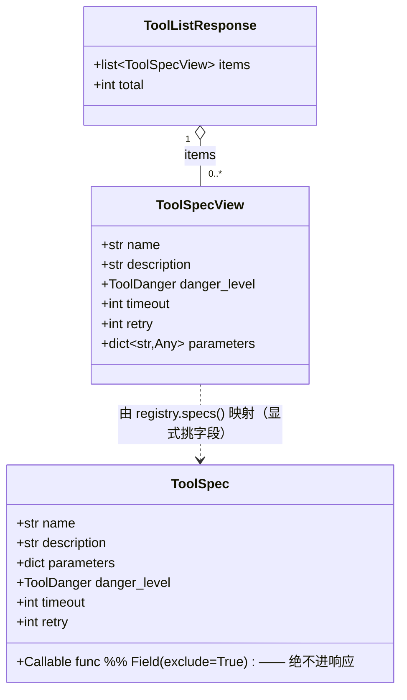
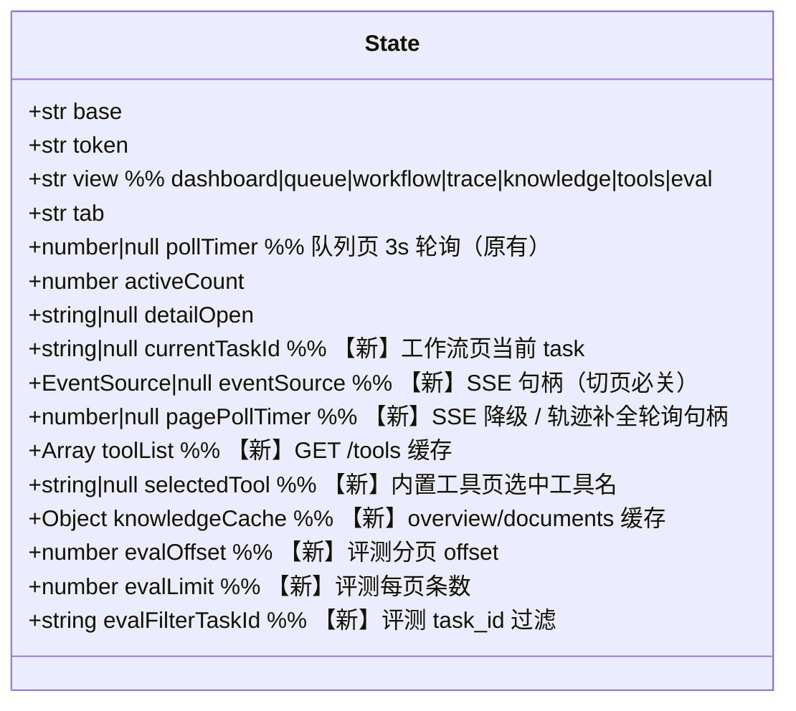
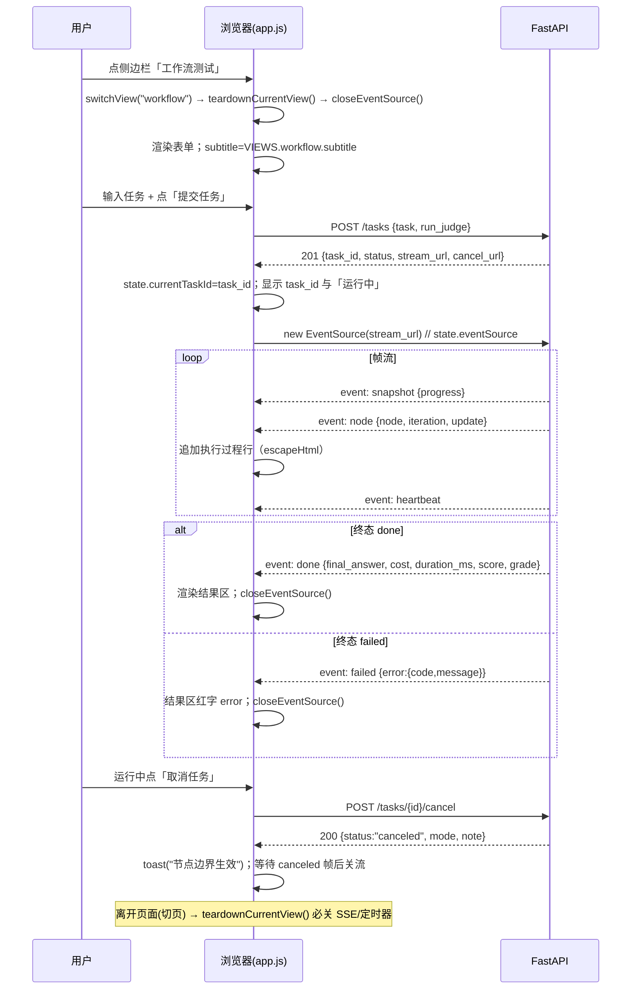
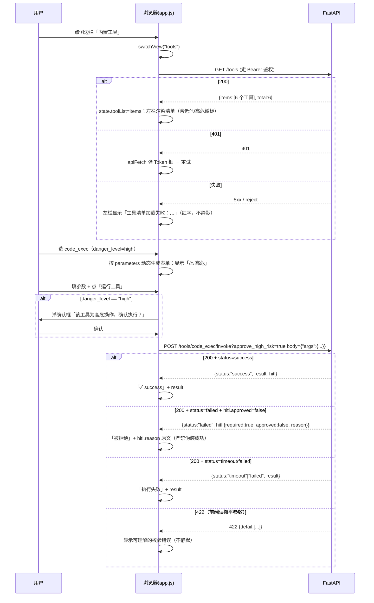
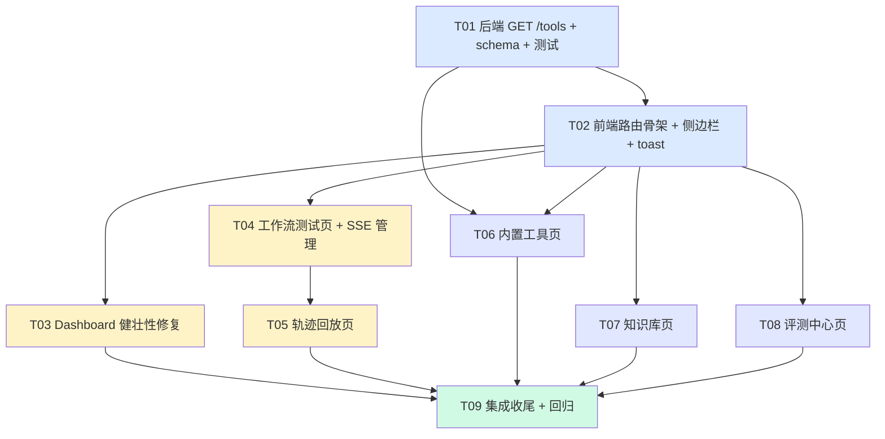

# M2 增量系统设计 + 任务分解：侧边栏接入 + Dashboard 空态改造

> 阶段 5 · M2 前端可用性修复
> 上游权威需求：`docs/m2_sidebar_prd.md`（本设计**不重述需求**，只给实现方案）
> 基线纪律：`pytest tests -q` → **379 passed / 0 failed**，本轮结束后必须保持全绿。
> 事实标注：**「已实测确认」= 主理人实测 / 我读代码逐行核对；「读代码推断」= 高置信但未运行验证。**

---

## 0. 事实校准（先纠三个容易踩的点）

| # | 事实 | 来源 | 影响 |
|---|---|---|---|
| F1 | **`tests/integration/test_api_tools.py` 已存在（82 行）**，已覆盖 `invoke` 成功 / 404 / 校验失败 / HITL 三态。 | 已读文件 | 任务表里它是**「修改」而非「新增」**；新测试追加在同一文件，**不得**新建 `test_api_tools_list.py` 之外的重名文件（可直接追加）。 |
| F2 | `api/schemas.py` 的 `__all__` 是**显式列表**（445-477 行），新增模型必须同步加进 `__all__`。 | 已读文件 | 漏加不报错但违反该模块纪律，审查会拦。 |
| F3 | `GET /tasks?limit=10` 实测有 8 条真实任务，但 Dashboard 的 `today`/`daily` 口径为空 — **两者口径不同，不是 bug**。 | PRD §2.A 补充 | Dashboard 空态与「最近任务」有数据**可以并存**，不属于矛盾。 |

---

## Part A：系统设计

### 1. 实现方案与关键技术决策

#### 1.1 `GET /tools` 端点设计（最重要、最易踩坑）

**放哪**：`api/routes/tools.py`（复用现有 `router`，`prefix=""`、`tags=["tools"]`）。**不新建文件、不改 `api/routes/__init__.py`**（router 已被 `ROUTES` 收录）。

**方法定义：`def`（同步）——理由（硬约束）**：
- 端点做的事是「读内存里的注册表 `registry.specs()` → 映射成 pydantic 模型」，**零 DB、零网络、零 LLM**，是纯内存读。
- 对照 `api/routes/tasks.py` 顶部既有选择表：`GET /tasks/{id}` 因「纯 DB 读」用 `def` 交给线程池；本端点更轻，**同属 `def` 一类**。
- 关键反例：本端点**绝不能**用 `async def` 去 await 任何东西（没有可 await 的对象），也**绝不能**触碰 `asyncio.Queue` / `EventBus`（那是 `tasks.py` 用 `async def` 的原因）。选 `def` 完全符合既有纪律。

**response_model**：`ToolListResponse`（新建），字段 `items: list[ToolSpecView]` + `total: int`。

**`ToolSpec.func` 的序列化排除（CRITICAL，踩坑点）**：
- `ToolSpec.func` 是 `Field(exclude=True)`（registry.py 第 74 行）。`exclude=True` 只作用于 **`model_dump()` 的默认行为**，它**不能**保证「FastAPI 拿 `ToolSpec` 当 `response_model` 时会自动剔除 `func`」——`Callable` 字段会进 OpenAPI schema 并可能触发序列化告警。
- **因此必须新建一个显式 schema 模型 `ToolSpecView`，逐字段挑出 `name / description / danger_level / timeout / retry / parameters`，完全不含 `func`**。**禁止** `response_model=ToolSpec`、**禁止** `-> list[ToolSpec]`、**禁止**把 `ToolSpec` 直接丢给 FastAPI。
- 映射用 `ToolSpecView.model_validate(spec.model_dump())` 或显式构造皆可，但**推荐显式构造 6 个字段**——显式即自证「没有 func」。

```python
# api/routes/tools.py（追加，示意签名，不写函数体）
@router.get("/tools", response_model=ToolListResponse, summary="列出全部内置工具规格（只读）")
def list_tools_endpoint() -> ToolListResponse: ...
```
- 依赖：`registry = get_tool_registry()`（`api/deps.py` 第 69 行，与 `invoke` 同源）。
- 注意**命名冲突**：`api/routes/tools.py` 目前未 import `list_tools`，但 `core/tools/registry.py` 有**模块级函数 `list_tools()`**（第 346 行）。若工程师 `from core.tools.registry import list_tools`，会与路由函数名撞名。**约定：本文件的处理函数命名为 `get_tools()`（或 `list_tools_endpoint()`），不要叫 `list_tools`。**
- `total` 直接取 `len(items)`，与 `items` 同源，不另算。

**鉴权（CRITICAL，踩坑点）**：
- `AUTH_EXEMPT_PREFIXES = ("/docs", "/redoc", "/openapi.json", "/console")`，`AUTH_EXEMPT_PATHS = {"/health", "/docs", "/openapi.json", "/redoc"}`。**`/tools` 不在任何豁免名单**（已读 `api/constants.py` 第 110-114 行确认）。
- 结论：**`GET /tools` 会走 Bearer 鉴权**（`api/main.py` 的 `auth_middleware` 对非豁免路径调 `verify_token`）。这与现有 `POST /tools/{name}/invoke` 行为一致，**不需要也不应该加豁免**（加豁免会把工具元数据暴露给未鉴权者，且破坏既有安全边界）。
- 前端由 `apiFetch()` 统一处理 401 → 弹 Token 框，**无需额外代码**。

**性能**：`registry.specs()` 是 `[self._specs[k] for k in sorted(...)]`（第 200 行），6 个元素的排序 + 列表推导，**微秒级**，满足 PRD ≤100ms 且零 token。

**契约样例（工程师自查用）**：
```
GET /tools → 200
{
  "items": [
    {"name":"calculator","description":"...","danger_level":"low","timeout":5,"retry":0,
     "parameters":{"type":"object","properties":{"expression":{"type":"string"}},"required":["expression"]}},
    {"name":"code_exec","danger_level":"high","timeout":0,"retry":0, ...},
    {"name":"extract","danger_level":"low","timeout":60,"retry":1, ...},
    {"name":"file_io","danger_level":"high","timeout":10,"retry":1, ...},
    {"name":"knowledge_search","danger_level":"low","timeout":10,"retry":1, ...},
    {"name":"web_search","danger_level":"low","timeout":15,"retry":2, ...}
  ],
  "total": 6
}
```
（顺序由 `specs()` 的 `sorted()` 决定，即字母序：calculator / code_exec / extract / file_io / knowledge_search / web_search。）

#### 1.2 前端多视图路由扩展（2 → 7 视图）

**`VIEWS` 表**（app.js 130-133 行）改为 7 项，每项 `{title, subtitle, render}`：

| key | title | subtitle | 对应 DOM 容器 |
|---|---|---|---|
| `dashboard` | Dashboard | 平台运行概览 | `#view-dashboard`（已有） |
| `queue` | 任务队列 | 管理所有异步任务 · 支持取消 | `#view-queue`（已有） |
| `workflow` | 工作流测试 | 提交任务并实时观察 planner → executor → reviewer | `#view-workflow`（新） |
| `trace` | 轨迹回放 | 输入 task_id 复盘一次执行的完整轨迹 | `#view-trace`（新） |
| `knowledge` | 知识库 | RAG 文档索引与检索 | `#view-knowledge`（新） |
| `tools` | 内置工具 | 查看 6 个内置工具并单独试跑 | `#view-tools`（新） |
| `eval` | 评测中心 | 查看评测记录（只读 · 本轮不提供批量评测入口） | `#view-eval`（新） |

**`switchView()` 改造（关键：从硬编码两行 → 循环）**：
- 现在的写法是**写死两行** `$("view-dashboard").style.display = ...; $("view-queue").style.display = ...`（140-141 行）。扩到 7 个视图必须改成**数据驱动**：遍历 `Object.keys(VIEWS)`，对每个 key 设置 `$("view-" + key).style.display = (key === view ? "" : "none")`。
- **同时必须调用 `teardownCurrentView()`**（见 §1.4），在切页**之前**清理旧视图的 SSE / 定时器。
- 侧边栏高亮沿用现有 `document.querySelectorAll(".sidebar-item[data-view]")` 循环（137-139 行），**无需改动**——只要新点亮项带上 `data-view`。
- `refreshCurrentView()`（148-154 行）改为查 `VIEWS[view].render()`，**不再 if/else 硬编码**。

**`index.html` 加容器**：在 `#view-queue` 之后、`.main` 结束之前，依次插入 6 个 `<div id="view-xxx" style="display:none">…</div>`。**统一用 `style="display:none"`，首屏由 `switchView("dashboard")` 或启动逻辑决定可见性。**

**侧边栏 `disabled` 项的两类处置**：
- **本轮点亮（5 项）**：移除 `class="disabled"`、移除 `badge`、加 `data-view="workflow|trace|knowledge|tools|eval"`。
  - ⚠️ **原 badge 文案要删**：工作流测试 / 轨迹回放 / 知识库三项原 badge 是「M2 待接入」，内置工具 / 评测中心原 badge 是「M3 待接入」。点亮后**badge 整个 `<span class="badge">` 标签删掉**，不是改文案。
- **保留灰置（3 项）**：MCP 集成 / Agent 角色 / 提示词工坊 —— **保留 `class="sidebar-item disabled"`，但加 `data-view=""` 不行**（会让选择器命中并 switchView 到空视图）。
  - **正确做法**：这三项**加一个不同属性 `data-unready="mcp|agent|prompt"`**（而非 `data-view`），这样现有 `.sidebar-item[data-view]` 选择器**天然不会命中**，不会误触发 `switchView`。
  - badge 文案改为 `后端未就绪`；加 `title="后端无 MCP 相关端点（本轮不接入）"` 等悬浮说明；**新增一段独立事件绑定**：`document.querySelectorAll(".sidebar-item[data-unready]")` → 点击时 `toast("MCP 集成：后端暂未提供对应端点，本轮不接入")`。
  - 视觉上沿用 `.disabled`（`opacity:.45; cursor:not-allowed`，CSS 47-48 行），**与可点项可区分**。

#### 1.3 Dashboard 渲染健壮性修复（P0-1 ~ P0-5）

**`loadDashboard()` 兜底策略**：
- 现状（158-182 行）：副标题先设「加载中…」，渲染三步（175-177）**无 try/catch**，`loadRecentTasks()`（181）**没 await**。
- 改法：把「指标卡 + 两张图 + 系统面板」三段渲染**包进同一个 `try/catch`**；catch 里把副标题**改写为含失败环节名的错误文案**（如 `渲染失败（系统状态）：<message>`），并**追加一个可见错误提示**（P0-1 验收 2 要求「页面上出现可见错误提示（非静默）」——可在页面顶部插入一条红色横幅 `#dashboard-error`）。**副标题绝不停留在「加载中…」**。
- **成功路径才覆盖副标题**为 `平台运行概览 · 数据生成于 HH:MM:SS`（保留现逻辑）。
- `loadRecentTasks()`：改成 `await loadRecentTasks()` **并**在 `loadDashboard` 外层再包一层 `try/catch`（双保险）；`loadRecentTasks` 内部**已有** try/catch 把错误写进 tbody（264-267 行），保留，并确认「空态文案」与「失败文案」**视觉可区分**（现有：失败红字 `#ef4444`、空态灰字 `#9ca3af`，已满足）。
- 外层 catch 若捕获到 `loadRecentTasks` 抛出的异常（理论上不会，因为内部已吞），也要能接管，**禁止静默**。

**`renderCostChart` 零值基线（P0-3）**：
- 根因：`Math.max(...costs, 0.000001)`（186 行）→ 全 0 时高度 2%（隐形）。
- 改法：**先判断 `daily` 是否「全零」**（`daily.every(d => !Number(d.cost))`）。若全零 → **不进 bar 渲染的塌陷分支**，改为在图表容器内叠加显式空态文案「近 14 天无花费」，**柱子统一给一个可见的零值基线高度**（如固定 4-6px，而不是 2% 的百分比高度），并保留 14 根柱子的日期标签。
- 若非全零 → 保留现有 `max` 归一化逻辑（该分支已正确）。
- **必须保留**：日期标签（`d.date.slice(5)`）、`title` 悬浮 `日期：金额（N 条任务）`、今天柱子的 `.today` 橙色（194-196 行）。

**`renderQualityChart` 空态（P0-4）**：
- 现状：`scored` 全 `null` → 无评分折线；`completion_rate` 全 0 → 折线压在 y=132 底部（211-215 行），视觉像空白。
- 改法：**先算两个条件**：`hasScore = daily.some(d => d.avg_score != null)`、`hasRate = daily.some(d => Number(d.completion_rate) > 0)`。
  - 两者皆假 → 在 SVG 容器上叠加**居中空态文案**「近 14 天暂无评分数据（完成率均为 0%）」，**仍渲染网格**（避免纯空白）。
  - 仅 `hasRate` → 正常画完成率折线 + 叠加「暂无评分数据」提示（**两者共存**，对应 P0-4 验收 3）。
  - 有 `hasScore` → 现状逻辑（折线 ≥2 点才画 `polyline`，点恒画 `circle`）。
- **注意**：现有 `n <= 1` 时 `xOf` 退化（206 行），P1-7 要求单点也画点标记 —— 本轮**不强制**（P1），但空态分支要保证不因此崩溃。

**指标卡 `—` vs `0`（PRD §7 Q5 已定）**：
- `today.count` → `0`（真实值，不得为 `—`）：现 `today.count ?? 0`（169 行）已正确。
- `completion_rate` → `0.0%`（现 `fmtRate` 对 0 返回 `0.0%`，正确）。
- `total_cost` → `¥0`（现 `fmtCost(0)` 返回 `¥0`，正确）。
- `avg_score` → `—`（现 172 行 `today.avg_score == null ? "—"` ，正确）。
- **结论：这 4 个指标的取值逻辑现状已符合 Q5，本任务只需确认空态下不被外层异常短路**（即确保兜底后仍能跑到赋值），**不要无谓重写**。

**`renderSystemPanel` 空态**：现状对 `system` 为空对象时仍渲染 4 行（`system.llm_configured` 等取 undefined → 走 falsy 分支，显示「未配置 Key」等），**不会空白**。已满足 P0-5 验收 2。⚠️ 但若 `system` 为 `undefined`，`loadDashboard` 传的是 `stats.system || {}`（177 行），已兜住。**保留该 `|| {}`**。

#### 1.4 SSE 订阅管理（工作流测试页 + 轨迹回放页共用）

**这是最容易泄漏的地方，纪律如下**：
- **`EventSource` 全生命周期由 `state.eventSource` 一个句柄持有**，新建前**必须先关旧的**（`closeEventSource()` 幂等：`if (state.eventSource) { state.eventSource.close(); state.eventSource = null; }`）。
- **切页必关**：`switchView()` 在切换前调 `teardownCurrentView()`，其中包含 `closeEventSource()` 与 `stopTracePolling()`。这样「反复进出 5 次」不会累积连接（PRD 验收）。
- **SSE 与队列页 3s 轮询互不干扰**：
  - `schedulePolling()`（477-486 行）已自检 `state.view === "queue" && !document.hidden`，**只在队列页跑**。
  - 工作流测试页 / 轨迹回放页**不要复用 `state.pollTimer`**，各自用独立句柄 `state.tracePollTimer`（如需补全运行中任务的轨迹），并在 `teardownCurrentView()` 里 `clearInterval`。
  - 终态到达（`done`/`failed`/`canceled` 事件）→ **立即 `closeEventSource()`**，并把结果区渲染出来。同时刷新 `state.activeCount` 相关不影响。
- **SSE 事件与契约**（已读 `api/routes/tasks.py` 463-592 行 + `api/constants.py` 确认）：
  - 帧名：`snapshot` / `node` / `heartbeat` / `done` / `failed` / `canceled`。
  - `snapshot.data = {task_id, status, progress:{current_node, completed_nodes, iteration, max_iterations, elapsed_ms}|null, ts}`（终态 progress 为 `null`）。
  - `node` 事件承载节点输出（`update` 已剔除 `messages`，M1 口径，**前端不得假设有原始 LLM 消息**）。
  - `done.data = {task_id, status, final_answer, cost, duration_ms, iterations, score, grade}`。
  - `failed.data = {task_id, error:{code, message}}`。
  - `canceled.data = {task_id, reason:"user_requested", canceled_at}`。
  - `heartbeat.data = {task_id, ts, running_ms}`。
  - **重要**：SSE 是 `EventSource` 原生协议，**无法携带 `Authorization` 头**。若服务端开了 `API_AUTH_TOKEN`，`/tasks/{id}/stream` 会 401 → `EventSource` 触发 `onerror`。**这是已知限制，本轮按「SSE 在鉴权开启时不支持」如实降级**：`onerror` 里提示用户「SSE 订阅失败（可能是鉴权未通过），已切换为轮询补全」并降级调用 `GET /tasks/{id}` 轮询。**不得静默**。（→ 见 Part H 待确认 H1。）
- **取消**：运行中点「取消」→ `POST /tasks/{id}/cancel`（复用现有 `apiJson` 与状态码处理），提示「节点边界生效」，并等待 SSE 收到 `canceled` 帧后关流。

#### 1.5 高危工具二次确认（内置工具页）

- 判定依据：**只有来自 `GET /tools` 的 `danger_level === "high"`** 才需确认（`code_exec`、`file_io`）。**禁止前端硬编码工具名判断高危**——否则后端注册表变更即失效。
- 交互：点「运行工具」→ 若 `danger_level === "high"`，**先弹现有 `.modal-overlay` 风格的确认框**（含「该工具为高危操作，确认执行？」+ 工具名 + 参数摘要）→ 用户确认后，请求带 `?approve_high_risk=true`。
- **结果如实展示（CRITICAL）**：后端契约是「**失败也返回 HTTP 200**，结果编码在 `status`」。且后端**还需 `API_ALLOW_HIGH_RISK_OVERRIDE` 才真放行**（`api/routes/tools.py` 119-127 行）：
  - `status === "success"` → 显示「✓ success」+ `result`。
  - `status === "failed"` 且 `hitl.required === true && hitl.approved === false` → **明确显示「被拒绝」+ `hitl.reason` 原文**（如「已请求放行…但服务端未开启 API_ALLOW_HIGH_RISK_OVERRIDE」）。**严禁把它渲染成成功**。
  - `status === "timeout"` / `"failed"`（非 HITL）→ 显示「执行失败」+ `result`（失败原因字符串）。
- 请求体恒为 `{"args": {...}}`（顶层摊平会 **422**）。422 时页面显示**可理解的校验错误**（取 `detail.message` / `detail[].msg`），**不得静默**。
- 表单动态生成：由 `parameters.properties` + `parameters.required` 生成输入控件（`enum` → `<select>`，`integer` → `number`，`string` → text；默认值取 `properties[k].default`）。

#### 1.6 toast 复用于未就绪项

- 直接复用 `toast(message, isError=false)`（app.js 第 64-69 行）。3 个未就绪项点击 → `toast("MCP 集成：后端暂未提供对应端点，本轮不接入")` 等。**页面不切换、不报错**。

---

### 2. 文件列表及相对路径

| # | 文件（相对仓库根） | 性质 | 职责 | 预估改动量 |
|---|---|---|---|---|
| 1 | `api/schemas.py` | **修改** | 新增 `ToolSpecView`、`ToolListResponse` 两个模型；同步加入 `__all__` | +~35 行 |
| 2 | `api/routes/tools.py` | **修改** | 新增 `GET /tools`（`def`，`response_model=ToolListResponse`）；import 新模型 | +~40 行 |
| 3 | `tests/integration/test_api_tools.py` | **修改（已存在！）** | 追加：`GET /tools` 200 / 恰好 6 项 / 每项字段齐全 / 含 `func` 泄漏断言（`"func" not in item`）| +~35 行 |
| 4 | `web/index.html` | **修改** | 侧边栏 5 项点亮 + 3 项改「后端未就绪」+ `data-unready` + `title`；新增 6 个 `#view-*` 容器；可选新增 `#dashboard-error` 横幅 | +~120 行 |
| 5 | `web/app.js` | **修改** | 路由扩 7 视图（数据驱动 `switchView`/`refreshCurrentView`）；`teardownCurrentView`；Dashboard 兜底修复；6 个新页面逻辑；SSE 管理；未就绪 toast | **+~600 行**（本任务最重） |
| 6 | `web/style.css` | **修改** | 新页面样式（工具页两栏、知识库三块、工作流轨迹时间线、评测分页、空态条） | +~150 行 |
| 7 | `docs/m2_sidebar_design.md` | **新增（本文件）** | 设计文档 | — |
| 8 | `docs/sequence-diagram.mermaid` | **新增** | 3 张时序图独立文件 | — |
| 9 | `docs/class-diagram.mermaid` | **新增** | 类图独立文件 | — |

**确认**：`tests/integration/test_api_tools.py` **已存在（82 行）→ 性质为「修改」**。本轮**不新建**测试文件（除非工程师认为 6 项断言与既有文件耦合过重，可另建 `test_api_tools_list.py`，但**默认追加**）。

---

### 3. 数据结构与接口

#### 3.1 后端新增 schema（`api/schemas.py`）



**字段进出响应清单（工程师必须逐条对齐）**：

| 字段 | 进响应？ | 说明 |
|---|---|---|
| `name` | ✅ | 工具名 |
| `description` | ✅ | 给模型看的一句话说明（第一行 docstring） |
| `danger_level` | ✅ | `Literal["low","high"]` |
| `timeout` | ✅ | 秒；`code_exec` 为 0（不限） |
| `retry` | ✅ | 0..5 |
| `parameters` | ✅ | JSON Schema（`type/properties/required`） |
| `func` | ❌ **必须排除** | `Field(exclude=True)`；靠**新建 `ToolSpecView` 而不复用 `ToolSpec`** 来保证 |

`ToolSpecView.danger_level` 直接复用 `Literal["low","high"]`（与 `core/tools/registry.py::ToolDanger` 同值，**不 import registry 以避免 API 层耦合内核**，就地声明字面量即可）。

#### 3.2 前端 `state` 扩展后结构



#### 3.3 每个新页面依赖的完整端点清单

| 页面 | 方法 + 路径 | 请求体 / 参数 | 关键响应字段 |
|---|---|---|---|
| 工作流测试 | `POST /tasks` | `{task, use_tools?, max_iterations?, review_threshold?, run_judge?}` | `task_id, status, stream_url, cancel_url, queue_position, estimated_cost_cny` |
| 工作流测试 | `GET /tasks/{id}/stream` | `EventSource` | 帧 `snapshot/node/heartbeat/done/failed/canceled` |
| 工作流测试 | `POST /tasks/{id}/cancel` | 无 | `task_id, status:"canceled", mode, note` |
| 工作流测试 | `GET /tasks/{id}` | — | `status, final_answer, cost, duration_ms, score, grade, error` |
| 轨迹回放 | `GET /tasks/{id}` | — | `task_id, task, status, iterations, score, grade, final_answer, cost, duration_ms, tool_calls, tool_failures, progress, error, created_at, updated_at` |
| 轨迹回放 | `GET /tasks?limit=N` | — | `items[].{task_id, task, status, score, cost, duration_ms}`（下拉选择用） |
| 轨迹回放 | `GET /tasks/{id}/stream` | `EventSource` | 仅当任务**运行中**才订阅补全；404 → 显示「任务不存在」 |
| 知识库 | `GET /knowledge/overview` | — | `document_count, chunk_count, token_count, ready_count, failed_count, indexing_count, vector_backend, embedding_model, last_indexed_at` |
| 知识库 | `GET /knowledge/documents` | — | `items[]{document_id, filename, size_bytes, format, status, error_stage, error_message, chunk_count, token_count, indexed_at}, total` |
| 知识库 | `POST /knowledge/documents` | **multipart** `file` + query `overwrite=false` | 201 `document_id, filename, status:"pending", warnings`；409 `duplicate_document`；422 `unsupported_format/file_too_large` |
| 知识库 | `DELETE /knowledge/documents/{id}` | — | `{deleted: true}` / 404 |
| 知识库 | `POST /knowledge/documents/{id}/retry` | — | `{document_id, status:"pending", queued}`；非 failed 文档 422 |
| 知识库 | `POST /knowledge/search` | `{query, top_k?=5, bm25_weight?, vector_weight?}` | `query, top_k, took_ms, hits[]{document_name, chunk_seq, start_char, end_char, text, bm25_score, vector_score, score}` |
| 内置工具 | `GET /tools` | — | `items[]{name, description, danger_level, timeout, retry, parameters}, total`（**需鉴权**） |
| 内置工具 | `POST /tools/{name}/invoke` | `{"args":{...}}` + query `approve_high_risk=false` | **恒 200** `{name, args, result, status:"success"|"failed"|"timeout", duration_ms, hitl:{required, approved, reason}}`；未注册工具 404；摊平 422 |
| 评测中心 | `GET /eval` | query `task_id?, limit=50 (1..200), offset=0` | `items[]{eval_id, task_id, score, grade, reasoning, issues, suggestions, created_at}, total, limit, offset` |
| 全部页面 | `GET /health`（可选，复用队列页） | — | `checks.queue.{running, queued, max_concurrent}` |

> ⚠️ **`/eval` 的 `items[]` 是 `EvalRecord.as_dict()` 的**裸 dict**：字段为 `eval_id/task_id/score/grade/reasoning/issues/suggestions/created_at`（已读 `storage/models.py` 确认）——**没有 `verdict` 字段**，P0-11 说的「判定」列请用 `grade` 或 `issues.length > 0` 表达，**不要渲染不存在的 `verdict`**。

---

### 4. 程序调用流程（Mermaid 时序图）

#### 4.1 打开 `/console` → Dashboard 加载（含失败分支）

```mermaid
sequenceDiagram
    participant U as 用户
    participant B as 浏览器(app.js)
    participant API as FastAPI
    U->>B: 打开 /console
    B->>B: state.view="dashboard"; loadDashboard()
    B->>B: subtitle="加载中…"
    B->>API: GET /stats/dashboard
    alt 请求成功
        API-->>B: 200 {today, daily, system, generated_at}
        B->>B: try { 指标卡 + renderCostChart + renderQualityChart + renderSystemPanel }
        alt 渲染抛异常
            B->>B: subtitle="渲染失败（<环节>）：<msg>"; 插入 #dashboard-error 横幅
        else 渲染正常
            B->>B: subtitle="平台运行概览 · 数据生成于 HH:MM:SS"
        end
        B->>API: GET /tasks?limit=10  (await loadRecentTasks)
        alt 成功
            API-->>B: 200 {items}
            B->>B: 有数据→表格行；空→灰字空态
        else 失败
            API-->>B: 5xx
            B->>B: tbody 红字「加载失败：code: message」
        end
    else 请求失败 / 断网
        API-->>B: 5xx 或 fetch reject
        B->>B: subtitle="加载失败：…" / "无法连接 API(…)…"
    end
    Note over B: 副标题绝不残留「加载中…」
```

#### 4.2 工作流测试页：提交 → SSE → 节点更新 → 终态 → 清理



#### 4.3 内置工具页：拉清单 → 选工具 → 动态表单 → 高危确认 → 调用 → 渲染



---

## Part B：任务分解

### 5. 依赖包列表

**结论：本轮不需要新增任何 Python 依赖，也不需要任何 npm 依赖。**

理由：
- 后端只用到**现有** `fastapi` / `pydantic`（`ToolListResponse`/`ToolSpecView` 是纯 pydantic 模型；路由是 FastAPI 原生），**零新库**。
- 前端是**零构建原生 JS（ES2020+）**，`EventSource`/`fetch`/`localStorage` 全是浏览器原生 API，**不引任何外部 JS 库、不引打包器**。
- 测试沿用现有 `pytest` + `tests/integration/conftest.py` 的 `TestClient`，**零新依赖**。

### 6. 任务列表（有序 · 含依赖 · 按实现顺序）

> 粒度：一个任务 ≈ 一个工程师 turn。**后端先于前端**（T01 在 T04/T05/T06 之前）。
> 「Dashboard 修复线」与「侧边栏接入线」交错排序，尽量让 T02 与 T04 可并行。

| 编号 | 标题 | 产出文件 | 依赖 | 优先级 | 验收要点 |
|---|---|---|---|---|---|
| **T01** | **后端：新增 `GET /tools` 只读端点 + schema + 测试** | `api/schemas.py`、`api/routes/tools.py`、`tests/integration/test_api_tools.py` | — | **P0** | ① `ToolSpecView`/`ToolListResponse` 显式 6 字段、**无 `func`**；② 加入 `schemas.__all__`；③ 路由用 **`def`**，`response_model=ToolListResponse`，依赖 `get_tool_registry()`；④ `test_openapi_contains_all_endpoints` 的 `EXPECTED_PATHS` 需**加 `/tools`**（否则该既有测试会与契约脱节）；⑤ 新断言：200、`total==6`、6 个名字字母序、每项 `{"func"} ⊆ keys` 为空、`danger_level` 正确；⑥ **`pytest tests -q` 仍全绿** |
| **T02** | **前端：路由骨架扩展（7 视图 + 侧边栏 + teardown）+ 未就绪项 toast** | `web/index.html`、`web/app.js`（router/事件段）、`web/style.css`（少量） | T01（tools 视图依赖端点存在，但骨架可先写） | **P0** | ① `VIEWS` 7 项；② `switchView()` 数据驱动遍历 `view-*`；③ 5 项点亮（删 badge、加 `data-view`）；④ 3 项 `data-unready` + badge「后端未就绪」+ `title` + 点击 `toast`；⑤ `teardownCurrentView()` 挂钩（先空实现，含 `closeEventSource()`）；⑥ 无任何「点了没反应」项 |
| **T03** | **前端：Dashboard 健壮性修复（兜底 + 成本图零基线 + 质量图空态）** | `web/app.js`（Dashboard 段）、`web/index.html`（可选 `#dashboard-error`）、`web/style.css`（错误横幅/空态条） | T02（共用 `switchView`/`teardown`） | **P0** | ① 副标题任何情况不停「加载中…」；② 渲染异常→可见错误（副标题 + 横幅）；③ `await loadRecentTasks()`；④ 空库成本图肉眼可见「近 14 天无花费」+ 可见基线；⑤ 质量图空态「近 14 天暂无评分数据」；⑥ 指标卡空库 `0 / 0.0% / — / ¥0`；⑦ 系统面板恒 4 行 |
| **T04** | **前端：工作流测试页（提交 + SSE 实时 + 取消 + 清理）** | `web/app.js`（workflow 段 + SSE 管理）、`web/index.html`（`#view-workflow`）、`web/style.css` | T02、T03（复用兜底与 teardown） | **P0** | ① 提交拿 task_id ≤1s；② SSE 逐帧渲染 planner/executor/reviewer；③ 终态显示答案/成本/耗时、失败显示 `error.code+message`；④ 取消→`node_boundary`；⑤ 切页关 SSE（进出 5 次无泄漏）；⑥ SSE 401/onerror → 提示并降级轮询（不静默） |
| **T05** | **前端：轨迹回放页（task_id 查询 + 节点轨迹 + 运行中补全）** | `web/app.js`（trace 段）、`web/index.html`（`#view-trace`）、`web/style.css` | T04（复用 SSE 管理组件） | **P0** | ① 输入存在 id 显示完整信息；② 不存在→「任务不存在」（404 `task_not_found`）；③ 轨迹呈现 planner→executor→reviewer 顺序；④ 运行中逐步补齐；⑤ 失败任务红字 `error`；⑥ 可从最近任务下拉选择 |
| **T06** | **前端：内置工具页（动态清单 + 动态表单 + 高危确认 + 结果如实展示）** | `web/app.js`（tools 段）、`web/index.html`（`#view-tools`）、`web/style.css`（两栏布局 + 高危徽标） | T01（端点）、T02 | **P0** | ① 左栏 6 工具**来自 `GET /tools` 不硬编码**；② `calculator` `1+1`→`2`；③ 参数恒 `{"args":{…}}`，422 显示可理解错误；④ `high` 先二次确认；⑤ 被拒显示 `hitl.reason` **不伪装成功**；⑥ `status!=success` 显示「执行失败」；⑦ `high` 醒目危险徽标 |
| **T07** | **前端：知识库页（概览 + 文档 CRUD + 检索试跑 + 空态）** | `web/app.js`（knowledge 段）、`web/index.html`（`#view-knowledge`）、`web/style.css` | T02 | **P0** | ① 概览真实数据（空库 `document_count:0` 等显示 `0` 非 `—`）；② 上传 `.txt/.md` 生效、重名 `overwrite=false` 显示冲突；③ 删除/重试可用；④ 检索展示命中（文档名/块序号/分数）与空态；⑤ 空库有空态文案 |
| **T08** | **前端：评测中心页（分页只读 + task_id 过滤 + 空态）** | `web/app.js`（eval 段）、`web/index.html`（`#view-eval`）、`web/style.css`（表格 + 分页） | T02 | **P0** | ① 空库空态；② 3 条记录显示 3 行 + `total=3`；③ `limit/offset` 翻页正确；④ `task_id` 过滤生效；⑤ 无「批量评测」按钮；⑥ 列用 `grade`（**不渲染不存在的 `verdict`**） |
| **T09** | **集成收尾 + 回归 + 泄漏复检 + 全量测试** | 全量 `web/*`、`api/*`（微调） | T01–T08 | **P0** | ① 5 新页 + 2 旧页互相切换无残留；② 进出新增页 5 次无 SSE/定时器泄漏；③ 现有 Dashboard/队列功能**无回归**（取消、轮询、Token 弹窗、API 地址切换）；④ `pytest tests -q` 全绿；⑤ 手动走查 DoD 清单（PRD §8）|

> **并行提示**：T03（Dashboard 修复线）与 T04/T05（侧边栏接入线）在 T02 之后可**并行**推进，由不同工程师同时动手互不冲突——因为 T03 只碰 Dashboard 段，T04/T05 新增独立段与独立 `#view-*` 容器。

### 8. 共享知识（跨文件约定 · CRITICAL）

**K1 · CSS 类名前缀约定**
- 现有 263 行 CSS 已占用大量「短类名」（`.bar` / `.tab` / `.panel` / `.task-card` …）。**新增页面样式一律加语义前缀**，避免与既有/未来样式冲突：
  - 工具页：`.tools-*`（`.tools-layout` / `.tools-list` / `.tools-item` / `.tools-risk-high` / `.tools-result`）
  - 知识库页：`.kb-*`（`.kb-overview` / `.kb-doc-table` / `.kb-hit`）
  - 工作流页：`.wf-*`（`.wf-timeline` / `.wf-log-line` / `.wf-result`）
  - 轨迹页：`.trace-*`（`.trace-node-list` / `.trace-node-item`）
  - 评测页：`.eval-*`（`.eval-table` / `.eval-pager`）
- **必须复用**的既有词汇（不得另起一套）：`.main`/`.page-header`/`.page-title`/`.page-subtitle`/`.btn`/`.btn-primary`/`.btn-danger`/`.btn-sm`/`.metrics`/`.metric-*`/`.charts`/`.chart-*`/`.bottom`/`.panel`/`.panel-title`/`.task-table`/`.detail-grid`/`.detail-block`/`.status-badge`+`.status-*`/`.sys-*`/`.tabs`/`.tab`/`.tab-count`/`.task-grid`/`.task-card`/`.empty-state`/`.modal-overlay`/`.modal`/`.toast`。
- **新增全局词汇（仅 2 个，通用到值得全局）**：`.error-banner`（Dashboard 顶部错误条）、`.risk-badge`+`.risk-low`/`.risk-high`（工具危险徽标，也可用 `.tools-risk-*`，二者择一，**文档先定：用 `.risk-badge` / `.risk-low` / `.risk-high`**）。

**K2 · JS 函数命名约定**
- 沿用现有 `loadXxx()`（取数 + 编排） / `renderXxx(data)`（纯渲染，不取数）分工：
  - `loadDashboard` / `renderCostChart` / `renderQualityChart` / `renderSystemPanel` / `loadRecentTasks`（既有，保持）
  - 新增：`loadWorkflowPage` / `renderWorkflowLog` / `loadTracePage` / `renderTraceNodes` / `loadKnowledgePage` / `renderKnowledgeOverview` / `renderDocumentList` / `renderSearchHits` / `loadToolsPage` / `renderToolList` / `renderToolForm` / `renderToolResult` / `loadEvalPage` / `renderEvalTable`
- 生命周期统一：`teardownCurrentView()`（切页前调用，负责 `closeEventSource()` + `clearInterval(state.pagePollTimer)`）、`closeEventSource()`（幂等）。
- `VIEWS[view].render` 一律指向 `loadXxxPage`。

**K3 · 视图 id 约定**
- `#view-<key>` 与侧边栏 `data-view="<key>"` **必须严格一致**，key ∈ `{dashboard, queue, workflow, trace, knowledge, tools, eval}`。
- `switchView()` 与 `teardownCurrentView()` 均按 `Object.keys(VIEWS)` 遍历，**新增视图只需改 `VIEWS` + 加一个 `#view-*` 容器**，无需改 `switchView`。

**K4 · HTML 转义纪律（XSS 防线，不得绕过）**
- **所有**渲染用户/后端数据的插值必须过 `escapeHtml()`（app.js 489-495 行）。
- 高危对象：任务文本、`final_answer`、工具 `result`、`hitl.reason`、文档名、检索片段 `text`、评测 `reasoning/issues/suggestions`、SSE `node.update`。
- **不要**用 `innerHTML` 直接拼未转义字符串；如需结构化展示，先 `escapeHtml` 再拼。

**K5 · 错误展示纪律**
- 任何 API 失败都必须**可见**。统一复用 `apiJson()`（失败抛 `Error("code: message")`）与 `apiFetch()`（断网抛 `无法连接 API(…)`）。
- **禁止** `catch (e) {}` 空吞；**禁止**用 `.catch(() => {})` 静默。
- 展示区固定：页面级错误 → 副标题 / `.error-banner`；卡片/表格级错误 → 红字占位（`#ef4444`）。**空态（灰字 `#9ca3af`）与错误（红字）必须可区分**。

**K6 · ES2020+ 零构建约束**
- **不得**引入任何外部 JS 库 / CDN `<script>`（除现有 `app.js`）。
- **不得**用需要编译的语法（无 JSX/TS）。
- **不得**用裸 `import`。**本轮继续用 `<script src="app.js"></script>`（非 module）**，所有代码共享同一全局作用域，靠 `const`/函数声明组织。
- 若未来要拆模块成 ESM：必须整体改 `<script type="module" src="app.js">`，且 `app.js` 需要 `export`/`import` 全量重排——**本轮不这么做**。
- 允许的现代语法：可选链 `?.`、空值合并 `??`、`Promise.allSettled`、模板字符串、`EventSource`（均 ES2020 内且浏览器原生）。

**K7 · `async def` vs `def` 路由纪律（硬约束）**
- 仅 `POST /tasks` / `POST /tasks/{id}/cancel` / `GET /tasks/{id}/stream` 用 `async def`（触碰 `asyncio.Queue` / `EventBus`）。
- 本轮新增的 `GET /tools` 是**纯内存读 → 必须用 `def`**（交线程池，不阻塞 loop）。
- **禁止**给纯读端点写 `async def`（无 await 对象时反而阻塞 loop）。

**K8 · 回归纪律**
- 改动后必须 `pytest tests -q` 全绿（基线 379 passed）。
- **特别注意**：`tests/integration/test_api_health.py::test_openapi_contains_all_endpoints` 断言 `EXPECTED_PATHS.issubset(openapi.paths)`——新增 `/tools` **不会**让该断言失败（子集判定），但**为保持契约文档与实现一致，T01 应把 `/tools` 加进 `EXPECTED_PATHS`**（属于「更新既有测试」而非「让测试变绿」）。

### 9. 任务依赖图



（T03 与 T04 在 T02 之后**可并行**；T05 在 T04 之后；T06/T07/T08 在 T02（+T01）之后**可并行**。）

---

## Part H：待明确事项（H1 需拍板，其余为建议）

| # | 事项 | 背景 | 我的建议 |
|---|---|---|---|
| **H1** | **SSE 在开启 `API_AUTH_TOKEN` 时无法携带 Bearer 头** | `EventSource` 原生协议**不支持自定义请求头**；`/tasks/{id}/stream` 不在鉴权豁免名单 → 开了 token 的环境 SSE 必 401 | **A（推荐）**：本轮**不改后端**，前端 `onerror` 如实提示「SSE 订阅失败（可能鉴权未通过），已降级为轮询 `GET /tasks/{id}` 补全」，**不静默**。**B**：给 `/tasks/*/stream` 加豁免（**不推荐**，降低安全边界）。**C**：改用 `fetch`+`ReadableStream` 手写 SSE 以携带头（**本轮不做**，工作量与风险都大，且属 M4）。**请拍板** |
| **H2** | `#dashboard-error` 横幅 vs 复用 `.toast` | P0-1 验收 2 要求「页面上出现可见错误提示（非静默）」，toast 是瞬时的（2.6s 消失） | 建议**新增常驻 `.error-banner`**（可带「重试」按钮），不满足于 toast。若判定 toast 够用即降级。（P1-1 也要求统一错误条，二者可合并） |
| **H3** | 工作流测试页的 `run_judge` 默认值 | PRD §7 Q4 建议「默认不传 + `run_judge` 可勾选」 | 采用 PRD 默认：`task` 必填，其余**不传**（走后端 settings）；只暴露 `run_judge` 复选框 + 提示「多一轮 LLM 成本，失败任务不产生评测记录」。若要暴露 `max_iterations/review_threshold`，属 P1-3。 |
| **H4** | 知识库上传的 `format` 白名单前端预校验 | 后端 422 `unsupported_format` | 建议前端 `accept=".pdf,.md,.docx,.txt,.html"` 做前置提示，但**仍以后端 422 为准**（不重复实现白名单逻辑，避免双份真相）。 |
| **H5** | 是否本轮就做 P1-6「统一空态组件」 | 5 个新页 + Dashboard 都要空态 | 建议：**T02 就抽一个 `emptyState(text)` 复用**（已有该函数，461 行），新页统一调用——成本极低，避免各页文案/视觉漂移。**是否升级为「组件化（含图标/CTA）」留待 M3。** |
| **H6** | Dashboard 自动刷新 | PRD §7 Q3 | 建议**本轮不做**（保持手动刷新），与 PRD 默认一致；如需，按 PRD 建议的「仅有运行中任务时轮询」（复用 `schedulePolling` 哲学），但**不属本轮 P0**。 |
| **H7** | `GET /tools` 是否需要分页/过滤参数 | PRD 只要求返回 6 项 | 建议**不加**（YAGNI）。6 个工具不值得分页；若未来工具数增多再扩展。 |
| **H8** | 前端「工具清单加载失败」时是否退回硬编码 6 项 | 若 `GET /tools` 失败 | **禁止回退硬编码**（PRD Q1 明确「前端绝不硬编码」）。失败就显示红字错误 + 「重试」按钮，**宁可空着也不撒谎**。此纪律需在开工前确认。 |

---

## 附：本轮硬性踩坑清单（工程师开工前必读）

1. **`ToolSpec.func` 必须靠新建 `ToolSpecView` 排除**，`Field(exclude=True)` 不足以保护 FastAPI `response_model`。→ T01
2. **`GET /tools` 走鉴权**（`AUTH_EXEMPT_PREFIXES` 不含 `/tools`），前端靠 `apiFetch` 401 弹框，**不要**去改豁免名单。→ T01/T06
3. **`GET /tools` 必须用 `def`**（纯内存读，交线程池），**禁止** `async def`。→ T01
4. **SSE 在鉴权开启时不可用**（EventSource 无法带 Bearer 头）→ 必须 `onerror` 降级并如实提示，**禁止静默**。→ T04/T05
5. **切页必须 `closeEventSource()` + `clearInterval(pagePollTimer)`**，否则进出 5 次即泄漏。→ T04/T05/T09
6. **`escapeHtml()` 是 XSS 唯一防线**，所有插值必过。→ 全部前端任务
7. **零构建**：不加库、不加 CDN、不用 `import`（保持非 module）。→ 全部前端任务
8. **高危工具被拒必须如实显示 `hitl.reason`**，不得伪装成功；后端需 `API_ALLOW_HIGH_RISK_OVERRIDE` 才真放行。→ T06
9. **`/eval` 无 `verdict` 字段**（用 `grade`），**别渲染不存在的字段**。→ T08
10. **改完必跑 `pytest tests -q` 全绿**（基线 379 passed）。→ T01/T09
