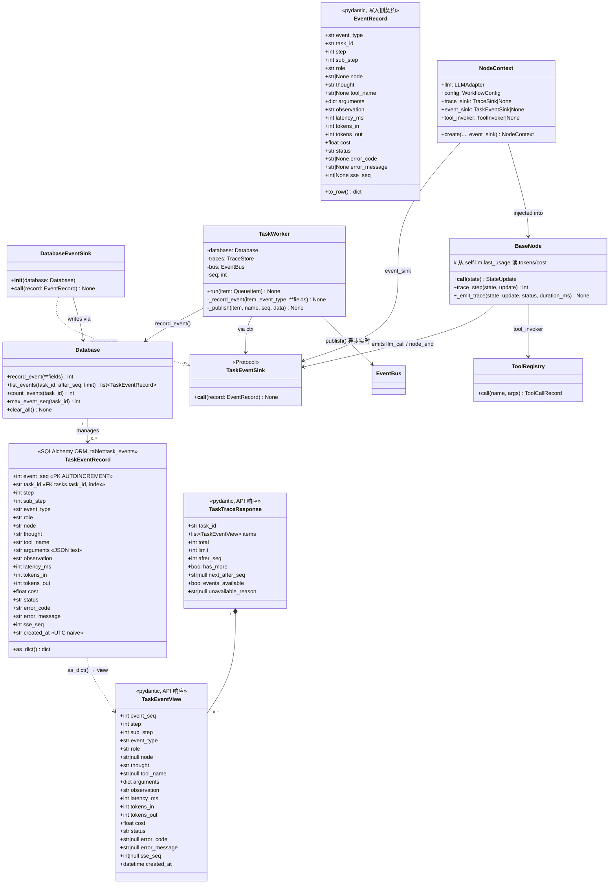
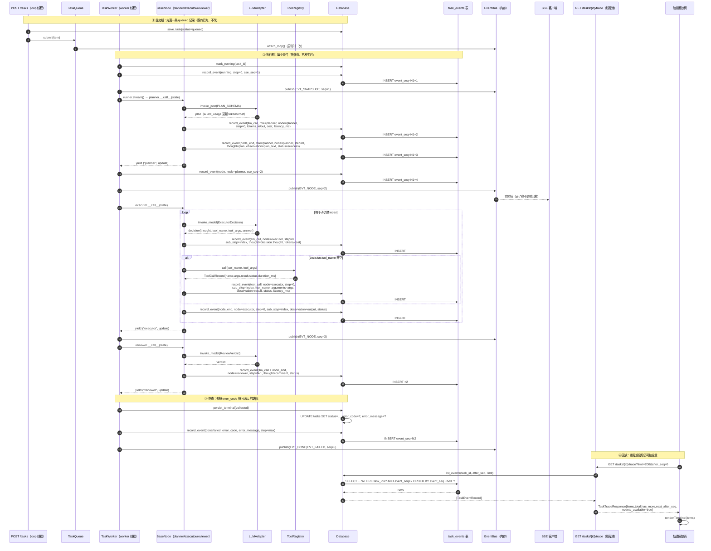
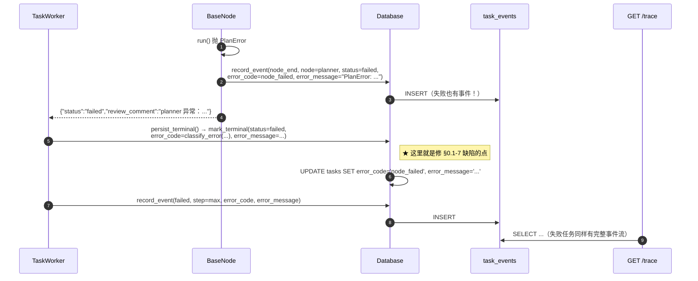
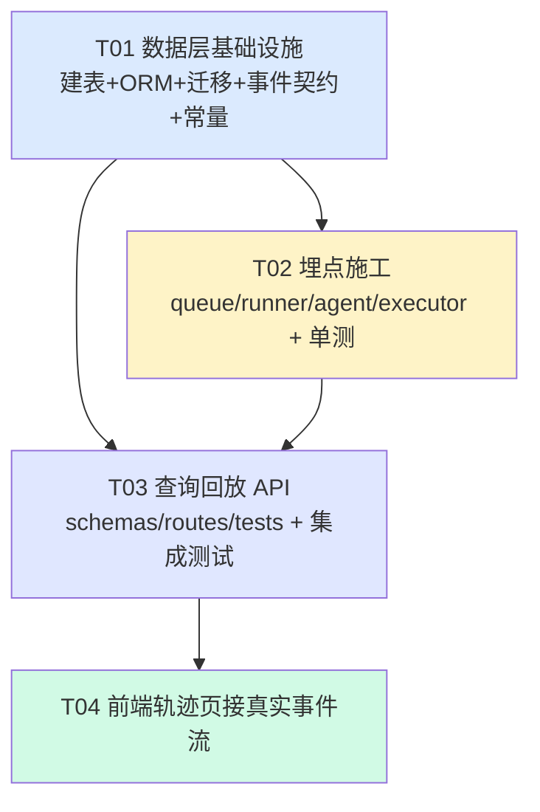

# P1-A 设计：`task_events` 事件表 —— 让「轨迹回放」经得起回放

> 项目：Trinity · 目标：把轨迹回放从「只能看结论卡」升级为「能看每一步」，且每一条断言都能被现场复现。
> 任务编号：**#10 / P1-A**（依赖：无；被依赖：埋点施工、API、前端轨迹页改造）
> **本文件为纯设计产出。撰写过程中未修改任何生产代码**（`api/`、`core/`、`storage/`、`web/` 零改动）。

---

## 0. 独立复核结论（先纠错，再设计）

我**没有采信**任务说明里的转述，全部结论均来自亲读代码与亲查数据库。取证脚本与原始输出见 `_evd2.txt` / `_evd3.txt` / `_evd4.txt`（本次会话保留，可直接 `Read` 复核）。

### 0.1 七条事实逐条核验

| # | 任务说明的转述 | 我的独立核验结论 | 判定 |
|---|---|---|---|
| 1 | `traces` 表结构 | **属实**。DDL 见 `evaluation/trace.py:38-57`。列：`trace_id,task_id,step,role,input,output,tool_calls,timestamp,duration_ms,status,token_in,token_out,cost`。索引 `idx_traces_task/task/role/ts`。**注意：它不走 SQLAlchemy，是裸 sqlite3 自管表**（`models.py:13-14` 明确「节点级埋点归 TraceStore 全权管理，不该被两套 ORM 同时写」） | ✅ 属实 |
| 2 | `base.py::trace_step()` 注释 | **属实，且原注释逐字为**：`step: int = Field(description="步骤序号：executor 用子步骤下标，其余角色用迭代轮次")`（`core/agent/base.py:46`）。实现见 `base.py:243-248`：executor 取 `max(current_step-1, 0)`，其余取 `state["iteration"]` | ✅ 属实 |
| 3 | `TraceStore.for_task()` 排序 | **属实，且错序已被真实数据证实**。`trace.py:278` `_sorted()` 按 `(step, timestamp)` 升序。实测 `task-4e56fd8560fe`：planner wrap 的 `ts=…297.682`，executor 的 `ts=…321.576`（真实更晚），但 reviewer 的 `step=0` 与 planner 同为 0 → 排序后 planner(0) → **reviewer(0)** → executor(3)，把**结论排到了过程前面**。见 `_evd3.txt` L56-63 | ✅ 属实，**后果比转述更严重** |
| 4 | `cost`/`tokens` 在哪算、落哪 | **部分属实，但关键结论是「没有直接落盘」**。`cost` 在 `core/llm/adapter.py:455-465`（`_call()` 末尾）算完，**只写进 `self.last_usage`（内存字段）**；`tokens` 在 `_invoke_once()` L415-418 从 `usage_metadata` 取。**没有任何一行代码把 usage 直接写库**。它只能经 `base.py::_emit_trace` L273 `getattr(self.llm, "last_usage", None)` 间接进 `traces` 表。**且 `last_usage` 是 `lru_cache` 单例上的单一可变槽位**——`runner.py:6-13` 已自述这个串号风险，靠「每任务 new 一个 adapter」绕过，但**跨线程读同一实例仍有 TOCTOU 窗口** | ⚠️ 部分属实（转述说「算完之后有没有落盘」——答案是**没有直接落盘**） |
| 5 | 工具执行入口 / `tool_name`/`arguments`/`observation` 记在哪 | **入口是 `core/tools/registry.py::ToolRegistry.call()` L215-261**，返回 `ToolCallRecord{name,args,result,status,duration_ms}`。**注意字段名是 `name` / `args` / `result`，不是 `tool_name` / `arguments` / `observation`**。这些记录最终被 `base.py:275-282` 聚合进 `TraceRecord.tool_calls`（JSON 串）再存 `traces.tool_calls`。**实测：24 行 traces 里 `tool_calls` 全部是 `'[]'`（`_evd4.txt` L57）——即工具轨迹一条都没落过盘**（原因是这批任务 `use_tools` 下 LLM 从未真的选工具；record 机制本身没坏） | ✅ 入口属实；**字段名需映射**；实测**零条工具轨迹** |
| 6 | `api/queue.py` / `api/runner.py` 的 EventBus 事件时机与丢失 | **`api/events.py` 是纯内存扇出**：`EventBus._subs` 是 `dict[task_id, set[asyncio.Queue]]`（L63），`publish()` L100-117 经 `loop.call_soon_threadsafe` 投递，**无 ring buffer、无落盘、无重放**。进程重启 → `_subs` 清空 + `_dropped_without_loop` 计数，**历史事件永久不可达**。事件在 `TaskWorker.run()` 里发：`snapshot`(L190)、每节点 `node`(L212)、终止 `done/failed`(L242-247)（`queue.py:169-275`） | ✅ 属实，**且比转述更彻底：连进程内离线订阅者都拿不到** |
| 7 | `tasks.error_code`/`error_message` 全 NULL 的写入路径 | **⚠️ 转述有误：不存在「26 条失败记录」。实测 `tasks` 表只有 8 行（7 `done` + **1** `failed`），`error_code`/`error_message` 8 行全 NULL**（`_evd4.txt` L41-45）。**根因已定位**：唯一写入点在 `api/queue.py:257-264`（worker 的**外层 `except Exception`**）。而这条失败任务 `duration_ms=276, cost=0.0`，是**节点返回 `status="failed"`**（planner 异常被 `BaseNode.__call__` L225-232 兜成失败增量）→ 走 `runner.py::persist_terminal()` L290-301 正常落终态，**而 `persist_terminal` 的 `mark_terminal(...)` 调用（L290-301）压根没传 `error_code`/`error_message`**。只有 worker **自身抛异常**（罕见）才会写这两列 → 所以生产上基本恒 NULL | ❌ 转述数字错误（26 条不存在）；✅ 根因成立 |

### 0.2 额外发现（未在任务说明中，但直接影响设计）

| # | 发现 | 证据 | 对设计的影响 |
|---|---|---|---|
| X1 | **存在两套互不相通的 `seq` 命名空间**：`TaskWorker.run()` 用函数局部 `seq`（`queue.py:177`，从 1 开始按事件自增）；`TaskQueue._next_seq()` 用按 task 分桶的 dict（`queue.py:577-582`），供 `canceled` 用。两者**都从 1 开始，会撞号**——同一任务可能收到 `seq=1` 的 `snapshot` 和 `seq=1` 的 `canceled` | `queue.py:177` / `queue.py:189,204,241,265` / `queue.py:577-582` | **新表的全局序绝不能复用 EventBus 的 `seq`**，见 §1.1 |
| X2 | **SSE 生成器自己的 `seq` 是第三个计数器**，只用于帧内 `id:`，且是 `max(seq, event.seq)` 后自增（`routes/tasks.py:466, 509, 526`） | `routes/tasks.py:466-527` | 与持久化无关，但说明「seq」一词在本仓有 **3 种语义**，必须显式命名区分 |
| X3 | `Database.clear_all()` 明确「不动 traces 表」（`db.py:445`），`TraceStore.clear()` 只删 traces（`trace.py:257-262`） | `db.py:445-449` / `trace.py:257` | 新表**必须同时挂到这两条清理链**，否则「重新开始」会残留事件 |
| X4 | `traces` 表**不在** `Base.metadata` 里（`models.py:282-290` 的 `__all__` 无 traces） | `models.py` / `trace.py` | 「双写过渡」若成立，两条连接要各自设 PRAGMA，`trace.py:12-15` 已把这条列为「最容易踩的 5 个坑」 |
| X5 | 前端轨迹页**已经写死了「能力边界」文案**，且注释里逐条列了 traces 撑不住的三个理由（错序/无事件名/无 node 名） | `web/app.js:734-779` | **新表落地后必须同步改这段注释与文案**，否则前后端「真相」打架 |
| X6 | `traces` 行数：主库文件单独看 **22 行**，含 WAL 看 **24 行** | `_evd4.txt` L18 vs L36 | 老数据基线以**含 WAL** 为准 = 24 行 / 8 个任务（每任务恰好 3 行） |
| X7 | `eval_records` **0 行**、`documents`/`chunks` **0 行** | `_evd4.txt` L62-64 | 评测中心/知识库页当前是空态；`trace_refs` 反查路径确实断裂（前端注释 L748 说的属实） |

### 0.3 数据库实况（含 WAL，即应用视角）

```
tables: agents=4  tasks=8(7 done,1 failed)  traces=24  eval_records=0
        documents=0  chunks=0  knowledge_meta=1  (+sqlite-vec 虚拟表族)
tasks.error_code non_null=0 / total=8
tasks.error_message non_null=0 / total=8
traces.tool_calls 非空行数 = 0
traces: 每个 task 恰好 3 行；role 分布 planner=8, executor=8, reviewer=8
        executor 的 step ∈ {0,2,3,4}（子步骤下标）；planner/reviewer 恒 step=0
journal_mode=wal
```

---

## Part A：系统设计

### 1. 实现方案与关键技术决策

#### 1.0 三个技术难点

| 难点 | 为什么难 | 本设计的对策 |
|---|---|---|
| **D1 全局单调序** | EventBus 的 `seq` 有 3 套语义且会撞号（X1/X2）；`traces` 的 `(step, timestamp)` 又错序（事实 3） | 新表用 **SQLite `INTEGER PRIMARY KEY AUTOINCREMENT` 的 `event_seq`** 作为唯一全局序；`step` 语义重定义为「跨角色可比的执行轮序号」；EventBus 的 `seq` 仅作 `sse_seq` 旁挂参考，**不参与排序** |
| **D2 同步路径落盘** | 若把落盘挂在 EventBus（异步扇出）上，worker 崩了就丢（事实 6） | 落盘点**全部落在 worker 线程的同步调用栈内**：`TaskWorker.run()` 的 `_record_event()` 与节点埋点 `_emit_trace()` 内**直接 `INSERT` 后 `commit`**，先于 `publish()` |
| **D3 双写一致性** | 新表（SQLAlchemy 连接）+ 旧 traces（裸 sqlite3 连接）并存（X4） | **不做双写**。新表成为事件真源；`traces` 表**冻结在写入路径之外**（详见 §5） |

#### 1.1 「序」的定义（本设计的核心）

本仓有 **4 种**「序号」概念，必须命名隔离，否则一问就穿：

| 名称 | 归属 | 语义 | 是否全局唯一 | 用途 |
|---|---|---|---|---|
| `event_seq` | **新表 `task_events`** | `AUTOINCREMENT` 全局单调整数，**跨任务、跨进程重启都单调不减** | ✅ 表级 | **回放排序的唯一依据**、分页游标 |
| `step` | **新表 `task_events`** | **执行轮序号（iteration-like）**，跨角色可比：planner=0，executor/reviewer 归属同一轮 | ❌（同一 step 有多个事件） | 前端按「轮」分组展示 |
| `sse_seq` | EventBus `StreamEvent.seq` | SSE 帧 `id:`，去重/断线续传 | 仅单 task 内 | 实时流 |
| `trace.step` | 旧 `traces.step` | 角色的**局部**下标/轮次（错序元凶） | ❌ | **冻结**，不再用于任何排序 |

> **关键决策**：`AUTOINCREMENT` 而非裸 `INTEGER PRIMARY KEY`。裸 rowid 在删除最大行后会**复用**旧 id（SQLite 规范）；`AUTOINCREMENT` 借 `sqlite_sequence` 保证**永不复用**，这样「删除任务 → 新增任务」也不会让旧 `event_seq` 撞上新的。

#### 1.2 `step` 的重定义（消灭错序）

旧表 `step` 的致命问题是「executor 用子步骤下标、其余用 iteration」，两套口径放同一列再排序必然错序。

**新定义（写死，写进代码注释）**：

```
step = 本次事件所属的「编排轮次」，从 0 开始：
  - planner 事件：        step = 0
  - 第 N 轮 executor 事件：step = N - 1   (N ≥ 1；首轮 = 0)
  - 第 N 轮 reviewer 事件：step = N - 1
  - tool 事件：           step = 其所属 executor 事件的 step
  - 任务级事件(running/done/failed/canceled)：step = 当前最大 step
```

依据：`state["iteration"]` 在 reviewer 通过前自增（`reviewer.py:74`），且 planner 恒在 `iteration=0` 时跑，executor/reviewer 每轮共享同一个 `iteration` 上界。**executor 内部的子步骤下标另开一列 `sub_step`**（可空），需要「第几个子步骤」时读它。

> 这样 `ORDER BY step, sub_step, event_seq` 能同时满足「按轮分组」与「轮内精确有序」，且**不再依赖 timestamp**（timestamp 在 WAL 与多线程下只作展示）。

#### 1.3 落盘时机与线程模型

```
worker 线程（ThreadPoolExecutor, ≤ api_max_concurrent_tasks 个）
  └─ TaskWorker.run(item)
       ├─ ① 每产生一个事件 → _record_event(...) → INSERT INTO task_events → COMMIT   ← 同步、先于 publish
       ├─ ② 再 _publish(...) → EventBus.publish → call_soon_threadsafe（实时 SSE，丢了也不影响回放）
       └─ ③ 节点内部埋点（LLM usage / tool call）→ 由 NodeContext.event_sink 直接 INSERT
```

**核心纪律**：`_record_event()` 内部用**独立的短事务**，`INSERT` 失败只记 `WARNING`、**绝不抛**（与 `TraceStore.add()` L152-153 同一纪律）；但**不会**因为「EventBus 无 loop」而跳过落盘（对比 `events.py:107-112` 的 drop 行为）。

#### 1.4 存储介质选择

| 方案 | 取舍 |
|---|---|
| **A. 新表进 `Base.metadata`（SQLAlchemy）** | ✅ 与 `tasks`/`documents` 同一套 Session 生命周期，`init_db()` 自动建表；✅ 复用 `check_same_thread=False` + PRAGMA 回调；❌ 写路径稍重（ORM 开销） |
| ~~B. 挂在 `TraceStore`（裸 sqlite3）~~ | ❌ 违反 `models.py:13-14` 的既定分工；且会与 SQLAlchemy 抢同一库的写锁 |

**选 A**。理由：`task_events` 是**低频**（一条任务 3–15 个事件）且**强一致要求**（要能 CAST 状态）的**业务表**，与 `traces`（高频、可丢、纯观测）性质相反。**B 方案的三条理由（高频写入/轻量/防 ORM 争抢）在新表上全不成立。**

> **量化**：`traces` 是每个节点 1 条；`task_events` 是每个节点 1 条 + 每 LLM 调用 1 条 + 每工具调用 1 条。按 planner/executor/reviewer 各 1 次 + executor 最多 5 子步骤 × 1 LLM 计算，**上限约 20 条/任务**，与 `tasks.tool_calls` 同量级，ORM 完全承受得住。

#### 1.5 架构模式

沿用项目既有的 **「同步核 + 线程池 + 事件总线」三层**（`queue.py:1-24` 自述），不引入新架构。新表落在**「核」的同步栈内**，是本次改造的最小侵入点。

---

### 2. 文件列表

| # | 文件（相对仓库根） | 性质 | 职责 | 预估改动 |
|---|---|---|---|---|
| 1 | `storage/models.py` | **修改** | 新增 `TaskEventRecord` ORM 模型 + 加进 `__all__` | +45 行 |
| 2 | `storage/db.py` | **修改** | 新增 `record_event()` / `list_events()` / `count_events()` / `max_event_seq()`；`clear_all()` 连带清 `task_events` | +70 行 |
| 3 | `storage/migrations.py` | **修改** | 新增 `ensure_task_events_table()`（幂等建表 + 建索引）；`init_db()` 调用 | +60 行 |
| 4 | `core/agent/base.py` | **修改** | `NodeContext` 增 `event_sink`；`_emit_trace()` 里**同时**发 `llm_call` / `node_end` 事件 | +60 行 |
| 5 | `core/events.py` | **新增** | `EventRecord` 数据契约（pydantic）+ `TaskEventSink` 协议 + `ExecutorDecision/StepResult → 事件` 的转换纯函数 | +130 行 |
| 6 | `api/queue.py` | **修改** | `TaskWorker` 增 `_record_event()`；在 snapshot/node/done/failed/canceled 各点**先落盘再发事件**；`error_code` 补写 | +80 行 |
| 7 | `api/runner.py` | **修改** | `build_runner()` 注入 `event_sink`；`persist_terminal()` **补传 `error_code`/`error_message`**（修 §0.1-7 缺陷） | +35 行 |
| 8 | `api/schemas.py` | **修改** | 新增 `TaskEventView` / `TaskTraceResponse`；加进 `__all__` | +60 行 |
| 9 | `api/routes/tasks.py` | **修改** | 新增 `GET /tasks/{task_id}/trace`（**`def`**，纯 DB 读） | +55 行 |
| 10 | `api/constants.py` | **修改** | 新增 `EVT_*` 事件类型常量 + `TASK_EVENT_TYPES` 白名单 + `TRACE_MAX_LIMIT` | +25 行 |
| 11 | `scripts/migrate_add_task_events.py` | **新增** | 运维手工迁移脚本（范式照抄 `migrate_add_task_error_fields.py`） | +80 行 |
| 12 | `tests/unit/test_task_events.py` | **新增** | 单测：DDL 幂等、`event_seq` 单调、`step` 归类、NULL 语义 | +180 行 |
| 13 | `tests/integration/test_api_trace.py` | **新增** | 集成：`GET /tasks/{id}/trace` 200/404/分页/空数据降级 | +160 行 |
| 14 | `web/app.js` | **修改** | 轨迹页 `traceLoadById()` 优先拉 `/trace` 渲染真实时间线；删掉「能力边界」硬编码文案 | +180 行 |
| 15 | `web/index.html` / `web/style.css` | **修改** | `#view-trace` 增「事件流」容器与 `.trace-evt-*` 样式 | +40 行 |
| 16 | `docs/p1_trace_events_design.md` | **新增（本文件）** | 设计文档 | — |
| 17 | `docs/p1_trace_sequence.mermaid` | **新增** | 时序图独立文件（§4） | — |
| 18 | `docs/p1_trace_class.mermaid` | **新增** | 类图独立文件（§3） | — |

> **不改**：`evaluation/trace.py`（冻结旧表）、`api/events.py`（EventBus 保持纯内存）、`api/deps.py`（无需新依赖）、`storage/cache.py`。

---

### 3. 数据结构与接口

#### 3.1 类图



#### 3.2 `task_events` 完整 DDL（SQLite 方言）

```sql
-- 说明：由 Base.metadata.create_all 生成等价语句；此处给出规范 DDL，供迁移脚本与审查比对。
CREATE TABLE IF NOT EXISTS task_events (
    -- ① 全局单调序：本表唯一的排序依据。AUTOINCREMENT 保证删除后不复用 id。
    event_seq     INTEGER PRIMARY KEY AUTOINCREMENT,

    -- ② 归属
    task_id       TEXT    NOT NULL,
    event_type    TEXT    NOT NULL,   -- 见 api/constants.py::EVT_* 白名单
    role          TEXT,               -- planner/executor/reviewer/judge/system；非角色事件为 NULL

    -- ③ 顺序：step 为「编排轮次」(0 起)，sub_step 为轮内子步骤下标（仅 executor/tool 事件有值）
    step          INTEGER NOT NULL DEFAULT 0,
    sub_step      INTEGER,            -- NULL = 该事件不隶属于某个子步骤

    -- ④ 过程内容（用户点名的 10 个字段族）
    node          TEXT,               -- planner/executor/reviewer；任务级事件为 NULL
    thought       TEXT NOT NULL DEFAULT '',   -- LLM 的思考/决策文本；无则空串
    tool_name     TEXT,               -- NULL = 非工具事件（关键 NULL 语义）
    arguments     TEXT,               -- JSON 串；NULL = 非工具事件。禁止默认 '{}'，见 §3.4
    observation   TEXT NOT NULL DEFAULT '',   -- 工具返回/节点输出；无则空串

    -- ⑤ 计量（来自 adapter.last_usage，落盘时机见 §2）
    latency_ms    INTEGER NOT NULL DEFAULT 0,
    tokens_in     INTEGER NOT NULL DEFAULT 0,
    tokens_out    INTEGER NOT NULL DEFAULT 0,
    cost          REAL    NOT NULL DEFAULT 0.0,

    -- ⑥ 状态与失败
    status        TEXT    NOT NULL DEFAULT 'success',  -- success/failed/timeout/running/done/aborted/canceled
    error_code    TEXT,               -- NULL = 无错误
    error_message TEXT,               -- NULL = 无错误

    -- ⑦ 与 EventBus 的旁挂参考（不参与排序，可 NULL）
    sse_seq       INTEGER,

    created_at    DATETIME NOT NULL DEFAULT CURRENT_TIMESTAMP
);

-- 主查询：按 task 拉时间线，且按全局序稳定排序
CREATE INDEX IF NOT EXISTS idx_task_events_task_seq
    ON task_events (task_id, event_seq);

-- 次要查询：按角色过滤（可选，前端「只看 executor」）
CREATE INDEX IF NOT EXISTS idx_task_events_task_role
    ON task_events (task_id, role);
```

> **为什么 `task_id` 不加 `REFERENCES tasks(task_id)` 外键**：
> 见 §5.3 —— 用户已定「保留旧 traces 表不动」，且失败任务可能在 `tasks` 无行时先写事件。加外键会引入「先写 events 后写 tasks」的顺序耦合与级联删除歧义。**改为应用层保证**：删任务时由 `Database.delete_task()` 连带删事件（同事务）。这是**显式取舍**，不是遗漏。

#### 3.3 索引设计（主查询是「按 task_id 查时间线」）

| 索引 | 列 | 支撑的查询 | 必要性 |
|---|---|---|---|
| `idx_task_events_task_seq` | `(task_id, event_seq)` | `WHERE task_id=? AND event_seq>? ORDER BY event_seq LIMIT ?`（**唯一主查询**） | ✅ 必须，覆盖索引 + 天然有序 |
| `idx_task_events_task_role` | `(task_id, role)` | 前端按角色过滤（P2 需求） | ⚪ 可选，先建（增量小） |

**不建** `idx_task_events_created_at`：分页一律用 `event_seq` 游标（比 `OFFSET` 更稳，且不受并发写入影响）。**不建** `idx` on `event_type`：基数太低（~8 个值）。

#### 3.4 逐列 NULL 语义（**这是最容易被追问的部分**）

| 列 | NULL 含义 | 哪些 event_type 会是 NULL | 不允许 NULL 的理由 |
|---|---|---|---|
| `role` | 「不属于任何 Agent 角色」 | `running` / `done` / `failed` / `canceled`（任务级事件） | — |
| `node` | 「不隶属于某个具体节点」 | 任务级事件、`tool_call`（工具挂在 executor 下但自身无 node） | — |
| `sub_step` | 「不隶属某个子步骤」 | planner/reviewer 事件、任务级事件 | — |
| **`tool_name`** | **「本事件不是工具调用」** | 除 `tool_call` 外的**全部** | ✅ 用 NULL 而非 `''`，这样 `WHERE tool_name IS NOT NULL` 即为「全部工具调用」，语义可查询 |
| **`arguments`** | **「本事件没有入参」** | 除 `tool_call` 外的全部、以及**无参工具调用** | ⚠️ **禁止默认 `'{}'`**：`'{}'` 与 `NULL` 在「有没有参数」上是两回事，会被追问「空对象 vs 空」 |
| **`observation`** | **无**（用 `''`） | — | 与 `tool_name` 相反，选择 `NOT NULL DEFAULT ''`：因为「观察结果为空」是合法的**事实**（工具返回空串），不该与「没有这条事件」混淆 |
| `error_code` / `error_message` | **「本次事件成功，无错误」** | `success` / `running` 等 | — |
| `sse_seq` | **「该事件未经 EventBus 推送」**（如进程恢复时补写的任务级事件） | 补写事件 | — |

> **纪律**：`arguments`/`tool_name`/`role`/`node`/`sub_step`/`error_*`/`sse_seq` 用 **NULL 表示不存在**；`thought`/`observation` 用 **空串表示「值为空」**。前者可被 `IS NULL` 查询，后者不会让「空结果」与「无事件」混淆。

---

### 4. 程序调用流程（Mermaid 时序图）



**错误路径（同样是顺序落盘的）**：



**关键顺序断言（可直接指认）**：
1. `record_event` 的 `INSERT ... COMMIT` **严格早于**同源的 `EventBus.publish`（`queue.py` 落盘在 `_publish` 之前一行）；
2. `NodeContext.event_sink` 的落盘发生在节点返回**之前**（在 `run()` 内、`invoke_model` 之后），**早于** LangGraph 的 `yield`；
3. 因此：**进程在任何时刻崩溃，已完成的步骤都已在表内**；唯一可能丢的是「正在执行的那一步」，这是物理极限，如实标注（见 §6 U3）。

---

### 5. 兼容与迁移

#### 5.1 旧 `traces` 表怎么办 —— **冻结，不双写**

**决策：保留表 + 保留现有数据 + 停止作为回放数据源；不删、不改、不双写。**

| 选项 | 评估 |
|---|---|
| A. 删除 traces | ❌ 破坏 `TraceStore`/`test_trace_store.py`/`evaluation.metrics`（`TaskOutcome.from_state(state, records)`，`runner.py:269-270`）；且用户明确「保留旧表不动」 |
| B. 标记 deprecated 但继续双写 | ❌ 双写要同时维护两条 sqlite 连接（X4 的 PRAGMA 坑）、两套序列化；且 `traces.step` 本身就是错的，双写等于**继续生产错序数据** |
| **C. 冻结（本设计采纳）** | ✅ 零回归；`traces` 继续被 `TaskOutcome` 用于**汇总成本/耗时**（它的真实用途，不是回放）；新回放走 `task_events` |

**具体做法**：不改 `evaluation/trace.py` 一行。仅在文档与代码注释里标注：
```
# traces 表自 P1-A 起：只用于 TaskOutcome 汇总（cost/duration/tool_counts），
# 不再作为轨迹回放的数据源（其 step 语义错序，见 docs/p1_trace_events_design.md §0.1-3）。
# 回放请用 task_events 表。
```

#### 5.2 迁移脚本

**位置**：`scripts/migrate_add_task_events.py`（与既有 `scripts/migrate_add_task_error_fields.py` 平级）
**命名规范**：`migrate_add_<对象>_<动作>.py`（照抄既有：`migrate_add_task_error_fields.py`）

**范式（照抄既有脚本的三条硬约束）**：
1. **幂等**：连跑 N 次，只有第一次真改表，后续返回 `[]` 且不报错；
2. **不猜**：用 `PRAGMA table_info` / `sqlite_master` 查真实现状，不靠版本号；
3. **只管 SQLite**：`db_path is None` 直接返回并记日志。

**与既有迁移的分工**：
- `storage/migrations.py::ensure_task_events_table()` —— 新函数，`Database.init_db()` 内**自动调用**（进程启动即建表）；
- `scripts/migrate_add_task_events.py` —— **运维手工入口**，用于「不重启就补表」的场景；
- 两者**共用** `ensure_task_events_table()`，不重复实现 DDL。

> **与 `ensure_task_error_columns` 的关键差异**：那个是 `ALTER TABLE ADD COLUMN`；这个是 `CREATE TABLE IF NOT EXISTS` + `CREATE INDEX IF NOT EXISTS`。**因为 `Base.metadata.create_all()` 本身就会建新表**，所以新函数主要是为「手工脚本 + 显式索引」服务，逻辑更简单（无「表不存在则跳过」的必要，`IF NOT EXISTS` 已幂等）。

#### 5.3 老数据展示策略 —— **诚实降级，绝不伪造**

**现状**：8 个任务（7 done + 1 failed）、24 行 `traces`、`task_events` **0 行**。

**策略**：

| 任务类型 | `/trace` 返回 | 前端展示 |
|---|---|---|
| **老任务**（`task_events` 无行） | `200` + `events_available: false` + `unavailable_reason: "该任务在事件持久化落地前执行，节点级轨迹不可追溯（仅有结论数据）"` + `items: []` | ① 结论卡（`GET /tasks/{id}`，信息量最大，**已有**）；② 事件流区域显示**灰字**说明（复用 `.trace-empty`，颜色 `#9ca3af`）；③ **不渲染任何"模拟时间线"** |
| **新任务**（有事件） | `200` + `events_available: true` + `items[...]` | 按 `step` 分组、`event_seq` 排序渲染真实时间线 |
| **不存在的任务** | `404` + `task_not_found` | 红字「任务不存在」 |

**为什么用 `200 + events_available:false` 而不是 `404`**：任务**确实存在**，只是它的轨迹不可追溯。「任务不存在」与「任务存在但无事件数据」是**两种不同的事实**，用同一个 404 会撒谎。这与 `errors.py:122-124` 的既定纪律（「路由级 404 与领域级 404 是两回事」）一脉相承。

> **必须同步修改 `web/app.js:734-779` 的注释与文案**：那里现在写「服务端没有任何事件持久化」——新表落地后这句话**变成假话**，必须改成「P1-A 之后的任务有事件；P1-A 之前的历史任务标注能力边界」。**这是本设计明确点名的交付项，不许漏。**

---

### 6. 新增 API 契约

#### 6.1 `GET /tasks/{task_id}/trace`

| 项 | 值 |
|---|---|
| 方法 | `GET` |
| 路径 | `/tasks/{task_id}/trace` |
| 定义方式 | **`def`**（纯 DB 读，交线程池；**禁止 `async def`**，纪律见 `routes/tasks.py:3-16` 与 sidebar 设计 K7） |
| 鉴权 | **走 Bearer**。`AUTH_EXEMPT_PREFIXES` 为 `("/docs","/redoc","/openapi.json","/console")`，`/tasks/*` **不在其中** → **不改豁免名单**（`constants.py:114`） |
| 依赖 | `get_database()` |
| 查询参数 | `limit`（默认 200，1..500，由 `constants.TRACE_MAX_LIMIT` 收敛）；`after_seq`（默认 0，游标分页）；`role`（可选，`planner/executor/reviewer/judge`） |
| 响应模型 | `TaskTraceResponse` |
| 错误码 | `404 task_not_found`（任务不存在）；`422 invalid_request`（`role` 非法 / `limit` 越界） |

#### 6.2 响应 schema（含类型、示例值）

```jsonc
{
  "task_id": "task-4e56fd8560fe",          // str
  "items": [                                // list[TaskEventView]，按 event_seq 升序
    {
      "event_seq": 1,                       // int  全局单调序（回放排序唯一依据）
      "step": 0,                            // int  编排轮次（0 起）
      "sub_step": null,                     // int|null  轮内子步骤下标；null=不隶属子步骤
      "event_type": "node_end",             // str  见 §6.4 白名单
      "role": "planner",                    // str|null
      "node": "planner",                    // str|null
      "thought": "把任务拆成 3 步…",         // str  可为空串
      "tool_name": null,                    // str|null  非工具事件为 null
      "arguments": null,                    // object|null  非工具事件为 null
      "observation": "1. …\n2. …\n3. …",    // str  可为空串
      "latency_ms": 4881,                   // int
      "tokens_in": 376,                     // int
      "tokens_out": 340,                    // int
      "cost": 0.001849,                     // float（元；6 位小数展示精度）
      "status": "success",                  // str
      "error_code": null,                   // str|null
      "error_message": null,                // str|null
      "sse_seq": 2,                         // int|null  与 EventBus 的旁挂参考
      "created_at": "2026-09-17T22:11:37.682+08:00"  // datetime，北京时间（复用 to_cn）
    },
    {
      "event_seq": 7,
      "step": 0,
      "sub_step": 1,
      "event_type": "tool_call",
      "role": "executor",
      "node": "executor",
      "thought": "需要算一下",
      "tool_name": "calculator",
      "arguments": {"expression": "1+1"},   // ← 工具参数，对象形态（非 JSON 串）
      "observation": "2",                   // ← 工具返回
      "latency_ms": 3,
      "tokens_in": 0,
      "tokens_out": 0,
      "cost": 0.0,
      "status": "success",
      "error_code": null,
      "error_message": null,
      "sse_seq": null,
      "created_at": "2026-09-17T22:11:41.100+08:00"
    }
  ],
  "total": 12,               // int  该任务事件总数（不受 limit 影响）
  "limit": 200,              // int  本次请求的页大小
  "after_seq": 0,            // int  本次请求的游标
  "has_more": false,         // bool 是否还有下一页
  "next_after_seq": null,    // int|null  下一页游标（has_more=false 时为 null）
  "events_available": true,  // bool ★ 事件数据是否可用（区分「无事件」「任务存在但无轨迹」）
  "unavailable_reason": null // str|null ★ events_available=false 时给出人话原因
}
```

**老任务（无事件）的响应**：
```jsonc
{
  "task_id": "task-aed2103dc22b",
  "items": [],
  "total": 0,
  "limit": 200,
  "after_seq": 0,
  "has_more": false,
  "next_after_seq": null,
  "events_available": false,
  "unavailable_reason": "该任务在事件持久化（P1-A）落地前执行，节点级轨迹不可追溯；结论数据请见 GET /tasks/{task_id}"
}
```

**404 响应**（复用既有信封，`errors.py:103-111`）：
```jsonc
{
  "detail": {
    "code": "task_not_found",
    "message": "任务不存在：task-deadbeef",
    "request_id": "a1b2c3d4e5f6"
  }
}
```

#### 6.3 Pydantic 模型（写入 `api/schemas.py`）

```python
class TaskEventView(BaseModel):
    """单条轨迹事件（GET /tasks/{id}/trace 的列表项）。"""
    event_seq: int = Field(description="全局单调序，回放排序的唯一依据")
    step: int = Field(description="编排轮次（0 起），跨角色可比")
    sub_step: int | None = Field(default=None, description="轮内子步骤下标；非子步骤事件为 null")
    event_type: str = Field(description="事件类型，见 constants.TASK_EVENT_TYPES")
    role: str | None = Field(default=None, description="角色；任务级事件为 null")
    node: str | None = Field(default=None, description="节点名；任务级事件与 tool_call 为 null")
    thought: str = Field(default="", description="LLM 思考/决策文本；无为空串")
    tool_name: str | None = Field(default=None, description="工具名；非工具事件为 null")
    arguments: dict[str, Any] | None = Field(default=None, description="工具入参；非工具事件为 null（不用 {} 混淆）")
    observation: str = Field(default="", description="工具返回或节点输出；无为空串")
    latency_ms: int = Field(default=0)
    tokens_in: int = Field(default=0)
    tokens_out: int = Field(default=0)
    cost: float = Field(default=0.0, description="本次事件成本（元）")
    status: str = Field(default="success")
    error_code: str | None = Field(default=None)
    error_message: str | None = Field(default=None)
    sse_seq: int | None = Field(default=None, description="与 EventBus 事件的旁挂参考；不参与排序")
    created_at: datetime = Field(description="事件时间（北京时间 +08:00）")


class TaskTraceResponse(BaseModel):
    """GET /tasks/{task_id}/trace 的 200 响应。"""
    task_id: str
    items: list[TaskEventView] = Field(description="按 event_seq 升序")
    total: int = Field(description="该任务事件总数（不受 limit 影响）")
    limit: int
    after_seq: int = Field(description="本次请求的游标")
    has_more: bool
    next_after_seq: int | None = Field(default=None, description="下一页游标")
    events_available: bool = Field(description="false=该任务无事件数据（老数据），items 恒为空")
    unavailable_reason: str | None = Field(default=None)
```

> **纪律**：按 sidebar 设计 F2，新增模型**必须加进 `api/schemas.py::__all__`**（显式列表）。漏加不报错但违反模块纪律。

#### 6.4 事件类型白名单（写入 `api/constants.py`）

沿用既有 `EVT_*` 命名风格，但**新开一组**（避免与 SSE 的 `EVT_*` 混淆，X1/X2 已证明混用会出事）：

```python
# ---- task_events 事件类型（持久化事件，与 SSE 的 EVT_* 不是一回事）----
TASK_EVT_RUNNING  = "running"     # 任务开跑
TASK_EVT_NODE     = "node"        # 节点完成（SSE EVT_NODE 的同源快照）
TASK_EVT_NODE_END = "node_end"    # 节点内部结束（含 thought/observation/status）
TASK_EVT_LLM_CALL = "llm_call"    # 一次 LLM 调用（tokens/cost/latency）
TASK_EVT_TOOL_CALL= "tool_call"   # 一次工具调用（tool_name/arguments/observation）
TASK_EVT_DONE     = "done"
TASK_EVT_FAILED   = "failed"
TASK_EVT_ABORTED  = "aborted"
TASK_EVT_CANCELED = "canceled"

TASK_EVENT_TYPES: frozenset[str] = frozenset({
    TASK_EVT_RUNNING, TASK_EVT_NODE, TASK_EVT_NODE_END, TASK_EVT_LLM_CALL,
    TASK_EVT_TOOL_CALL, TASK_EVT_DONE, TASK_EVT_FAILED, TASK_EVT_ABORTED, TASK_EVT_CANCELED,
})

#: 单次 /trace 拉取的事件上限（游标分页的兜底，防客户端一次拉爆）
TRACE_MAX_LIMIT = 500
TRACE_DEFAULT_LIMIT = 200
```

---

### 7. 埋点位置（**精确到 文件:行号**）

> 行号基于本次复核时的文件状态。**施工前请再 `Read` 一次确认行号漂移**（本仓文件体积不小，插入代码会让后续行号一致后移）。

#### 7.1 编排层（`api/queue.py::TaskWorker.run`，现 L169-275）

| # | 埋点位置 | 事件 | 要写的字段 | 说明 |
|---|---|---|---|---|
| Q1 | `queue.py:188` 之后（`mark_running` 成功、`mark_started` 之后） | `TASK_EVT_RUNNING` | `step=0, status="running", sse_seq=1` | 先落盘，再执行 `queue.py:190` 的 `_publish(snapshot)` |
| Q2 | `queue.py:204`（`seq += 1`）之后、`queue.py:212` 的 `_publish` 之前 | `TASK_EVT_NODE` | `node=node, step=int(collected.get("iteration",0)), status="success", sse_seq=seq` | 与既有 SSE `node` 事件**同源**，字段从 `collected` 取 |
| Q3 | `queue.py:230-238`（`persist_terminal` 返回后） | `TASK_EVT_DONE`/`TASK_EVT_FAILED`/`TASK_EVT_ABORTED` | 按 `status` 映射；`error_code`/`error_message` 从 `record` 取（见 §7.4） | 在 `queue.py:242` 的 `_publish` 之前 |
| Q4 | `queue.py:255-264`（worker 外层 `except` 里的 `mark_terminal`）之后 | `TASK_EVT_FAILED` | `error_code=code, error_message=f"{message}｜{detail}"[:1000], step=max` | 修 §0.1-7 的**另一半**：此处本就写了，需**同步落事件** |
| Q5 | `queue.py:562-575`（`TaskQueue.publish_canceled`）**前**，改为在 `routes/tasks.py::cancel_task`（L413-415）内 | `TASK_EVT_CANCELED` | `status="canceled", error_code=null, step=max` | 取消发生在 loop 线程；落盘走 `database.record_event()`（线程安全，见 §7.5） |

#### 7.2 LLM 层（`core/llm/adapter.py`）

> **决策：不在 `adapter.py` 内部埋点**。理由：`adapter.py` 是**无任务上下文**的通用层（它不知道 `task_id`/`step`/`node`），在里面埋点会污染它的通用性，且 `last_usage` 的串号风险（事实 4）在 adapter 内无法解决。

**改为在节点层读 `last_usage` 后落盘**（唯一可信的、有上下文的时机）：

| # | 埋点位置 | 事件 | 字段来源 | 说明 |
|---|---|---|---|---|
| L1 | `core/agent/base.py:263-299`（`_emit_trace`）**内**，紧接着 `usage = getattr(self.llm, "last_usage", None)`（L273） | `TASK_EVT_LLM_CALL` | `tokens_in=usage.token_in`、`tokens_out=usage.token_out`、`cost=usage.cost`、`latency_ms=usage.duration_ms`、`role=self.role`、`step=self.trace_step(state, update)`、`node=self.role` | **这就是「cost/tokens 从哪几个变量取」的答案**：`adapter.py:455-465` 写入的 `self.last_usage` 的 `.token_in/.token_out/.cost/.duration_ms` 四个字段 |
| L2 | 同上的 `_emit_trace` 末尾（L283-299 之后） | `TASK_EVT_NODE_END` | `thought=self.trace_output(update)`、`observation=self.trace_output(update)`、`status=status`、`latency_ms=duration_ms` | `duration_ms` 是 L234 算好的节点总耗时 |

> **⚠️ `last_usage` 串号风险（必须写进施工注释）**：`LLMAdapter.last_usage` 是实例字段。`runner.py:6-13` 已说明靠「每任务 new 一个 adapter」隔离，但**同一 adapter 在同一节点内连续调用两次 LLM 时，后一次会覆盖前一次**。当前 planner/executor/reviewer 都是「节点内单次 LLM 调用」，所以**当前安全**。**施工要求**：在 `_emit_trace` 的 L1 处加注释明示此前提；若未来出现「一个节点多次调用 LLM」，**必须**改成让 adapter 返回本次 usage（而不是读 `last_usage`）。**这是不确定项 U4（见 §8）。**

#### 7.3 工具执行层（`core/tools/registry.py` → `core/agent/executor.py`）

| # | 埋点位置 | 事件 | 字段来源 | 说明 |
|---|---|---|---|---|
| T1 | `core/agent/executor.py:87-89`（`if decision.tool_name:` 内，`_call_tool` 返回后） | `TASK_EVT_TOOL_CALL` | `tool_name=decision.tool_name`、`arguments=decision.tool_args`、`observation=call["result"]`、`status=call["status"]`、`latency_ms=call["duration_ms"]`、`step=当前 iteration`、`sub_step=index`、`thought=decision.thought` | **这是「tool_name/arguments/observation 从哪取」的答案**：来自 `ToolCallRecord`（`registry.py:291-298` 的 `_record()`），字段名是 `name/args/result/status/duration_ms`，需**映射**到 `tool_name/arguments/observation/status/latency_ms` |

> **命名映射表（施工务必照抄，别写错）**：
> | `ToolCallRecord`（源） | `task_events`（目标） |
> |---|---|
> | `name` | `tool_name` |
> | `args` | `arguments`（落盘时 `json.dumps`，读取时 `json.loads`） |
> | `result` | `observation` |
> | `status` | `status` |
> | `duration_ms` | `latency_ms` |
>
> **注意**：`executor.py:97-103` 也会构造 `StepResult`（含 `tool_calls` 列表），但那是**state 层**的聚合；埋点应直接从 `tool_calls` 逐条落盘，而不是从 `StepResult` 反推（后者拿不到单次调用精确的 `duration_ms` 之外的字段区分）。

#### 7.4 失败路径（**修掉 error_code 恒 NULL 缺陷**）

| # | 位置 | 动作 |
|---|---|---|
| E1 | `api/runner.py:290-301`（`persist_terminal` 的 `database.mark_terminal(...)` 调用） | **补传两个参数**：`error_code=...`、`error_message=...`。取值逻辑：当 `status == STATUS_FAILED` 时调 `classify_error(collected)`（该函数已在 `runner.py:165-186` 定义、`queue.py:255` 已被使用）；否则传 `None`。**这是 §0.1-7 缺陷的主修点。** |
| E2 | `api/queue.py:255-264`（worker 外层 `except`） | 既有的 `mark_terminal(error_code=code, error_message=...)` **保持不变**；在其后**补一条** `record_event(TASK_EVT_FAILED, error_code=code, ...)`（即 Q4） |
| E3 | `core/agent/base.py:225-232`（`BaseNode.__call__` 的异常兜底） | **不改**。它把异常转成 `review_comment` 文本（`f"{self.role} 异常：{type(exc).__name__}: {exc}"`），`classify_error` 正是从这段文本识别错误码（`runner.py:178-186`）。**E1 依赖它**。 |

> **验证方法（施工后必须做）**：跑一个必然失败的任务（如未配 `LLM_API_KEY`），断言 `SELECT error_code FROM tasks WHERE status='failed'` **非 NULL**。当前实测该列为 NULL（`_evd4.txt` L45）。

#### 7.5 线程安全与同步落盘保证

| 关注点 | 设计 |
|---|---|
| **落盘线程** | 全部在 **worker 线程的同步调用栈**（`TaskWorker.run` → `NodeContext.event_sink` → `Database.record_event`）。**不经过 asyncio 队列**，进程崩了已完成步骤仍在表内 |
| **`Database` 跨线程** | `Database` 的 engine 已设 `check_same_thread=False`（`db.py:106`），`session()` 每次新建 Session（`db.py:155-166`）→ **天然线程安全**，无需新锁 |
| **批量 vs 逐条** | **逐条 `INSERT` + `COMMIT`**。理由：批量会引入「缓冲区里的事件在崩溃时全丢」的新风险，与本设计的核心目标（抗崩溃）冲突。事件量小（≤20/任务），逐条开销可接受 |
| **失败隔离** | `record_event()` 内部 `try/except sqlite3.Error` + `SQLAlchemyError`，失败只 `logger.warning`，**绝不抛**（纪律同 `TraceStore.add()` L152-153） |
| **WAL 与并发** | 新表与既有表共用同一 engine 的 PRAGMA（`db.py:94-96`：WAL + busy_timeout=5000 + synchronous=NORMAL）→ **无需额外设置**（这正是选 A 方案的好处，X4 的坑自动规避） |

---

### 8. 与 EventBus 的关系

#### 8.1 决策：**「先写表，再发事件」**（同步落盘 → 异步广播）

```
事件产生
   ├─(1) Database.record_event()  ← 同步、阻塞 worker、失败只 WARN
   └─(2) EventBus.publish()       ← 异步、非阻塞、可丢
```

**为什么不是「发事件时异步写表」**：异步写表意味着表里的事件也从队列来，而队列在进程崩溃时**必然丢**（`events.py:107-117` 已承认）。这与「轨迹要能回放」的**根本目标**直接冲突。**「先写表」是本设计的不可妥协项。**

#### 8.2 同一事件如何避免双写不一致

**答：不是「双写」，是「一次写入 + 一次广播」。**

- **唯一真源（single source of truth）= `task_events` 表**。事件对象在 `TaskWorker` 里构造一次（`EventRecord`），
  - 落盘：`database.record_event(**record.to_row())`；
  - 广播：`bus.publish(StreamEvent(..., data=record.to_sse_data()))`。
- 两者**共用同一个 `EventRecord` 实例**，不各自拼字段 → 结构上不可能不一致。
- `sse_seq` 列存 EventBus 的 `seq`，是把「实时流」与「持久化」**关联**起来的一根线：SSE 客户端断线重连后用 `after_seq` 拉表，可判断「哪些事件我实时收到过」。

> **标准答案**：「EventBus 与 task_events 不是双写关系，是『一份数据、两个消费者』。表是**因果**，SSE 是**通知**。表先写，因为回放是硬需求；SSE 后发，因为实时是软需求（可丢、可重连）。」

#### 8.3 是否有必要让 `task_events` 成为 EventBus 的唯一真源

**本轮：不必要，且不推荐。**

| 方案 | 评估 |
|---|---|
| **A. 保持 EventBus 纯内存（本设计采纳）** | ✅ 零风险、零回归；✅ SSE 路径与 M1 完全一致（现有 379 测试不受影响）；✅ 职责清晰：表管回放，总线管实时 |
| B. 让 EventBus 从表「读后广播」/ 表即总线 | ❌ 会把「实时推送」与「DB 事务」耦合，loop 线程要等 DB（阻塞事件循环）；❌ 改动面覆盖整个 M1 SSE 链路，回归风险极大；❌ 收益仅是「优雅」，非需求 |

**但保留演进可能**：`sse_seq` 列已建立关联；未来若要「断线续传（Last-Event-ID → after_seq）」或「多进程广播」，`task_events` 已是现成的持久层。**这是有意的架构预留，不是过度设计**——一列 int，成本可忽略。

---

### 9. 测试策略

#### 9.1 单测（`tests/unit/test_task_events.py`，新增）

| # | 用例 | 断言 |
|---|---|---|
| U1 | DDL 幂等 | `ensure_task_events_table()` 连跑 3 次，第 2/3 次返回 `[]` 且不抛；表结构与预期列集合一致 |
| U2 | **`event_seq` 全局单调** | 交替写 task-A / task-B 各 5 条，`SELECT event_seq ORDER BY event_seq` 严格递增；**跨任务不重复** |
| U3 | **`event_seq` 不复用** | 写 3 条 → 删全部 → 再写 1 条，新 `event_seq` **大于**已删的最大值（验证 `AUTOINCREMENT` 生效，这是相对裸 rowid 的关键差异） |
| U4 | `step` 归类 | 构造 planner/executor(3 子步)/reviewer 事件，断言 planner=0、executor 全为 0、reviewer=0；第二轮迭代断言全为 1 |
| U5 | **NULL 语义** | 非工具事件的 `tool_name`/`arguments` 为 `NULL`（**不是 `'{}'`**）；`observation` 为 `''` |
| U6 | `record_event` 失败不抛 | monkeypatch 让 `INSERT` 抛 `SQLAlchemyError`，断言 `record_event()` 返回 `None` 且**不抛异常** |
| U7 | 老数据降级 | 空表的 `list_events()` 返回 `[]`、`count_events()` 返回 0，无异常 |

#### 9.2 集成（`tests/integration/test_api_trace.py`，新增）

| # | 用例 | 断言 |
|---|---|---|
| I1 | 成功任务全量回放 | 跑一个 mock-LLM 任务 → `GET /trace` 返回 200、`events_available=true`、`items` 含 `llm_call`+`node_end`+`tool_call`；`event_seq` 严格递增 |
| I2 | **顺序正确性（回归事实 3）** | 断言 `items` 里 planner 的 `event_seq` **小于** executor/reviewer 的；**且不依赖 timestamp**（专门构造 timestamp 乱序的数据，断言仍按 `event_seq` 排） |
| I3 | 404 | 不存在 task_id → 404 + `detail.code == "task_not_found"` |
| I4 | 分页游标 | 造 30 条事件，`limit=10` 分 4 页；拼接后与一次性 `limit=500` 的结果**完全一致**（含顺序） |
| I5 | **空事件任务降级** | 直接建一条无事件的 `tasks` 行 → `GET /trace` 返回 **200**（不是 404）、`events_available=false`、`items=[]`、`unavailable_reason` 非空 |
| I6 | **并发下 `event_seq` 单调** | 并发提交 3 个任务（`max_concurrent=3`），全部 `GET /trace` 后合并所有 `event_seq`，断言**无重复**且**每个任务内严格递增**（跨任务的交错不需单调，只需不重复） |
| I7 | **工具失败时 `observation` 存什么** | 调一个必失败的 `calculator(expression="1/0")`（mock 工具抛异常）→ 断言 `tool_call` 事件的 `status="failed"`、`observation` 含异常文本、`tool_name="calculator"`、`arguments` 保留原入参 |
| I8 | failed 任务的 `error_code` 落盘（**修 §0.1-7**） | 造一个 `status="failed"` 任务 → `GET /tasks/{id}` 的 `error.code != null`；`/trace` 里有 `event_type="failed"` 且 `error_code` 非空 |
| I9 | 鉴权 | 开 `API_AUTH_TOKEN` 后无 Bearer 请求 `/trace` → 401（**证明它没被加进豁免名单**） |
| I10 | OpenAPI 契约同步 | `tests/integration/test_api_health.py::test_openapi_contains_all_endpoints` 的 `EXPECTED_PATHS` 加 `/tasks/{task_id}/trace` |
| I11 | 既有回归 | `pytest tests -q` 全绿（基线 **379 passed**，见 sidebar 设计 K8） |

#### 9.3 前端（手工 + 既有约定）

| # | 用例 |
|---|---|
| F1 | 老任务（如 `task-aed2103dc22b`）→ 灰字「能力边界」提示，**不出现假时间线** |
| F2 | 新任务 → 按 `step` 分组渲染，可展开单条事件详情 |
| F3 | 404 → 红字「任务不存在」 |
| F4 | 所有插值过 `escapeHtml()`（XSS 纪律，sidebar K4）；空态灰 `#9ca3af`、错误红 `#ef4444`（K5） |

---

## Part B：任务分解

### 10. 依赖包列表

**结论：本轮不需要新增任何 Python / npm 依赖。**

```
（无新增。全部复用现有）
- fastapi          : 现有，路由与响应模型
- pydantic         : 现有，EventRecord / TaskEventView
- sqlalchemy       : 现有，TaskEventRecord ORM
- pytest           : 现有，测试
- （前端零构建，继续用原生 ES2020，不引库）
```

理由：`task_events` 是纯 SQL + ORM + pydantic，全是既有栈；前端沿用零构建原生 JS（sidebar K6）。

### 11. 任务列表（有序 · 含依赖 · 含文件列表）

> **硬约束遵守**：**4 个任务**（≤5）✅；每任务 ≥3 个相关文件 ✅；**T01 = 项目基础设施（建表 + 迁移 + 契约 + 依赖声明）** ✅；无单文件任务 ✅；无长线性依赖链（T02/T03 均只依赖 T01，可并行）✅。

| 编号 | 标题 | 产出文件 | 依赖 | 优先级 | 验收要点 |
|---|---|---|---|---|---|
| **T01** | **数据层基础设施：`task_events` 建表 + ORM + 迁移 + 事件契约 + 常量** | `storage/models.py`、`storage/db.py`（`record_event`/`list_events`/`count_events`/`max_event_seq`/`clear_all` 连带清理）、`storage/migrations.py`（`ensure_task_events_table`）、`core/events.py`（**新增**：`EventRecord`/`TaskEventSink`）、`api/constants.py`（`TASK_EVT_*` + `TRACE_MAX_LIMIT`）、`scripts/migrate_add_task_events.py`（**新增**）、`docs/p1_trace_class.mermaid`（**新增**） | — | **P0** | ① DDL 与 §3.2 完全一致（含 `AUTOINCREMENT`、两个索引）；② `ensure_task_events_table()` 幂等（连跑 3 次第 2/3 次返回 `[]`）；③ `record_event` 失败**只 WARN 不抛**；④ `list_events` 用 `event_seq` 游标而非 `OFFSET`；⑤ `clear_all()` **连带清空 `task_events`**（X3，别漏）；⑥ `EventRecord.to_row()` 的 `arguments` 序列化为 JSON 串、`None` 保持 `None`；⑦ 迁移脚本照核 `migrate_add_task_error_fields.py` 三约束（幂等/不猜/只管 SQLite）；⑧ `pytest tests -q` 全绿 |
| **T02** | **埋点施工：编排层 + LLM 层 + 工具层 + 失败路径** | `api/queue.py`（`TaskWorker._record_event` + Q1–Q5 五个埋点）、`api/runner.py`（`build_runner` 注入 `event_sink` + **`persist_terminal` 补传 `error_code`/`error_message`**）、`core/agent/base.py`（`NodeContext.event_sink` + `_emit_trace` 内 L1/L2）、`core/agent/executor.py`（T1 工具埋点）、`tests/unit/test_task_events.py`（**新增**，U1–U7） | T01 | **P0** | ① 每个埋点的**文件:行号**与 §7 一致（施工前重新 `Read` 确认行号）；② **落盘严格早于同源 `publish`**（顺序断言可被代码审查确认）；③ 字段映射照 §7.3 表，**不得把 `name` 写成 `tool_name` 之外的键**；④ `step` 口径照 §1.2（planner=0/executor=iteration-1/reviewer 同轮）；⑤ **`persist_terminal` 传 error_code**（修 §0.1-7，用 `classify_error`）；⑥ U2/U3/U4/U5/U6 全过；⑦ 在 `_emit_trace` L1 处**写注释说明「节点内单次 LLM 调用」的前提**（U4 风险）；⑧ `pytest tests -q` 全绿 |
| **T03** | **查询与回放 API：`GET /tasks/{task_id}/trace` + schema + 集成测试** | `api/schemas.py`（`TaskEventView`/`TaskTraceResponse` + 加 `__all__`）、`api/routes/tasks.py`（**`def`** 路由 + 游标分页 + 404/422）、`tests/integration/test_api_trace.py`（**新增**，I1–I11）、`tests/integration/test_api_health.py`（`EXPECTED_PATHS` 加路径）、`docs/p1_trace_events_design.md`、`docs/p1_trace_sequence.mermaid` | T01、T02（I1–I8 需真实事件数据） | **P0** | ① 路由**必须 `def`**（纯 DB 读，纪律 `routes/tasks.py:3-16`）；② `response_model=TaskTraceResponse`；③ 新模型加进 `schemas.__all__`（F2 纪律）；④ 404 用 `ErrorCode.TASK_NOT_FOUND` + 既有信封；⑤ **不改 `AUTH_EXEMPT_PREFIXES`**（I9 验证走鉴权）；⑥ 老任务返回 `200 + events_available=false`（**不是 404**，I5）；⑦ I2 专门验「不依赖 timestamp 排序」；⑧ I6 并发 `event_seq` 无重复；⑨ I7 工具失败 `observation` 语义；⑩ `EXPECTED_PATHS` 同步；⑪ `pytest tests -q` 全绿 |
| **T04** | **前端：轨迹页接真实事件流 + 删除「能力边界」硬编码** | `web/app.js`（`traceLoadById` 改拉 `/trace`、新增 `renderTraceEvents`、**重写 L734-779 注释**）、`web/index.html`（`#view-trace` 增事件流容器）、`web/style.css`（`.trace-evt-*` 样式） | T03 | **P0** | ① 新任务渲染真实时间线（按 `step` 分组、`event_seq` 排序）；② 老任务灰字「能力边界」，**不伪造时间线**；③ 404 红字；④ **必须改 `app.js:734-779` 的注释**（那句「服务端没有事件持久化」已成为假话，F5 前后端真相必须一致）；⑤ 所有插值过 `escapeHtml()`（K4）；⑥ 空态灰 `#9ca3af` / 错误红 `#ef4444`（K5）；⑦ 切页 `teardownCurrentView()` 不泄漏（K5/踩坑 5）；⑧ 零构建、不引库（K6） |

> **并行提示**：T02 与 T03 都只依赖 T01 → **可并行**（T02 碰 `queue/runner/agent`，T03 碰 `schemas/routes/tests`，文件不冲突）。T04 依赖 T03 的响应契约。若人力充足，T01 完成后可 **T02 ∥ T03** 双线推进。

### 12. 共享知识（跨文件约定 · CRITICAL）

```
K1 · 「序」的命名纪律（本设计的核心，写错一个就错序）
   - task_events.event_seq  = 全局单调（AUTOINCREMENT），回放排序唯一依据
   - task_events.step       = 编排轮次（0 起），跨角色可比（planner=0, executor=iteration-1, reviewer 同轮）
   - task_events.sub_step   = 轮内子步骤下标，仅 executor/tool 事件有值
   - EventBus StreamEvent.seq = sse_seq，仅实时帧用，不参与排序
   - 旧 traces.step         = 冻结，不再用于任何排序
   ★ 禁止用 timestamp 排序（多线程/WAL 下会错序，事实 3 已证）

K2 · 落盘纪律
   - 埋点必须落在 worker 线程的同步调用栈内（record_event 直接 INSERT+COMMIT）
   - 严禁依赖 asyncio 队列/EventBus 异步刷盘（进程崩了就丢，事实 6）
   - 顺序：record_event() 先，_publish() 后（同源事件共用同一个 EventRecord 实例）
   - record_event 失败只 logger.warning，绝不抛（纪律同 TraceStore.add L152-153）
   - 逐条 INSERT+COMMIT，不做批量缓冲（缓冲 = 崩溃丢数据，与目标冲突）

K3 · NULL 语义纪律
   - tool_name / arguments / role / node / sub_step / error_* / sse_seq：NULL 表示「不存在」
   - thought / observation：空串表示「值为空」（NOT NULL DEFAULT ''）
   - ★ arguments 禁止默认 '{}'：NULL（非工具事件）≠ '{}'（无参工具调用）
   - WHERE tool_name IS NOT NULL 必须等价于「全部工具调用」

K4 · API 纪律
   - GET /tasks/{id}/trace 必须用 def（纯 DB 读），禁止 async def
   - 走 Bearer 鉴权，不改 AUTH_EXEMPT_PREFIXES
   - 错误码用 ErrorCode.TASK_NOT_FOUND + 既有信封 {detail:{code,message,request_id}}
   - 新增 pydantic 模型必须加进 api/schemas.py::__all__（显式列表）
   - 老任务返回 200 + events_available=false（不是 404）；404 只留给「任务不存在」
   - 分页用 event_seq 游标，禁止 OFFSET

K5 · 前端纪律（沿用 sidebar 设计 K4/K5/K6）
   - 所有插值过 escapeHtml()（XSS 唯一防线）
   - 空态灰 #9ca3af / 错误红 #ef4444，必须可区分；禁止 catch(e){} 静默
   - 零构建：不引库、不引 CDN、不用 import
   - 切页 teardownCurrentView() + closeEventSource()
   - ★ 必须重写 app.js:734-779 注释与文案（「无事件持久化」已成假话）

K6 · 回归纪律
   - 改完必跑 pytest tests -q 全绿（基线 379 passed）
   - test_api_health.py::test_openapi_contains_all_endpoints 的 EXPECTED_PATHS 加 /tasks/{task_id}/trace
   - clear_all() 必须连带清 task_events（否则「重新开始」留残留，X3）
   - evaluation/trace.py 一行不改（traces 冻结）

K7 · 字段名映射（工具埋点专用，错一个就丢数据）
   ToolCallRecord.name        → task_events.tool_name
   ToolCallRecord.args        → task_events.arguments   (json.dumps)
   ToolCallRecord.result      → task_events.observation
   ToolCallRecord.status      → task_events.status
   ToolCallRecord.duration_ms → task_events.latency_ms
```

### 13. 任务依赖图



> **并行说明**：T01 完成后，**T02 与 T03 可并行**（文件集不相交：T02 只碰 `api/queue.py`/`api/runner.py`/`core/agent/*`/`tests/unit/`；T03 只碰 `api/schemas.py`/`api/routes/tasks.py`/`tests/integration/`）。
> T03 的 I1–I8 需要真实事件数据 → 形式上依赖 T02，故图中画了 `T02 → T03`；若 T02 未完成，T03 可先写 I3/I5/I9/I10/I11（不依赖真实事件）并留 I1/I2/I4/I6/I7/I8 待 T02 落地后补齐。

---

## Part C：待明确事项（U 系列：不确定项与需拍板的取舍）

| # | 事项 | 背景/证据 | 我的建议 | 需谁拍板 |
|---|---|---|---|---|
| **U1** | **`traces` 表是否要加 `deprecated` 标记** | 用户已定「保留旧表不动」。但代码里没有任何信号提示「别再拿它做回放」 | **只加注释，不改 schema**（加列=迁移成本，收益为零）。在 `evaluation/trace.py` 模块 docstring 与 `models.py:13-14` 各加一句「回放请用 task_events」。**若the user要硬标记，可加 `PRAGMA user_version`，但我不推荐** | the user |
| **U2** | **老任务是否要「回填」事件** | 有 24 行 traces，理论上可事后转成事件。但 `traces.step` 语义错序（事实 3）、无事件名/node 名（X5），**回填必然产出错误时间线** | **不回填**。诚实标注 `events_available=false`。**回填 = 伪造时间线，违反用户「必须诚实，不许伪造」的硬要求** | the user（默认按不回填施工） |
| **U3** | **「正在执行的那一步」崩溃时会丢** | 落盘发生在「LLM 返回后、下一步开始前」。若进程恰在一次 120s LLM 调用中崩溃，该步无事件 | **接受**（这是物理极限）。**可选增强**：在调用 LLM 前先写一条 `status="running"` 的事件，返回后 UPDATE 为终态。**代价**：多一次写 + 需要 UPDATE 逻辑。**建议本轮不做**，先记入「已知边界」在文档与页面上如实标注 | the user |
| **U4** | **`LLMAdapter.last_usage` 的串号风险** | `adapter.py:364` `self.last_usage` 是实例字段；`runner.py:6-13` 靠「每任务 new adapter」隔离。同一节点内多次 LLM 调用会互相覆盖 | 当前 planner/executor/reviewer 都是**节点内单次 LLM 调用** → **当前安全**。**施工要求**：在 `_emit_trace` L1 处写注释固化此前提；一旦未来出现「节点内多次 LLM 调用」，**必须**改成 adapter 返回本次 usage。**是否本轮就改成 `invoke_*` 返回 `(result, usage)`**？改动面覆盖 `adapter` + 3 个节点 + 多个测试 → 建议**本轮不改**，只加注释 + 记入风险 | the user/工程师 |
| **U5** | **`step` 新定义的边界**：reviewer 打回重做时，同一步骤会被重跑 | `executor.py:57-60`：reviewer 打回后 `cursor=0` 整轮重做；`executor.py:104-105` 按 `step_index` 覆盖 `carry` | **事件不覆盖，全量保留**（重做的第二次执行是**新的历史事实**，`event_seq` 递增）。前端可按 `step`+`sub_step` 分组显示「本步被重做了 N 次」。**这需要前端配合**（见 T04）。**若the user要「只显示最后一次」，属前端过滤策略，不影响表结构** | the user |
| **U6** | **是否需要 `GET /tasks/{id}/trace` 的实时补全（SSE 版）** | 现在页面靠 `/stream` SSE 看运行中任务，靠 `/trace` 看历史 | **本轮不做**。`/stream`（实时）+ `/trace`（历史）职责已分开。若任务运行中打开轨迹页，可先拉 `/trace` 拿已完成事件，再订 `/stream` 补增量（前端编排，无需新后端端点） | the user |
| **U7** | **`event_seq` 是否会因 `VACUUM` / 库重建而回退** | `AUTOINCREMENT` 依赖 `sqlite_sequence`。若整库重建（删文件），`sqlite_sequence` 归零 | **接受**：这是「库重建」的语义（等于全新库）。但**前端游标分页需处理**：`after_seq` 只在**单次任务的一次拉取会话**内有意义，不跨「库重建」。**已在契约里标注 `after_seq` 是页内游标** | 记录即可 |

---

## 附：本轮硬性踩坑清单（工程师开工前必读）

1. **`task_events` 必须在 `Base.metadata` 里**（T01）——`create_all` 才会建它；且 `__all__` 要加 `TaskEventRecord`。
2. **`clear_all()` 必须连带清 `task_events`**（T01，X3）——否则「重新开始」留残留。
3. **`record_event` 先于 `_publish`**（T02，K2）——这是「抗崩溃」的全部意义，写反了等于没做。
4. **工具字段名映射**（T02，K7）：`name→tool_name`、`args→arguments`、`result→observation`、`duration_ms→latency_ms`。**写错一个就丢数据且不报错。**
5. **`arguments` 禁止默认 `'{}'`**（T01/T02，K3）——NULL ≠ `{}`，值得单列。
6. **`persist_terminal` 必须补传 `error_code`/`error_message`**（T02，E1）——这是修 §0.1-7 缺陷的**唯一主修点**；不改则 `tasks.error_*` 继续恒 NULL。
7. **`GET /tasks/{id}/trace` 必须 `def`**（T03，K4）——纯 DB 读用 `async def` 会阻塞 loop。
8. **`AUTH_EXEMPT_PREFIXES` 不许改**（T03）——`/tasks/*` 走 Bearer 是既定边界。
9. **老任务返回 `200 + events_available=false`，不是 404**（T03，I5）——「任务存在但无轨迹」≠「任务不存在」。
10. **必须重写 `web/app.js:734-779` 的注释**（T04，K5）——那句「服务端没有事件持久化」在 T01 之后**就是假话了**，留着会让下一个读代码的人被误导。
11. **排序只用 `event_seq`，绝不用 `timestamp`**（T02/T03，K1）——事实 3 已用真实数据证明 `(step, timestamp)` 会错序。
12. **改完必跑 `pytest tests -q` 全绿**（基线 379 passed，K6）；`EXPECTED_PATHS` 加 `/tasks/{task_id}/trace`。
13. **`evaluation/trace.py` 一行不改**（traces 冻结，§5.1）。

---

## 附录 A：原始取证证据（可现场复核）

> 临时探针脚本运行后已删除（未留残骸）；证据输出保留在本目录，可直接 `Read`。
> 运行命令（托管解释器）：
> ```powershell
> & "<USER_HOME>\.workbuddy\binaries\python\versions\3.13.12\python.exe" _probe4.py
> ```

### A.1 数据库实况（`_evd4.txt` 摘录）

```
## A. main db file ALONE (ignore WAL)
  tables: ['agents','chunks','documents','eval_records','knowledge_meta','tasks','traces', ...]
   agents: 4   tasks: 8   traces: 22   eval_records: 0   documents: 0   chunks: 0

## B. snapshot WITH wal/shm (what the app sees)
   knowledge_meta: 1   tasks: 8   traces: 24      ← 老数据基线：24 行

## C. tasks: TRUE status distribution + failed rows
  total tasks: 8
   ('done', 7)
   ('failed', 1)                                    ← 不是「26 条失败记录」
   ('task-53e986598a58','failed', None, None, 276, 0.0, '2026-09-18 14:06:48', ...)
                                                    ↑ error_code/error_message 均为 None

## D. traces: step semantics evidence per role
   ('executor', 8, '3,4,2,0')     ← executor 的 step 是子步骤下标（0..4）
   ('planner',  8, '0')           ← planner 恒 0
   ('reviewer', 8, '0')           ← reviewer 恒 0

## E. does traces.tool_calls ever carry content?
   '[]'                             ← 24 行全是空数组（工具轨迹零落盘）

## F. eval_records/documents/chunks 均 0 行；knowledge_meta 1 行（current_fingerprint）
```

### A.2 错序实证（`_evd3.txt` 摘录，Fact 3）

```
--- task-4e56fd8560fe: ordered (step,timestamp) ---       ← 现有 for_task() 的排序
   step=0   planner   ts=1789618297.682 dur=4881   success
   step=0   reviewer  ts=1789618331.893 dur=10315  success   ← reviewer 被排到 executor 前！
   step=3   executor  ts=1789618321.576 dur=23892  success

--- task-4e56fd8560fe: ordered (timestamp) only ---       ← 真实发生顺序
   ts=1789618297.682 step=0 planner
   ts=1789618321.576 step=3 executor
   ts=1789618331.893 step=0 reviewer
```

> 结论：`(step, timestamp)` 把 **reviewer（step=0，实际最晚）排到了 executor（step=3，实际居中）之前**。这是「回放会给出错误顺序」的**可复现证据**。

### A.3 与任务说明不符之处（汇总）

| 任务说明原文 | 实测真相 | 影响 |
|---|---|---|
| 「实测 26 条失败记录的这两列全是 NULL」 | **`tasks` 表共 8 行，失败仅 1 行**，`error_code`/`error_message` 全 NULL（8/8） | 数字错误，但**根因（写入路径缺失）成立**；结论不变 |
| 「现存 7 个 done 任务、21 行 traces」（未在任务说明中，但在 §5 隐含） | **7 done ✅**；traces **24 行**（含 WAL）/ 22 行（不含 WAL），每任务恰好 3 行 | 基线数字需修正为 **24** |
| `cost`/`tokens`「算完之后有没有落盘」 | **没有直接落盘**；只写 `adapter.last_usage`（内存），经 `_emit_trace` 间接进 traces | 设计需显式从 `last_usage` 取（§7.2） |
| 工具字段名 `arguments`/`observation` | 源头是 `ToolCallRecord.args`/`.result`；**需映射** | 已固化进 K7 |
| （隐含）EventBus 事件「进程重启后还能拿到吗」 | **完全拿不到**（纯内存、无 ring buffer、无落盘） | 支撑「先写表再发事件」的决策 |
