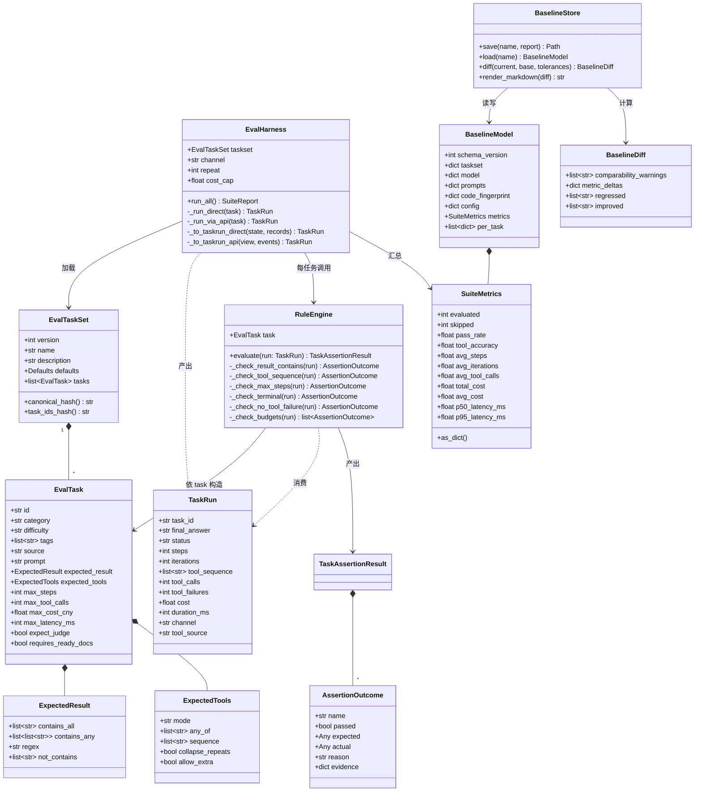
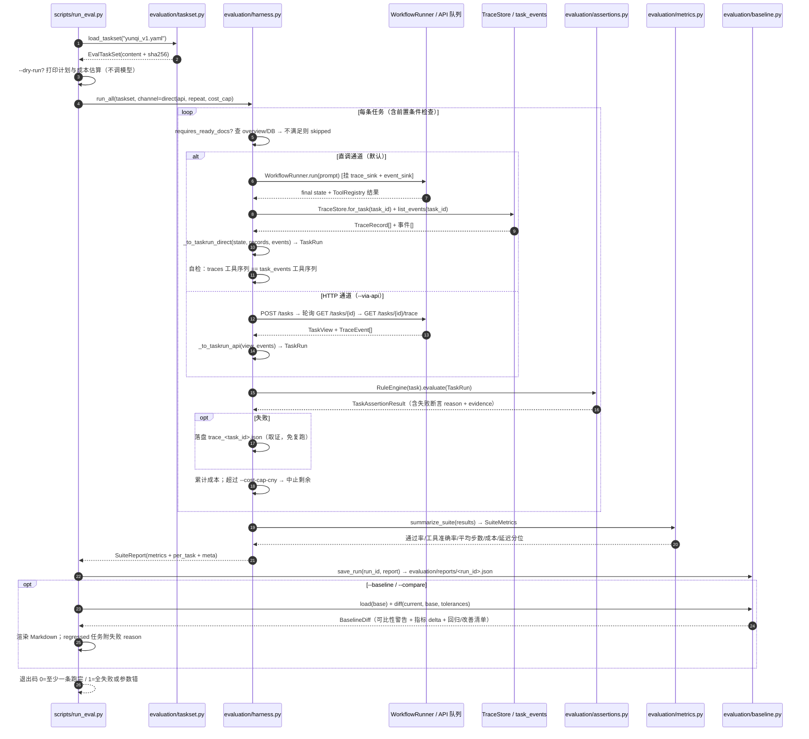

# P2 全链路评测台（任务集 + 规则断言 + 回归对比）· 系统设计

> 状态：设计已归档 · 范围：**只读调研 + 设计**，不改任何生产代码
> 目标：让使用者能回答「我改了 Prompt / 换了模型之后，怎么知道变好了？」——
> 用**真实可复现**的指标与**来自真实运行**的基线给出可归因的结论。

---

## 0. 现状核实（先证伪既有转述，全部附证据）

按纪律，下面每一条「现状是这样」的断言都附**实际读到的文件 + 行号**或**实际跑出的输出**。
凡与既有转述不一致处，**加粗标注**。

### 0.1 已独立核实的现状

| # | 结论 | 证据 |
|---|------|------|
| 1 | `task_events` 表已建，**20 列**（`event_seq` + 19 业务列，`AUTOINCREMENT` 主键） | `data/trinity.db` `PRAGMA table_info(task_events)` 实跑输出；建表 DDL 见 `storage/migrations.py`（`ensure_task_events_table`） |
| 2 | `GET /tasks/{id}/trace` 已上线：`def` 路由、Bearer 鉴权、`event_seq` 游标分页、老任务返回 200 + `events_available:false` | `api/routes/tasks.py:383-466`；响应模型 `api/schemas.py:540-591` |
| 3 | `GET /eval` 已存在：`offset`/`limit` 契约（1..200 / ≥0），`items` 是 `EvalRecord.as_dict()` 裸 dict，`total` 走 `count_evals` 单独 count | `api/routes/eval.py:24-51`；契约 `api/schemas.py:315-321`；落库 `storage/db.py:380-434` |
| 4 | 真实任务可跑通：`task-62302bd2c06a` = `status=done` / `score=8` / `cost=0.051993` / `duration_ms=36054` / `tool_calls=3` / **14 条事件（seq 23→36）** / 3 条 `tool_call` 均 `knowledge_search` | 实跑 DB 探针（见 `data/_arch5_probe_out.json`）；事件明细逐条核对 | 
| 5 | `evaluation/` 包已有 `dataset.py`（旧 JSONL 任务集）、`judge.py`（LLM Judge）、`batch.py`（批跑执行器）、`metrics.py`（指标）、`trace.py`（旧 TraceStore）、`retrieval_eval.py`（检索评测，零 LLM） | `evaluation/` 目录 Glob + 逐个读取 |
| 6 | 知识库有 **4 份「深圳市云启智能科技有限公司」文档**处于 `ready`（员工手册 10 chunk / 财务报销制度 5 / 考勤管理制度 5 / 费用标准对照表 8） | DB `documents` 表实跑输出；原件在 `data/knowledge/files/` |
| 7 | 混合检索参数：`bm25_weight=0.4` + `vector_weight=0.6`；embedding = `bge-small-zh-v1.5`（dim 512） | `config.py:154-159`；`data/_arch5_env_out.json` |
| 8 | LLM：`llm_model_large == llm_model_small == deepseek-flash`，Key 有效（`llm_configured=true`） | `config.py:58-63`；`data/_arch5_env_out.json` |

### 0.2 与既有转述不一致 / 需要修正之处（重点）

**① `evaluation` 执行通道读的是「旧 traces 表」，不是 `task_events`（架构事实，影响全部设计）。**
- `evaluation/batch.py:85-92`：`run_batch` 构造 `NodeContext.create(trace_sink=trace_store, tool_invoker=registry)` —— **只挂了 `trace_sink`，没有 `event_sink`**，所以 `run_batch` 跑出的任务**不产生任何 `task_events`**。
- 对比 `api/runner.py:149-160`：`build_runner` 同时挂 `trace_sink` 与 `event_sink=DatabaseEventSink(database)`，所以**只有走 HTTP/队列的任务**才写 `task_events`。
- 结论：`task_events`（P1-A 新表）只服务 `/trace` 回放；批量评测（`run_batch`）与 `TaskOutcome` 汇总走的是旧 `traces` 表。

**② `tool_calls` 计数口径确实会分歧，并有实测证据（此前只是"怀疑"，此处给出实证）。**
- `tasks.tool_calls` 来源链：`api/runner.py:413`（`tool_calls=outcome.tool_calls`）← `evaluation/metrics.py:60-78`（`TaskOutcome.from_state` 累加 `TraceRecord.tool_calls`）← 旧 `traces` 表（`evaluation/trace.py`）。
- `task_events` 里的 `tool_call` 事件来源：`core/agent/base.py:447-477`（executor 每个子步骤逐条落盘）。
- **两者实测分歧**：`task-85a272fd0efb` 的 `tasks.tool_calls=2`，但该任务 `task_events` 的 `tool_call` 事件数 = **0**（它由不带 `event_sink` 的路径产生）。而 `task-62302bd2c06a` 两者都为 3（走了 HTTP，两个 sink 都写）。
- 在设计里**必须指定唯一权威口径**，否则「工具调用准确率」在两个通道下会自相矛盾（见 §3.3）。

**③ `iterations` 不是「执行轮数」，而是「被 reviewer 打回的轮数」（`max_steps` 口径必须避开它）。**
- `core/agent/reviewer.py:74`：`iteration = state.iteration + (0 if passed else 1)` —— **通过时不加一**。
- 因此 `task-62302bd2c06a`（首轮通过）的 `iterations=0`，而 `task-0aae0e555587`（触达上限收口）的 `iterations=5`。
- 若把 `max_steps` 直接绑到 `iterations`，一个「首轮成功、其实跑了 3 个节点」的任务会显示成 0 步——语义错误。见 §3.3 的替代口径。

**④ `scripts/run_eval.py` 与 `evaluation/` 全套**已存在（不是从零新建）。
- 需求转述为「加 `scripts/run_eval.py`」，实为**扩展**：现有 `scripts/run_eval.py:1-259` 已实现 `--dataset/--limit/--difficulty/--no-judge/--dry-run/--json` 与高峰计费护栏；`evaluation/batch.py`、`metrics.py`、`judge.py` 均已落地。
- 因此本次设计的真实任务 = **在既有 criteria-based 评测之上，叠加「YAML 任务集 + 规则断言 + 基线 diff」**，并**不破坏**既有 `pytest tests/` 基线。

**⑤ 磁盘上有一份未被索引的文档**：`data/knowledge/files/doc-829e61368158_cat6_spec_t07.txt` 存在于磁盘，但**不在 `documents` 表**里（`documents` 计数 = 4）。属 T07 测试残留，与本次无关，仅记录。

**⑥ `evaluation/fixtures/` 的 4 篇文档 ≠ 云启智能 4 份文档**，是两个不同来源：
- `evaluation/fixtures/{zonghebuxian,anfangjiankong,menjinyikatong,jifangguangbo}.md`（弱电/综合布线域）供 `retrieval_eval.py` 的**检索评测**（零 LLM）使用，配 `evaluation/dataset/knowledge_eval.jsonl`（26 条）。
- 需求中的「知识库 4 份云启智能文档」是**运行中 KB**（`data/knowledge/`），供 Agent 端到端评测使用。两者别混。

**⑦ 未独立复跑 `pytest tests/`（460 passed 为既有记录）**：本任务为只读设计，避免制造负载与副作用，未复跑全量测试；设计里把「不得打破既有测试」写作硬约束。

### 0.3 `task_events` 事件类型与任务级埋点（供断言设计引用）

DB 实测出现的事件类型分布：`node_end`(9) / `node`(9) / `llm_call`(7) / `tool_call`(3) / `running`(3) / `failed`(2) / `done`(1)。
白名单定义在 `api/constants.py:109-132`：`running / node / node_end / llm_call / tool_call / done / failed / aborted / canceled`。
- 节点级（`core/agent/base.py:364-477`）：`llm_call`（**仅当本次真调用过 LLM**）、`node_end`、`tool_call`（executor 每个子步骤一条）。
- 任务级（`api/queue.py:230-323`）：`running`（开跑）、`node`（每个节点完成一帧）、终态 `done/failed/aborted`。
- `tool_call` 事件带 `step`（编排轮次）+ `sub_step`（轮内子步骤 = executor 的 `step_index`），天然构成有序序列。

---

## 1. 实现方案 + 框架选型

### 1.1 核心难点

1. **两套可观测链路并存**（`traces` vs `task_events`）——断言必须选定权威口径，并在两种执行通道下保持同源（§0.2①②）。
2. **LLM 输出是开放文本**——结果断言必须稳健（子串/正则/多可接受写法），不能因措辞变化误判。
3. **工具序列语义**：executor 一次节点调用跑完整轮计划，**每个子步骤最多调 1 个工具**（`core/workflow/state.py:82-97` 的 `ExecutorDecision` 只有一个 `tool_name`），所以「3 步计划」会产出「同一 `step` 下 `sub_step=0,1,2` 的 3 条 `tool_call`」，且可能**重复同一工具多名**。序列匹配必须能处理重复与额外调用。
4. **基线可归因**：模型名 / Prompt 版本（含文件哈希）/ 任务集哈希 / 代码指纹缺一不可，否则「指标变了」无法归因。
5. **成本与耗时**：真跑 30-50 条 = 真花钱真耗时，必须有护栏与小样本冒烟。

### 1.2 框架与库选型（在既有栈内扩展，不引新框架）

| 关注点 | 选型 | 理由 |
|--------|------|------|
| 任务集定义 | **YAML（PyYAML 6.0.3，已装但未声明）** | 用户明确要求 YAML；多行 `prompt`、注释、嵌套 `expected_result` 比 JSONL 可读，比 JSON 适合人写 |
| Schema 校验 | **Pydantic v2**（项目已用） | 与 `evaluation/dataset.py:40-49`、`api/schemas.py` 同栈，校验错误可读 |
| 断言引擎 | **纯 Python（无框架）** | 断言是确定性逻辑，引入 pytest/assert 式框架只会增加耦合；用「检查函数 + 结构化结果」自研最小引擎 |
| 指标聚合 | 复用 **`evaluation/metrics.py`** 的 dataclass 风格 | 与既有「不美化数字」（`metrics.py:1-14`）哲学一致，避免两套报表口径 |
| 基线存储 | **JSON 文件**（`evaluation/baselines/*.json`） | 与既有 `evaluation/reports/eval_*.json` 一致；git 友好、可 diff；无需新建表、无迁移 |
| 执行通道 | **默认直调编排器 + `--via-api` 可选** | 见 §1.3 |
| 复现性 | 复用 `temperature=0.0`（`core/llm/adapter.py:359`）+ 可选重复采样 | 零成本降方差 |

### 1.3 决策 1：执行通道 —— 推荐「默认直调 + `--via-api` 可选」的混合方案

**事实对比**

| 维度 | 直调（`WorkflowRunner`，仿 `batch.py`） | 走 HTTP（`POST /tasks` + 轮询 `GET /tasks/{id}` + `GET /trace`） |
|------|------|------|
| 端到端成色 | 绕开队列/并发/CAS/持久化，**非真·端到端** | **真·端到端**：含队列、并发上限、CAS 终态、SSE、持久化 |
| 速度 | 快（无轮询开销） | 慢（`api_max_concurrent_tasks=3` 排队 + 轮询间隔） |
| 污染 | 需指定隔离库（否则写 `trinity.db`） | 写运行中服务的库（无法隔离，除非重启，禁止） |
| 稳定性 | 高（无端口/队列满/高峰硬拦） | 存在 `429`（队列满）、`422`（`api_block_peak_tasks` 高峰硬拦）、端口依赖 |
| 环境约束 | 无 | 需 :8000 常驻服务；**不得启停服务**（只读约束） |
| `task_events` | 默认**不写**（除非显式挂 `event_sink`） | **自动写**（`build_runner` 已挂） |

**推荐：默认直调，`--via-api` 作为「金标准通道」按需开启。** 理由与代价：

- **理由**：① 规则断言需要的四项（final_answer / 工具序列 / 步数 / 终态）在直调下全部可得（`state` + `TraceStore` 记录），无需依赖 `task_events`；② 直调可把每任务隔离到独立 DB、成本可控、无端口依赖、无队列满/高峰硬拦的伪失败；③ 批量回归（几十条 × 多轮 × 重复采样）对吞吐敏感，直调显著更省时省钱。
- **代价（必须如实写进报告）**：直调不覆盖队列并发、CAS、SSE——「端到端成色」打折。故提供 `--via-api` 跑一版**金标准基线**，并在报告里标注 `channel`。
- **两通道断言同源保证**：定义**唯一规范化产物 `TaskRun`**（§3.2），断言引擎**只吃 `TaskRun`**。两通道各写一个适配器把各自原始数据映射成 `TaskRun`：
  - 直调：`state`（`final_answer`/`iteration`/`status`）+ `TraceStore.for_task()`（工具序列、步数、成本、耗时）；
  - HTTP：`TaskView`（`final_answer`/`iterations`/`status`/`cost`/`duration_ms`）+ `/trace` 的 `tool_call` 事件。
  - **额外自检**：直调通道同时挂 `event_sink`，于是同一任务既有 `traces` 又有 `task_events`，可**交叉校验两者工具序列一致**（不一致 = 埋点缺陷，应当报错而非静默）。这一条把 §0.2② 的分歧从「隐患」变成「可检测断言」。

**为什么不用「同一份记录两边都读」**：HTTP 的 `/trace` 只有在任务真跑过且 P1-A 之后才可用（老任务 `events_available:false`）；直调根本无法访问运行中服务的 `/trace`。所以只能是「各自取源 → 归一化到 `TaskRun`」。

---

## 2. 文件列表（新增 / 修改分开）

### 2.1 新增文件

| 相对路径 | 职责 |
|----------|------|
| `evaluation/contracts.py` | **冻结的数据契约**：`TaskRun`（规范化产物）、`AssertionOutcome`、`TaskAssertionResult`、`SuiteMetrics`、`BaselineModel`、`BaselineDiff`、容忍带常量。所有新模块只依赖它，实现并行开发 |
| `evaluation/taskset.py` | YAML 任务集 schema（Pydantic）+ 加载/校验 + 规范化序列化与 **sha256 哈希**（基线可比性用） |
| `evaluation/assertions.py` | 规则断言引擎：结果包含 / 工具序列 / 步数上限 / 终态 / 无工具失败 / 成本上限 / 延迟上限 / 负样本不编造；每条产出结构化结果 + 取证 |
| `evaluation/harness.py` | 执行与归一化：直调通道（仿 `batch.py` 装配，额外挂 `event_sink`）与 HTTP 通道适配器 → `TaskRun`；串行执行、超时、成本护栏、重复采样 |
| `evaluation/baseline.py` | 基线读写（`evaluation/baselines/*.json`）+ 指标 delta + 逐任务回归/改善清单 + Markdown 渲染 + 可比性守卫 |
| `evaluation/tasksets/yunqi_v1.yaml` | 主任务集（云启智能 KB，~40 条，含 6 类 + 负样本），规范见 §6 |
| `evaluation/tasksets/yunqi_smoke.yaml` | 冒烟子集（~5 条，覆盖 5 类各 1 条 + 1 负样本），供快速调试 |
| `evaluation/baselines/.gitkeep` | 基线目录占位（保持目录进版本库） |
| `tests/unit/test_eval_taskset.py` | 任务集 schema/加载/哈希 单测 |
| `tests/unit/test_eval_assertions.py` | 断言引擎单测（含重复工具、额外工具、负样本、数字边界） |
| `tests/unit/test_eval_baseline.py` | 基线 diff / 容忍带 / 可比性守卫 单测 |
| `tests/integration/test_eval_harness_direct.py` | 直调通道集成测试（用 `tests/integration/mock_llm.MockLLMAdapter`，零 token） |

### 2.2 修改文件（**每个改动都必须是可加性、低回归风险**）

| 相对路径 | 改动 | 回归风险 |
|----------|------|----------|
| `scripts/run_eval.py` | 新增 `--taskset` / `--tag` / `--baseline` / `--compare` / `--via-api` / `--repeat` / `--cost-cap-cny` / `--db`；**保留既有 criteria 模式参数不变** | 低（只加分支，原有 `--dataset` 路径完全保留） |
| `evaluation/metrics.py` | 追加 `SuiteMetrics`（通过率 / 工具准确率 / 平均步数 / 分位延迟）dataclass 与汇总函数；**不改动 `BatchMetrics`** | 极低（纯新增符号） |
| `pyproject.toml` | `dependencies` 增加 `"pyyaml>=6.0"`（当前 6.0.3 已装但未声明） | 极低 |

> 明确**不改动**：`api/`、`core/`、`storage/`、`evaluation/{dataset,judge,batch,trace,retrieval_eval}.py`、`web/`、`ui/`、`tests/` 既有用例。`evaluation/batch.py` 保持原样（新 `harness.py` 与之并行，见 §7 待明确事项）。

---

## 3. 数据结构与接口

### 3.1 决策 2：任务集 YAML schema

完整字段（Pydantic 模型 `evaluation/taskset.py`，字段名即 YAML 键）：

```yaml
version: 1                          # schema 版本（兼容演进）
name: yunqi-agent-v1                # 任务集名（基线里记录）
description: 云启智能知识库 · Agent 端到端评测集
defaults:                           # 每条任务可继承的默认值（减少重复）
  max_iterations: 3                 # 覆盖 settings.max_iterations（默认 5，这里收紧省成本）
  review_threshold: 7
  use_tools: true
  run_judge: false                  # 规则断言为主，judge 默认关闭以省成本
  timeout_s: 150
tasks:
  - id: yq-hr-001                   # 唯一；横向对比对齐锚点
    category: single_doc_lookup     # 分类维度（见 §6）
    difficulty: easy                # easy / medium / hard
    tags: [smoke, hr]               # 供 --tag 切片
    source: "01_员工手册.md 第 6.2 条"   # ★ 期望值的出处（可人工复核，禁止拍脑袋）
    prompt: "深圳市云启智能科技有限公司的普通员工到北京出差，住宿费上限是每人每晚多少元？请用一句话回答。"
    expected_result:
      contains_all: ["450"]                 # 归一化后必须全部出现
      contains_any:                         # 每组至少命中一个（容忍多种写法）
        - ["450 元", "450元", "每晚 450"]
      regex: "(?<![0-9])450(?![0-9])"       # 数字边界，防 4500 误命中
      not_contains: ["350"]                 # 反例护栏（★慎用，见下）
    expected_tools:
      mode: subset                          # none | subset | exact_sequence | set
      any_of: [knowledge_search]            # subset/set 用
      # sequence: [knowledge_search, calculator]   # exact_sequence 用
      collapse_repeats: true                # 连续重复工具折叠为一个（应对"每步都查 KB"）
      allow_extra: true                     # subset 下允许额外出其他工具
    max_steps: 4                    # 见 §3.3 口径：节点执行次数上限
    max_tool_calls: 5
    max_cost_cny: 0.10
    max_latency_ms: 90000
    expect_judge: false
    judge_min_score: 7              # 仅 expect_judge=true 时生效
    requires_ready_docs: true       # 前置条件：KB 就绪才跑
```

**字段语义与设计理由（逐条）**

- `id/category/difficulty/tags/source`：`id` 用于跨基线对齐；`category` 用于分层看指标；`tags` 用于 `--tag smoke`；`source` 是人类可复核的期望值出处（**从文档推导而非编造**的关键）。
- `expected_result` —— 用**归一化子串 + 正则 + 多可接受写法**，而不是精确相等：
  - 归一化函数 `normalize(text)`：NFKC 全半角统一 → 去所有空白 → ASCII 小写。这样「450 元 / 450元 / ４５０元」等价。
  - `contains_all`：必须全部命中（适合「必须同时提到 A 与 B」）。
  - `contains_any`：`list[list[str]]`，每个内层组至少命中一个（适合「同一事实的多种措辞」）。
  - `regex`：用于数值精度——**必须带数字边界** `(?<!\d)…(?!\d)`，否则 `450` 会被 `4500` 命中。
  - `not_contains`：**默认留空**；仅在 prompt 明确限定（如「只回答数字」）时才用，且只填**同类明确错误值**（如同一档位下的其他城市标准）。对开放式提问使用会误伤正确但话多的答案——这是刻意的稳健性取舍，写进文档提醒使用者。
- `expected_tools` —— **匹配语义四选一**（应对「重复调用 / 额外调用 / 顺序」三种真实情况）：
  - `mode: none`：不得调用任何工具。
  - `mode: subset`：期望工具是**实际序列的子序列**（保序、可重、允许额外）；`collapse_repeats=true` 时先把实际与期望各自的**连续重复**折叠（`[ks,ks,ks]→[ks]`）再比较。**默认模式**——真实任务里 3 步计划会产生 3 次 `knowledge_search`，严格相等会全判失败。
  - `mode: exact_sequence`：折叠后**严格顺序相等**（用于「必须恰好这样调」）。
  - `mode: set`：折叠后**无序集合相等**。
  - `allow_extra`：subset 下是否允许出现期望之外的工具（默认 true）。
- `max_steps` / `max_tool_calls` / `max_cost_cny` / `max_latency_ms`：上限类断言（见 §3.3）。
- `expect_judge` / `judge_min_score`：是否**额外**跑一次 LLM Judge（`evaluation/judge.py`）作为辅助信号；默认关闭（省成本），规则断言才是主判据。
- `requires_ready_docs`：前置条件——harness 先查 `GET /knowledge/overview`（或 DB `documents`），不满足则该任务 `skipped`（不计入通过率分母，见 §4）。

**示例 2（跨文档交叉核对）**

```yaml
  - id: yq-fin-003
    category: cross_doc_consistency
    difficulty: medium
    tags: [smoke, reimbursement]
    source: "02_财务报销制度.txt 第 2.3 条 + 04_费用标准对照表.html 三"
    prompt: "员工提交一张 5000 元的报销单，需要经过哪些审批层级？请逐级列出。"
    expected_result:
      contains_all: ["直属主管", "部门负责人", "财务部"]
    expected_tools: { mode: subset, any_of: [knowledge_search] }
    max_steps: 5
    max_latency_ms: 120000
```

**示例 3（负样本：知识库未收录，重点考察"不编造"）**

```yaml
  - id: yq-neg-002
    category: negative
    difficulty: medium
    tags: [smoke, negative, no_fabrication]
    source: "知识库未收录（对照组）"
    prompt: "深圳市云启智能科技有限公司的员工食堂每天的餐费补助标准是多少元？"
    expected_result:
      contains_any:                       # 必须如实说明查不到
        - ["查不到", "未收录", "未提及", "没有找到", "未找到", "资料中没有", "无法确认", "未包含", "知识库中"]
    expect_no_fabrication: true           # 附加"不编造"断言（见 §3.2）
    expected_tools: { mode: subset, any_of: [knowledge_search] }   # 允许且鼓励先去查
    max_steps: 5
```

> 负样本的价值最高：它直接检验平台的核心价值观「不知道就说不知道，不编数字」。规则断言 = ① 必须出现免责措辞（`contains_any`）；② `expect_no_fabrication` 附加断言（可选 judge 辅助判定是否编造了具体金额）。

### 3.2 冻结契约（`evaluation/contracts.py`）

**规范化产物 `TaskRun`**（两通道的统一出口，断言引擎的唯一输入）：

```python
@dataclass(slots=True)
class TaskRun:
    task_id: str
    final_answer: str
    status: str                 # done / aborted / failed / canceled / unknown
    steps: int                  # = 节点执行次数（见 §3.3 口径）
    iterations: int             # = 被 reviewer 打回的轮数（真实语义，仅作旁参）
    tool_sequence: list[str]    # 有序工具名（已按 event_seq / (step,timestamp) 排序）
    tool_calls: int             # = len(tool_sequence)（权威口径，见 §3.3）
    tool_failures: int
    cost: float                 # CNY
    duration_ms: int
    channel: str                # "direct" | "api"
    tool_source: str            # "task_events" | "traces"（口径溯源，写进报告）
    event_range: tuple[int, int] | None   # (min_seq, max_seq)，用于取证跳转 /trace
    error: str | None           # 失败原因（failed 时非空）
    raw_summary: dict           # 通道原始摘要（cost/grade/progress 等），仅作排查
```

**断言结果 `AssertionOutcome`（结构化，便于报告与 diff）**：

```python
@dataclass(slots=True)
class AssertionOutcome:
    name: str                   # result_contains / tool_sequence / max_steps / terminal_status
                                # no_tool_failure / max_tool_calls / max_cost / max_latency / no_fabrication
    passed: bool
    expected: Any               # 期望值（可直接 json 化）
    actual: Any                 # 实际值
    reason: str                 # ★ 人话失败原因（唯一归因入口）
    evidence: dict              # ★ 取证（见下）
```

**取证字段 `evidence`（失败必须能归因，否则等于没测）**：
```python
{
  "final_answer_head": "答案前 300 字…",   # 结果类断言看这个
  "tool_sequence": ["knowledge_search", "calculator"],
  "tool_events": [{"event_seq": 29, "tool": "knowledge_search", "sub_step": 0}],
  "task_id": "task-xxxx",
  "trace_hint": "GET /tasks/{task_id}/trace?after_seq=0",   # 可跳转回放
}
```
失败时 harness 额外把该任务完整 `TaskRun` + 事件列表落盘到 `evaluation/reports/<run_id>/trace_<task_id>.json`，**无需复跑即可排查**。

**单任务断言结果**：`TaskAssertionResult = { task_id, passed: bool, outcomes: list[AssertionOutcome] }`，`passed = all(o.passed)`（AND 语义）。

### 3.3 决策 3：断言清单、口径与 `tool_calls` 权威源

**断言类型（覆盖用户要求的 3 类 + 补齐 5 类）**

| 断言 | 触发条件 | 判据 | 为什么补 |
|------|----------|------|----------|
| `result_contains` | 有 `expected_result` | 逐项 `contains_all/any/regex/not_contains` 全过 | 用户要求「结果包含」 |
| `tool_sequence` | 有 `expected_tools` | 按 `mode` 匹配 | 用户要求「工具调用序列匹配」 |
| `max_steps` | 有 `max_steps` | `run.steps <= max_steps` | 用户要求「步数上限」 |
| `terminal_status` | 恒开 | `run.status in {done}`（可由任务放宽为 `{done,aborted}`） | 用户没提，但「终态为 done」是最基本的验收 |
| `no_tool_failure` | 恒开 | `run.tool_failures == 0` | 区分「调了没调对」与「调了但失败」 |
| `max_tool_calls` | 有 `max_tool_calls` | `run.tool_calls <= max` | 防「用工具刷步骤」 |
| `max_cost` | 有 `max_cost_cny` | `run.cost <= max` | 成本护栏 |
| `max_latency` | 有 `max_latency_ms` | `run.duration_ms <= max` | 延迟护栏 |
| `no_fabrication` | `expect_no_fabrication=true` | 负样本专用：答案含免责措辞 **且** 未出现被断言为「编造」的具体数值（数值清单由任务给或交 judge 判定） | 负样本价值观护栏 |

**★ `tool_calls` 计数权威口径（回应 §0.2②）**：
- **权威源 = `task_events` 的 `tool_call` 事件数**（逐条、有序、含 `step`/`sub_step`），可用时优先。
- **回退源 = 旧 `traces` 表的 `TraceRecord.tool_calls`（即 `tasks.tool_calls`）**，仅在 `task_events` 不可用（老任务 / 未挂 event_sink 的历史运行）时使用。
- `TaskRun.tool_source` **必须记录实际用了哪个源**并写进报告——不同源的数字不可直接跨基线比较（这正是 §0.2② 分歧的根因）。
- **一致性自检**：直调通道同时挂两个 sink，harness 断言「`task_events` 工具序列 == `traces` 工具序列」，不一致则记 `WARNING` 并在报告中显著提示（把隐患变成可检测项）。

**★ `max_steps` 口径（回应 §0.2③）**：
- `max_steps` 绑定的量 = **节点执行次数**（= `node_end` 事件数 = 直调下 `len(TraceStore.for_task())`）。一个「首轮通过、3 个节点」的任务 = 3 步。
- 明确**不绑定** `state["iteration"]`（它通过时不加一，`reviewer.py:74`，会得出 0 的荒谬值）。
- 同时保留 `max_iterations`（编排器自身的轮次上限，`core/workflow/conditions.py:39-42`）作为独立的软护栏字段。

### 3.4 决策 5：基线模型（`evaluation/contracts.py` + `baseline.py`）

**存储位置**：`evaluation/baselines/<name>.json`（一次「晋级」= 把某次运行报告另存为基线）。单文件、git 可 diff、与既有 `evaluation/reports/eval_*.json` 同构。目录通过 `.gitkeep` 进版本库。

**基线 schema（可比性是第一要务）**：

```json
{
  "schema_version": 1,
  "created_at": "2026-09-18T14:00:00+08:00",
  "taskset":  { "name": "yunqi-agent-v1", "version": 1, "path": "evaluation/tasksets/yunqi_v1.yaml",
                "sha256": "<规范化序列化后的哈希>", "task_count": 40,
                "task_ids_hash": "<按 id 排序拼接后的哈希>" },
  "model":    { "llm_model_large": "deepseek-flash", "llm_model_small": "deepseek-flash",
                "embedding_model_name": "bge-small-zh-v1.5", "temperature": 0.0 },
  "prompts":  { "versions": {"planner":"v1","executor":"v1","reviewer":"v1"},
                "files_sha256": { "core/llm/prompts/v1/executor.md": "…", "...": "…" } },
  "code_fingerprint": { "git_commit": "abc123 | null",
                        "sources_sha256": { "evaluation/harness.py": "…", "core/agent/executor.py": "…" } },
  "config":   { "max_iterations": 3, "review_threshold": 7, "bm25_weight": 0.4,
                "vector_weight": 0.6, "embedding_dim": 512 },
  "channel":  "direct",
  "repeat":   1,
  "metrics":  { "...SuiteMetrics..." },
  "per_task": [ { "id": "yq-hr-001", "category": "single_doc_lookup", "difficulty": "easy",
                  "passed": true, "status": "done", "steps": 3, "iterations": 0,
                  "tool_calls": 3, "tool_failures": 0, "cost": 0.052, "duration_ms": 36054,
                  "tool_sequence": ["knowledge_search"],
                  "failed_assertions": [] } ]
}
```

- 缺 `model` / `prompts.files_sha256` / `taskset.sha256` / `code_fingerprint` 任何一项，「改 Prompt 后指标变了」就**无法归因**——这些是可比性的最小集。
- `code_fingerprint` 优先用 `git rev-parse HEAD`；非 git 环境退化为**相关源码文件 sha256 字典**（`evaluation/*.py`、`core/agent/*.py`、`core/llm/prompts/**`）。

**diff 报告（`baseline.py::diff`）呈现**：
1. **可比性守卫（最先输出，硬警告）**：`taskset.sha256`、`model.*`、`prompts.files_sha256` 任一变化 → 打印醒目的「结论不可直接比较」；允许 `--force-compare` 越过。
2. **逐指标 delta**：每个指标给出 `baseline → current（Δ 绝对值 / Δ 相对% / 方向 / 是否在容忍带内）`。
3. **逐任务清单**：`regressed`（pass→fail）/ `improved`（fail→pass）/ `changed`（指标变化超容忍带）/ `unchanged`。regressed 附该任务失败的断言 `reason`。
4. **不撒谎原则**：指标变差就如实显示，不因「想证明变好」而挑指标。

**★ 避免误报（variance 控制）**：
- `temperature=0.0`（已核实）大幅降方差，但**不为零**（服务端批处理/并行规约仍可能非确定）。
- `--repeat N`：同一任务跑 N 次取均值（默认 1；正式对比建议 N=3）。指标记录 `mean ± std`。
- **波动容忍带**（`contracts.py` 常量，单次运行用固定带；`repeat>1` 时带 = `max(固定带, 2×std)`）：

| 指标 | 固定容忍带 | 理由 |
|------|-----------|------|
| `pass_rate` | ±5 个百分点（小样本再取 `±1/任务数`） | 单条翻转不该被当成趋势 |
| `tool_accuracy` | ±5 个百分点 | 同上 |
| `avg_steps` | ±0.5 步 | 计划长度天然有波动 |
| `avg_cost` | ±20% | token 数波动大 |
| `p95 latency` | ±30% | 延迟最噪 |
- 报告对落在带内的 delta 明确写「**无显著变化（在波动带内）**」，避免把小抖动说成「变好了」。

### 3.5 类图



---

## 4. 决策 4：指标定义与计算口径（逐条精确）

设任务集筛选后有 `N` 条任务；`skipped` = 前置条件（KB 未就绪等）不满足而跳过的条数；`attempted = N - skipped`（实际执行并拿到结果的条数，**含 failed/aborted/timeout/canceled**）。

1. **通过率 `pass_rate`**
   - 单任务 `passed = all(assertion.passed)`。
   - `pass_rate = passed_tasks / attempted`。
   - **失败/超时/中止任务**：计入分母，分子记 0（**不剔除**——剔除会系统性高估，与 `metrics.py:1-14`「不美化数字」哲学一致）。
   - `skipped` 单列，不进分母也不进分子。

2. **工具调用准确率 `tool_accuracy`**（**分母明确 = 有工具期望的任务数**，不是全部任务）
   - 设 `T = { 有 expected_tools 的任务 }`（含 `mode:none`）。
   - 单任务 `tool_score = 1 if tool_sequence.assertion.passed else 0`。
   - `tool_accuracy = Σ tool_score(t for t in T) / |T|`（`|T|=0` 时定义为 `None`，报表写「本批无工具期望」而不是 0%）。
   - **可选软分**：`subset` 模式下 `soft_score = |命中期望工具去重集| / |期望工具去重集|`，另报 `tool_accuracy_soft`（不作为主指标）。
   - **与「成功率」严格区分**：`tool_call_success_rate = (total_tool_calls - total_tool_failures) / total_tool_calls`（复用 `metrics.py:183` 口径），描述「调用本身成不成功」，**不是**「有没有调对工具」。

3. **平均步数 `avg_steps`**
   - `steps = 节点执行次数`（§3.3 口径）。
   - `avg_steps = Σ steps / attempted`（含失败任务——步数描述「实际投入」，失败也有投入）。
   - 另报 `avg_iterations`（打回轮数）与 `avg_tool_calls` 作旁参。

4. **成本 `cost`**（单位：人民币元 CNY；全部 `round(x, 6)`）
   - `total_cost = Σ cost`（求和）；`avg_cost = total_cost / attempted`（均值）。两个都给。
   - 失败/超时任务**计入**（失败也烧了 token）。

5. **延迟 `latency`**
   - **主口径 = `duration_ms`**（= 各节点耗时之和，去掉排队等待，公平对齐「模型执行耗时」）；直调 = `Σ TraceRecord.duration_ms`，HTTP = `tasks.duration_ms`（同为求和口径，`api/runner.py:387,412`）。
   - 报 `avg_latency_ms`、`p50`、`p95`、`max`（分位数用 `statistics.quantiles` 或手写 nearest-rank，写死算法保证可复现）。
   - 另报**墙钟** `wall_ms`（含排队，HTTP 通道才显著）供对比，避免口径混淆。
   - 失败任务计入；**另报 `latency_success_only`**（仅 done 的 P50/P95）作为副指标，因为失败任务的延迟分布可能被长尾污染。

**汇总空集约定**：`attempted=0` 时所有比率返回 `0.0`，均值返回 `0.0`，`avg_score` 等可空项返回 `None`（与 `metrics.py:132-153` 一致）。

---

## 5. 决策 6 & 7：目录结构、成本预算与生态协调

### 5.1 目录与脚本风格（复用既有约定）

- **断言引擎放 `evaluation/` 包内**（不是独立 `evals/`）：与 `dataset.py/judge.py/batch.py/metrics.py` 同包，才能被 `scripts/`、`ui/`、测试三处复用，避免第二套口径；`pyproject.toml:92` 的 `packages.find` 白名单已含 `evaluation*`，新增模块零配置即被收录。
- **任务集放 `evaluation/tasksets/*.yaml`**：与既有 `evaluation/dataset/*.jsonl` 并列（都是「数据集资产」），但**不与检索评测的 `fixtures/` 混放**。
- **基线放 `evaluation/baselines/*.json`**：与 `evaluation/reports/` 同源，都是「运行产物」。
- **脚本风格统一**：`scripts/run_eval.py` 已遵循 `scripts/` 约定——`PROJECT_ROOT = Path(__file__).resolve().parents[1]` 补 `sys.path`、`argparse`、高峰计费护栏（`run_eval.py:182-189`）、退出码 `0/1`。新增参数沿用同一入口，**不新起第二套 CLI**。

### 5.2 决策 7：成本与耗时预算

**单任务实测基线**（`data/_arch5_probe_out.json`，真实运行）：
- 含 3 次工具调用的任务：`~36s / ¥0.052`（`task-62302bd2c06a`，约 2.4 万输入 token）。
- 纯推理任务：`~12–18s / ¥0.008–0.026`。

**全量跑一轮估算（40 条混合任务，`--repeat 1`）**：
- 成本：混合均值约 ¥0.03/条 → **≈ ¥1.2**；上界 50×¥0.052 → **≈ ¥2.6**。开 judge 再 +¥0.004/条（≈ ¥0.16–0.2）。
- 耗时（直调、串行）：40 × ~25s → **≈ 15–18 分钟**。走 HTTP（并发 3 + 轮询）→ **≈ 6–9 分钟**。
- `--repeat 3` 做正式对比：成本 ×3 ≈ **¥3.6–7.8**，耗时 ×3。

**小样本冒烟（防每次调试烧全量）**：
- `--limit N`（复用既有语义）或 `--tag smoke`（跑 `yunqi_smoke.yaml`，~5 条）：**≈ ¥0.06–0.15 / 1–2 分钟**。
- 复用既有 `--dry-run`（`run_eval.py:109-133`）：打印将跑哪些、按每条单价估总成本，**不调用模型**。

**成本护栏**：
- `--cost-cap-cny`（建议默认 `5.0`）：harness 累计已花成本，**超过阈值立即停下剩余任务**，报告标注 `aborted_prematurely=true` 并打印已花/未跑条数。避免「一个死循环任务烧穿预算」。
- 沿用既有**高峰计费硬拦**（`run_eval.py:185-189`，高峰单价 2×，默认拒绝执行，需 `--allow-peak`）。

### 5.3 决策 8：任务集构造方法（**从文档推导，不拍脑袋**）

**构造原则**：每个 `expected_result` 的值都必须能**回指到某份文档的某一条**（YAML 的 `source` 字段），人工可复核。期望值 = 该条款里的**字面数字/术语**（如「450」「直属主管、部门负责人、财务部」）。新值一律从 `data/knowledge/files/` 的 4 份文档读取（已逐条读取核对，见下表）。

**关键事实源（已核实，供任务集与期望值引用）**

| 事实 | 值 | 出处 |
|------|----|------|
| 出差住宿上限（一类/普通员工） | 450 元 | 员工手册 第 6.2 条 / 费用对照表 一 |
| 出差住宿上限（二类/普通员工） | 350 元 | 同上 |
| 出差伙食补贴 | 100 元/人/天 | 员工手册 第 6.4 条 |
| 单笔报销审批线 | ≤2000 / 2000–10000 / >10000 | 财务报销制度 第 2.3 条 |
| 报销时效 | 30 日（正常）/ 90 日（上限） | 财务报销制度 第 3.1/3.3 条 |
| 业务招待费 | 国内客户 200 / 重要客户 400（元/人） | 财务报销制度 第 4.3 条 |
| 通讯费补贴 | 总监 300 / 主管 150 / 其他 100（元/月） | 财务报销制度 第 4.4 条 |
| 旷工认定 | 迟到 >120 分钟 = 旷工半天 | 考勤管理制度 第 3.3 条 |
| 补卡上限 | 3 次/月 | 考勤管理制度 第 2.3 条 |
| 年休假 | 1–10 年 5 天 / 10–20 年 10 天 / ≥20 年 15 天 | 员工手册 第 4.2 条 |
| 发薪日 | 每月 15 日 | 员工手册 第 5.1 条 |
| 统一社会信用代码 | 91440300MA5F1A2B3C | 员工手册 第 1.2 条 |
| 飞机单程票面价上限（主管级及以下） | 1500 元 | 财务报销制度 第 5.3 条 |
| 市内交通单笔说明线 | 200 元 | 财务报销制度 第 5.5 条 |

**分类维度（6 类，覆盖不同失败模式）**
1. `single_doc_lookup`（单文档检索·约 12 条）：一个数字/术语，测检索命中与本分。
2. `cross_doc_consistency`（跨文档交叉核对·约 8 条）：需合并 2 份文档（如住宿标准在员工手册 6.2 与费用对照表 一 各一份）。
3. `numeric_reasoning`（数值计算·约 8 条）：如「3 人 × 2 晚 × 450 = 2700」「按年资算年假」，测是否需要 `knowledge_search + calculator` 协作。
4. `boundary`（边界·约 6 条）：如「迟到正好 120 分钟」「报销正好 2000 元」的临界判定。
5. `negative`（负样本·约 6 条）：问 KB 未收录内容（食堂餐标 / 股票代码 / 竞对公司信息），**期望如实答"查不到"**。
6. `multi_tool`（多工具协作·约 2–4 条）：显式要求"先查制度再算总费用"，测 `exact_sequence`/`subset` 工具断言。

合计 **≈ 40 条**（可扩到 50，上限由预算决定，见 §5.2）。

**负样本设计要点（最高价值）**：断言 = ① `contains_any` 命中免责措辞；② `expect_no_fabrication` 断言——可选：给一个"不该出现的编造值清单"（如不该出现任意具体金额），或用 LLM Judge 判「是否编造」。这类任务直接检验「不编数字」的价值观。

---

## 6. 程序调用流程（时序图）



---

## 7. 任务列表（有序、含依赖，按实现顺序）

> **接口冻结**：`evaluation/contracts.py`（§3.2/§3.4）在本设计中已冻结，T02/T03/T04 可**并行**开发，仅共同依赖 T01。
> 每个任务含 ≥3 个相关文件（实现 + 测试 + 集成点），不按单文件拆分。

| 任务 | 名称 | 交付文件 | 依赖 | 优先级 |
|------|------|----------|------|--------|
| **T01** | **数据契约与任务集 schema 层**（基线） | `evaluation/contracts.py`、`evaluation/taskset.py`、`evaluation/tasksets/yunqi_v1.yaml`、`evaluation/tasksets/yunqi_smoke.yaml`、`evaluation/baselines/.gitkeep`、`tests/unit/test_eval_taskset.py`、`pyproject.toml`(+pyyaml) | — | P0 |
| **T02** | **规则断言引擎** | `evaluation/assertions.py`、`evaluation/metrics.py`(追加 `SuiteMetrics`)、`tests/unit/test_eval_assertions.py` | T01 | P0 |
| **T03** | **执行与归一化通道（直调 + HTTP）** | `evaluation/harness.py`、`tests/integration/test_eval_harness_direct.py`、（复用 `tests/integration/mock_llm.py`） | T01 | P0 |
| **T04** | **基线存储与回归 diff** | `evaluation/baseline.py`、`tests/unit/test_eval_baseline.py`、（`evaluation/baselines/.gitkeep` 已在 T01） | T01 | P1 |
| **T05** | **CLI 集成 + 端到端冒烟 + 全量回归** | `scripts/run_eval.py`(扩展)、`docs/p2_eval_harness_design.md` 落地、真实冒烟证据（`evaluation/reports/…`）、`pytest tests/` 回归 | T02、T03、T04 | P0 |

**每个任务的验收要点**
- T01：`load_taskset()` 对非法 YAML/字段报可读错误；`canonical_hash()` 稳定（同内容同哈希、改一字变哈希）；`yunqi_*` 任务集的每个 `expected_result` 都能对应到 §5.3 的事实源。
- T02：覆盖「重复工具折叠」「额外工具允许/禁止」「数字边界 `450`≠`4500`」「负样本免责措辞」四类边界；每条断言产出 `reason` + `evidence`。
- T03：直调用 `MockLLMAdapter` 跑通端到端（零 token）；两通道 `TaskRun` 字段齐备；`tool_source` 正确溯源；`event_sink` 一致性自检生效。
- T04：可比性守卫能在模型/Prompt/任务集变化时告警；容忍带判定正确（带内=无显著变化）；regressed/improved 清单正确。
- T05：`--tag smoke --dry-run` 与真实冒烟均可跑；`--compare` 生成 Markdown；**`pytest tests/` 既有 460 用例不回归**。

---

## 8. 依赖包列表

| 包 | 版本 | 用途 | 状态 |
|----|------|------|------|
| `pyyaml` | `>=6.0` | 任务集 YAML 解析 | **需在 `pyproject.toml` `[project].dependencies` 显式声明**（本机 venv 已装 6.0.3，但未声明——干净 clone 会缺） |
| `pydantic` | `>=2.7` | schema 校验 | 已有 |
| `sqlalchemy` | `>=2.0` | 读取 `task_events` / `tasks` | 已有 |
| `statistics`（标准库） | — | 分位 / 均值 | 内置，无依赖 |
| `pytest` / `httpx` | `>=8.0 / >=0.27` | 测试与被测 HTTP 通道 | 已有（dev extra） |

**装包命令（本机纪律）**：
```bash
# 关键：safe-delete 拦截会让部分安装/清理失败，必须显式关闭；pip 走腾讯镜像
CODEBUDDY_SAFE_DELETE_ENABLED=0 ./.venv/Scripts/python.exe -m pip install -i https://mirrors.cloud.tencent.com/pypi/simple pyyaml
```
（本机 venv 解释器**必须用正斜杠** `./.venv/Scripts/python.exe`；`ls/grep/wc` 等在本机 Bash 下 exit 127，故一律「写文件 + Read 读取」。）

**无需新增的依赖**：不引入任何评测框架（如 `promptfoo`/`deepeval`）——既有 `judge`/`metrics`/`trace` 已覆盖，引入外部框架会与 `evaluation/` 现有口径打架且增加维护面。

---

## 9. 共享知识（跨文件约定）

1. **命名**：新增模块统一前缀 `evaluation/`；契约类名 `TaskRun` / `AssertionOutcome` / `TaskAssertionResult` / `SuiteMetrics` / `BaselineModel` / `BaselineDiff`；YAML 顶层 `EvalTaskSet` / `EvalTask`。断言 `name` 用 `snake_case` 固定枚举（`result_contains` / `tool_sequence` / `max_steps` / `terminal_status` / `no_tool_failure` / `max_tool_calls` / `max_cost` / `max_latency` / `no_fabrication`）。
2. **口径（唯一真源，禁止各写一份）**：
   - `tool_calls` 权威源 = `task_events.tool_call` 事件数，回退旧 `traces`；**必须记 `tool_source`**。
   - `steps` = 节点执行次数（**不是** `state["iteration"]`）。
   - `duration` 主口径 = `duration_ms`（节点耗时求和）；墙钟另记 `wall_ms`。
   - 成本单位 = **CNY 元**，一律 `round(x, 6)`；比率一律 `round(x, 4)`。
   - 时间一律北京时间 ISO-8601 `+08:00`（复用 `core.llm.pricing.now` / `api.schemas.to_cn`）。
3. **错误处理**：
   - 单任务失败**不中断整批**（与 `evaluation/batch.py:96-110` 一致），转成带 `error` 的 `TaskRun` 继续。
   - LLM「重试无用」错误（余额/鉴权，`core/llm/adapter.py:167-172`）→ **立即中止整批**并给可执行提示（复用 `text_reports_non_retryable`）。
   - 断言引擎**自身**不得抛异常（失败就产出 `passed=false` + `reason`）；任务集加载失败务必给出行号（对齐 `evaluation/dataset.py:74-94`）。
4. **与既有 `evaluation/` 协调**：新模块**只 import 不改写** `dataset.py/judge.py/metrics.py/trace.py`；`batch.py` 保持不动（legacy criteria 路径），新 `harness.py` 与之并行（见 §10 待明确事项）。
5. **与既有 `scripts/` 协调**：只扩展 `scripts/run_eval.py` 一个入口，保持 `argparse` + `PROJECT_ROOT` 补路径 + 高峰护栏 + 退出码约定；**不新起第二套 CLI**。
6. **状态/事件的 status 命名空间**：事件级 `success/failed/timeout`（`api.constants.TASK_EVENT_STATUSES`）与任务级 `done/aborted/failed/canceled` 是**两套**，断言里引用时必须区分（复用 `api.constants`，不自己造字符串）。
7. **复现性**：`temperature=0.0`；每次运行落 `run_id`（时间戳）+ 完整 meta（§3.4）；`--repeat>1` 时报告必须带 `mean±std`。
8. **不美化数字**：失败/超时计入分母；指标变差如实显示；容忍带内的变化标注「无显著变化」而非「变好」。

---

## 10. 待明确事项与后续计划

| # | 事项 | 我的倾向 | 影响 |
|---|------|----------|------|
| Q1 | **`harness.py` 与 `batch.py` 是否合并**：新 harness 直调装配与 `batch.py:76-92` 有约 30 行重复。 | 先**并行**（不动 `batch.py`，零回归风险），后续再抽公共函数 | 若不合并，存在「两处装配逻辑」维护面；若合并，需改 `batch.py`（有回归风险） |
| Q2 | **是否允许改动 `evaluation/metrics.py`**：`SuiteMetrics` 放 `metrics.py`（与既有指标同居）还是 `contracts.py`？ | 放 `metrics.py`（纯追加，低风险） | 影响 T02 是否触碰既有文件 |
| Q3 | **直调默认库**：默认写入隔离库 `data/eval/eval_<stamp>.db`，还是复用 `trinity.db`？ | **隔离库**（不污染生产表；`retrieval_eval.py:261-267` 有此先例） | 影响「跑完能在 UI/`/trace` 里看到」的便利性 |
| Q4 | **`max_steps` 正式口径**：确认采用「节点执行次数」（我的推荐），还是坚持「打回轮数 `iterations`」？ | 节点执行次数 | 直接决定一项核心指标的定义 |
| Q5 | **任务集规模与预算**：40 条（≈¥1.2–2.6/轮）是否够？是否要做 50 条 / `--repeat 3` 正式对比（≈¥4–8/轮）？ | 先 40 条 + 冒烟，正式对比再 repeat 3 | 决定 T01 任务集与预算上限 |
| Q6 | **负样本判「编造」**：是否允许对负样本调用 LLM Judge（+成本）来判「是否编造」？还是仅用「免责措辞」规则断言（零成本但较粗）？ | 规则断言为主，judge 可选 | 影响负样本严谨度与成本 |
| Q7 | **`grade` 一致性**：`/eval` 的 `items` 里 `grade` 可能是 `null`（如 `task-62302bd2c06a` 的 `grade=null`，仅 `score=8`）。基线是否需要统一用 `score` 而非 `grade`？ | 主用 `score`，`grade` 仅展示 | 避免 `null` 污染等级分布统计 |
| Q8 | **是否新增独立 mermaid 文件**：本设计按硬性要求**只新增 `docs/p2_eval_harness_design.md`**，两张图内嵌于文档；若需要 `docs/p2_eval_harness_class.mermaid` / `*.sequence.mermaid` 独立文件，请确认。 | 内嵌即可 | 影响是否产生额外文件 |

---

## 附：设计交付自检

- ✅ 只读调研，**未修改任何生产代码**（仅新增本文档；探针脚本 `scripts/_arch5_probe_*.py` 与 `data/_arch5_*` 为一次性取证，可删）。
- ✅ 所有「现状」断言附文件+行号或实跑输出；与既有转述不一致处已在 §0.2 逐条标注并给证据。
- ✅ 指标口径逐条精确（§4），失败/超时计入方式明确。
- ✅ 基线可比性元信息齐全（§3.4），含方差控制与容忍带。
- ✅ 任务集期望值全部可回指文档出处（§5.3），含负样本设计。
- ✅ 任务列表 ≤5、按依赖有序、含验收要点（§7）。
